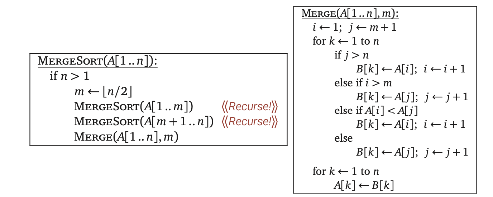
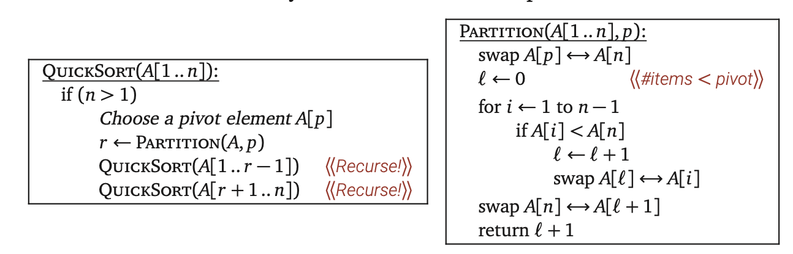

# Algorithm Design

## Chapter 1: Representative Problem

### 1.1 Stable Matching

#### The $G-S$ algorithm

Consider a set $M =\{m_1,\dots,m_n\}$  of $n$ men, and a set $W=\{w_1,\dots,w_n\}$ of n women. $M \times N$ denotes the set of all possible combinations of $(m,w)$ where $m \in M$ and $w\in W$.  A **perfect matching** S is a set of pairs that each element in $M$ and $W$ appears in exactly one pair in $S$. A matching $S$ is **stable** if it is perfect, and there is no **instability** with respect to $S$. There exists a stable matching for every set of preference lists.

**Theorem 1.3**	The $G-S$ algorithm terminates after at most $n^2$ iterations of the While loop.

**Theorem 1.5**	The $G-S$ algorithm returns a set of pair $S$ where $S$ is stable matching.

The $G-S$ algorithm will only return one of the stable matchings for a given set, which means it is unfair. In the book, the code of the example is favoring man, which gives the man the right to choose one of the women to propose. This will lead to the outcome of stable matching is the worse case for women. However, **all executions yield the same matching**.

**Theorem 1.7**	Every execution of The $G-S$ algorithm results in the set $S^*$, where $S^* = \{(m,best(m)):m\in M\}$ .

### 1.2 Five Representative Problem

#### Interval Scheduling

There are $n$ requests labeled $1,\dots,n$, and each time interval starts $s_i$ and ends $f_i$ where $s_i >f_i$ for all $i$. Two requests are **compatible** if there is no overlap. The goal is to find the max number of requests in a given time, related by **greedy algorithms**. 

#### Weighted Interval Scheduling

Now, each interval has a value, **weight**. In this question, it means the money we can get to accept given requests. And the goal is changed to find the max money we can get. Instead of using a greedy algorithm to find the intervals one at a time, **dynamic programming** is an efficient algorithm to solve this question.

#### Bipartite Matching

A graph $G = (V,E)$ is **bipartite** if its node-set $V$ can be partitioned into sets $X$ and $Y$ in such a way that every edge has one end in $X$ and the other end in $Y$. A **Bipartite Matching Problem** is, given an arbitrary bipartite graph $G$, to find a matching of maximum size.

#### Independent Set

Given a graph $G = (V,E)$, a set of node $S\sube V$ is **independent** if two nodes in $S$ are joined by an edge. According to the problem, the **Independent Set problem** is finding the independent set that is as large as possible.

#### Competitive Facility Location

Given a graph $G = (V,E)$, two players can choose the node in turns with the following rule: the graph the players choose can not be adjacent to the node that owns. At the same time, each node has a weight that represents the value of each node. The **Competitive Facility Location Problem** is finding out $P_2$ will be able to select a set of nodes with a total value of at least $B$ no matter how $P_1$ plays. If the graph is big, it would even be hard for us to convince you that $P_2$ have a winning strategy. This problem is in the class of **PSPACE-complete problems.** 

## Chapter 2: Basics of Algorithm Analysis

### 2.2 Asymptotic Order of Growth

#### $O$, $\Omega$, and $\Theta$

Define $O$ as **Asymptotic Upper Bounds**, $\Omega$ as **Asymptotic Lower Bounds**, and $\Theta$ as **Asymptotic Tight Bounds**

### 2.5 Implementing the Heap Operation

Just in case, the description of implement heap is in chapter 2.5

## Chapter 3: Graph

### 3.1 Basic Definition and Application

Edges in a graph indicate a symmetric relationship between their ends. The graph we consider is not directed, called an **undirected graph**.

#### Paths and Connectivity

A path is **simple** if all nodes are distinct from one another. A path $v_1,v_2,\dots, v_k-1, v_k$ in where $k>2$ is called **cycle** if the first $k-1$ nodes are all distinct, and $v_1 = v_k$. A graph is **connected** if, for every path of two nodes, there exists a path from one node to another. The **distance** between two nodes is the minimum number of edges in a path. 

**Theorem 3.2**	Let $G$ be an undirected graph on $n$ nodes. Any two of the following statements imply the third.

- $G$ is connected.

- $G$ does not contain a cycle.
- G has $n-1$ edges.

### 3.2 & 3.3 Graph Traversal and Implement

#### Breadth-First Search

BFS focus on the Layer., implemented by a queue.

**Theorem 3.3**	For each $j \ge 1$, layer $L_j$ produced by BFS consists of all nodes at distance exactly $j$ from $s$. There is a path from $s$ to $t$ $iff$ $t$ appears in some layer.

**Theorem 3.4**	Let $T$ be a BFS tree, let $x$ and $y$ be nodes in $T$ belonging to layers $L_i$ and $L_j$ respectively, and let $(x,y)$ be an edge of $G$. Then $i$ and $j$ differ by at most $1$.

#### Depth-First Search

DFS focus on the depth, implemented by a stack.

**Theorem 3.7**	Let $T$ be a DFS tree, let $x$ and $y$ be nodes in $T$, and let $(x,y)$ be an edge of $G$ that is not an edge of $T$. Then one of $x$ or $y$ is an ancestor of the other.

#### The Set of All Connected Components

**Theorem 3.8**	For any two nodes $s$ and $t$ in a graph, their connected components are either identical or disjoint.

### 3.4 Testing Bipartiteness(BFS)

**Theorem 3.14**	If a graph is bipartite, then it cannot contain an odd cycle.

The Step of testing bipartiteness will just become implement BFS and mark the color for each layer.

### 3.5 Connectivity in Directed Graphs

For a directed graph, the edge $(u,v)$ has a direction, which means the relationship between $u$ and $v$ is asymmetric.

#### Representing Directed Graph

We use a version of the adjacency list representation. This means that each node has two lists associated with it: once list consists of nodes to which it has edges, and a second list consists of nodes from which it has edges. The table below shows the example of a directed graph. The rows represent the start and the columns represent the end. If there is an edge existed, it is $1$. In the table, there is a path from $A$ to $B$, but not $B$ to $A$.

|      | A    | B    | C    |
| ---- | ---- | ---- | ---- |
| A    | 0    | 1    | 1    |
| B    | 0    | 0    | 1    |
| C    | 1    | 0    | 0    |

#### The Graph Search Algorithms

Both BFS and DFS works for directed graphs. Notes that it is possible for a node $s$ to have a path to a node $t$ even though $t$ have no path to $s$.

#### Strong Connectivity

A directed graph is **strongly connected** if, fr every two nodes $u $and $v$, there is a path from $u$ to $v$ and a path from $v$ to $u$. Two nodes $u$ and $v$ in a directed graph are **mutually reachable** if there is a path from $u$ to $v$ and also a path from $v$ to $u$.

**Theorem 3.17**	For ant two nodes $s$ and $t$ in a directed graph, their strong components are either identical or disjoint.

### 3.6 Directed Acyclic Graphs and Topological Ordering

If a directed graph has no cycles, we call it a **directed acyclic graph**, or a DAG for short. For a directed graph $G$, a **topological ordering** of $G$ is an ordering of its nodes as $v_1,v_2,\dots,v_n$ so that every edge $(v_i,v_j)$, we have $i < j$. In other words, all edges point "forward" in the ordering.

**Theorem 3.18**	If $G$ has a topological ordering, then $G$ is a DAG.

#### Computing a Topological Ordering

**Theorem 3.20**	If $G$ is a DAG, then $G$ has a topological ordering.

First, find a node $v_1$ that has no incoming edges. Second, delete $v_1$. Third, do the recursive until there is no node in $G $.

Define a node to be "active" if it has not yet been deleted by the algorithm, and we explicitly maintain two things:

- for each node $w$, the number of incoming edges that $w$ has from active nodes.
- the set $S$ of all active nodes in $G$ that have no incoming edges from other active nodes.

## Recursion

### 1.2 Simplify and Delegate

Recursion is a particularly powerful kind of reduction, which can be described loosely as follows:

- If the given instance of the problem can be solved directly, solve it!
- Otherwise, reduce it to one or more simpler instances of the same problem.

### 1.3 Tower of Hanoi

The only task is to reduce the problem instance we're given to one or more simpler instances or to solve the problem directly if such as reduction is impossible. 

### 1.4 Mergesort

Mergesort was developed by John von Neumann in 1945, and it can be divided into 3 steps:

1. Divide the input array into two subarrays of roughly equal size.
2. Recursively mergesort each of the subarrays.
3. Merge the newly-sorted subarrays into a single sorted array.

#### Analysis

MERGE function takes $O(n)$ time, because it's a simple for-loop with constant work per iteration. The "all levels equal" case of the recursion tree method immediately implies the closed-form solution $T(n) = O(n \log n)$.

### 1.5 Quicksort

Quicksort is discovered by Tony Hoare in 1959. In this algorithm, the hard work is splitting the array into smaller subarrays before recursion, so that merging the sorted subarrays is trivial.

1. Choose a pivot element from the array.
2. Partition the array into three subarrays containing the elements smaller than the pivot, the pivot element itself, and the elements larger than the pivot.
3. Recursively quicksort the first and last subarrays.

#### Analysis

PARTITION function clearly runs in $O(n)$ time. For the QUICKSORT function, we get a recurrence that depends on $r$, the rank of the chosen pivot element. If we magically choose the pivot to the pivot to be the median element of the array $A$, we would have $T(n) = O(n\log n)$. However, since the pivot is chosen randomly, we cannot make sure that the pivot is a median element. Actually, in the worst case, $T(n) = O(n^2)$ when the pivot is always the first or last point. The "average-case" running time should be $O(n\log n)$.

### 1.6 The Pattern

Both mergesort and quicksort follow a general three-step pattern called **divide and conquer**:

1. **Divide** the given instance of the problem into several independent smaller instances of exactly the same problem.
2. **Delegate** each smaller instance to the Recursion Fairy.
3. **Combine** the solutions for the smaller instances into the final solution for the given instance.

### 1.7 Recursion Trees

There are three cases where the level-by-level series $(\Sigma)$ is especially easy to evaluate:

- **Decreasing**: If the series decays exponentially, then $T(n) = O(f(n))$. In this case, the sum is based on the value at the root of the recursion tree.
- **Equal**: If all terms in the series are equal, then $T(n)=O(f(n)\log n)$.
- **Increasing**: If the series grows exponentially, then $T(n)=O(n^{\log_cr})$. In this case, the sum is based on the number of leaves in the recursion tree.

### 1.10 Exponentiation

The standard naive method to compute $a^n$ is to perform $n-1$ multiplication. However, based on the information we have we can reduce the running time to $O(\log n)$ by dividing $a^4=a^2*a^2$.

