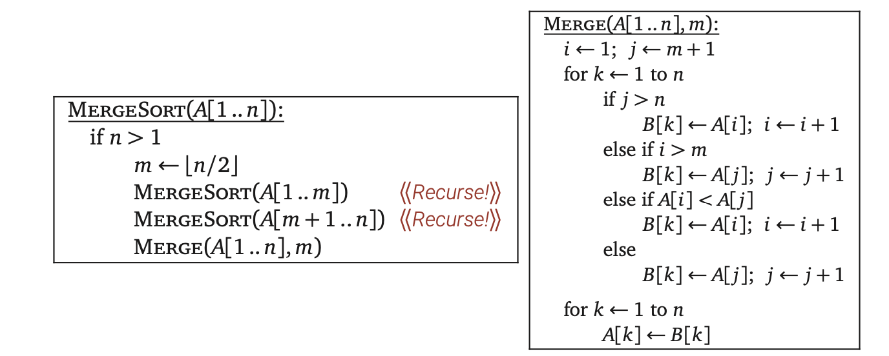
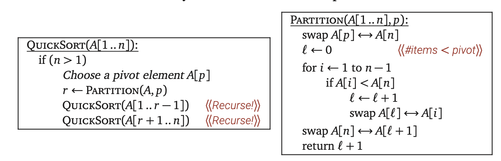

# Algorithms-JeffE

## Recursion

### 1.2 Simplify and Delegate

Recursion is a particularly powerful kind of reduction, which can be described loosely as follows:

- If the given instance of the problem can be solved directly, solve it!
- Otherwise, reduce it to one or more simpler instances of the same problem.

### 1.3 Tower of Hanoi

The only task is to reduce the problem instance we're given to one or more simpler instances or to solve the problem directly if such as reduction is impossible. 

### 1.4 Mergesort

Mergesort was developed by John von Neumann in 1945, and it can be divided into 3 steps:

1. Divide the input array into two subarrays of roughly equal size.
2. Recursively mergesort each of the subarrays.
3. Merge the newly-sorted subarrays into a single sorted array.

#### Analysis

MERGE function takes $O(n)$ time, because it's a simple for-loop with constant work per iteration. The "all levels equal" case of the recursion tree method immediately implies the closed-form solution $T(n) = O(n \log n)$.

### 1.5 Quicksort

Quicksort is discovered by Tony Hoare in 1959. In this algorithm, the hard work is splitting the array into smaller subarrays before recursion, so that merging the sorted subarrays is trivial.

1. Choose a pivot element from the array.
2. Partition the array into three subarrays containing the elements smaller than the pivot, the pivot element itself, and the elements larger than the pivot.
3. Recursively quicksort the first and last subarrays.

#### Analysis

PARTITION function clearly runs in $O(n)$ time. For the QUICKSORT function, we get a recurrence that depends on $r$, the rank of the chosen pivot element. If we magically choose the pivot to the pivot to be the median element of the array $A$, we would have $T(n) = O(n\log n)$. However, since the pivot is chosen randomly, we cannot make sure that the pivot is a median element. Actually, in the worst case, $T(n) = O(n^2)$ when the pivot is always the first or last point. The "average-case" running time should be $O(n\log n)$.

### 1.6 The Pattern

Both mergesort and quicksort follow a general three-step pattern called **divide and conquer**:

1. **Divide** the given instance of the problem into several independent smaller instances of exactly the same problem.
2. **Delegate** each smaller instance to the Recursion Fairy.
3. **Combine** the solutions for the smaller instances into the final solution for the given instance.

### 1.7 Recursion Trees

There are three cases where the level-by-level series $(\Sigma)$ is especially easy to evaluate:

- **Decreasing**: If the series decays exponentially, then $T(n) = O(f(n))$. In this case, the sum is based on the value at the root of the recursion tree.
- **Equal**: If all terms in the series are equal, then $T(n)=O(f(n)\log n)$.
- **Increasing**: If the series grows exponentially, then $T(n)=O(n^{\log_cr})$. In this case, the sum is based on the number of leaves in the recursion tree.

### 1.10 Exponentiation

The standard naive method to compute $a^n$ is to perform $n-1$ multiplication. However, based on the information we have we can reduce the running time to $O(\log n)$ by dividing $a^4=a^2*a^2$.

