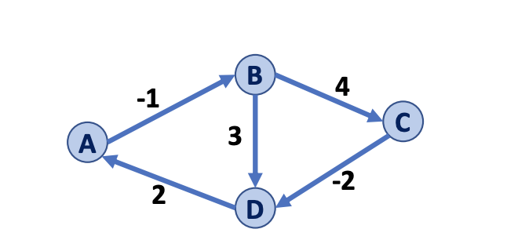

# CS 225 Note

## Data Structure

### Heaps

#### Introduction

A. heap allows your to store elements and query the most important elements quickly. Followed by the rule: **The parent has higher priority than any of its children.** 

- Data structure: array
- Worst-case performance: $O(n\log n)$

#### Implement

**Insertion:** We will put the element at the end of the array, call the function **heapify up** to make the element into the right position.

~~~c++
template <class T, class Compare>
void heap<T, Compare>::heapifyUp(size_t currentIdx)
{
    if (currentIdx == root())
        return;
    size_t parentIdx = parent(currentIdx);
    if (higherPriority(_elems[currentIdx], _elems[parentIdx])) {
        std::swap(_elems[currentIdx], _elems[parentIdx]);
        heapifyUp(parentIdx);
    }
}
~~~

**Removal**: We move the highest priority element by removing the root and moving the rightmost leaf in its place. Then, call the function **heaping down** to the rightmost leaf which is in the root.

~~~c++
template <class T, class Compare>
void heap<T, Compare>::heapifyDown(size_t currentIdx)
{   if(!hasAChild(currentIdx)) {
        return;
    }
    size_t childIdx = maxPriorityChild(currentIdx);
    if(higherPriority(_elems[childIdx], _elems[currentIdx])) {
        std::swap(_elems[currentIdx], _elems[childIdx]);
        heapifyDown(childIdx);
    }
}
~~~

 We can implement complete trees with arrays with the start index of 1 or 0. The index of 1 is recommended since it will be hard to think when the index is 0. If the start of the  heap is the index of 1, we have:

​	The parents is at the$\lfloor a/2 \rfloor$'th index.

​	The left and right children are at $a/2$'th index and $2a+1$'th index respectively.

### Hash Table

#### Introduction

To perform hashing, we need two things:

- **Hash function:** Converts a key into a smaller number and uses that number as an index in the table.

- **Hash table:** An array that stores values according to the index.

There is an example of the hash function.

~~~c++
template <>
unsigned int hash(const std::string& key, int size)
{
      // Bernstein Hash
      unsigned int h = 0;
      for (size_t i = 0; i < key.length(); ++i)
          h = 33 * h + key[i];
      return h % size;
 }
~~~

#### Hash Collisions

When a hash function puts two keys into one index, a hash collision happens, and we have two types of hash storing.

##### Separate Chaining

We can let the cells of our hash table point to several linked lists of values that have the same output from the hash function. We always insert the new value as the start of the linked list. If we want to find a value, we need to find the right index of this value($O(1)$)), and find the right value from the linked list($O(n)$).

- Data Structure: array/vector + linked list
- Worst-case performance to find a value: $O(n)$
- Performance to insert a value: $O(1)$

##### Linear Probing

Without creating any additional memory, we can just find the next available entry if the first one is occupied.

- Data Structure: array
- Best-case performance to find a value: $O(1)$
- Worst-case performance to find a value: $O(n)$
- Worst-case performance to insert a value:$O(n)$
- Best-case performance to insert a value:$O(1)$

### B-Trees

#### Introduction

A B-Tree is a self-balancing **Binary Search Tree(BST)**. B-Tree has the following properties:

- M denotes the max number of child nodes a node can point to
- The max number of keys per node is M-1
- The root node is either a leaf node or an internal node with 2 to M children and 1 to M-1 keys
- The rest of the internal nodes have between M/2 and M children
- All leaves are at the same depth, which makes the tree balanced

#### Implement

**Find** has the following step:

1. Go through each index of the current node's array of keys
2. If the key is in this node's array of keys, return the key
3. If the key is not in this node you have two options:
   - Find the next biggest key and go to then ith child of that node
   - Find the next smallest key and go to the (ith + 1) child
4. If you get to the leaf node where the data value should be and don't see it in the array of keys then this value is not in the tree.

**Insertion** is just finding the right position to put the value in, and it will be followed by **Splitting Nodes**.

**Splitting Nodes** has the following step:

1. When you try to insert into node, N1, you notice that the amount of keys is now greater than M-1.
2. Now You must take the middle key and put it in the parent node’s keys
3. Now all keys that were in the array of N1 that are greater than the thrown up key are put into a node that is the (i + 1), where i is the index of the thrown up key, child of the parent node. The rest are put into the Node that is the ith child of the parent tree. If a Node does not exist for that child but is a valid child to place, Since there is space in the parent, you can create the child Node and populate it.

#### Runtime & Data structure

- Data structure: tree node + array
- Performance of search: $O(\log n)$
- Performance of combining/splitting of keys: $O(M)$
- Performance of insert/delete: $O((M/\log M)*\log N)$

### AVL Tree

#### Introduction

AVL is just stand for the names of investors. This is the visualized graph: [Interactive AVL Simulator](https://www.cs.usfca.edu/~galles/visualization/AVLtree.html). It is a self-balancing binary search tree(BST) that allows you to store and query data in logarithmic time.

#### Implement

AVL trees use left rotation, right rotation, left-right rotation, and right-left rotation to keep the balance.

Code of left rotation:

~~~c++
template <class K, class V>
void AVLTree<K, V>::rotateLeft(Node*& t)
{
    functionCalls.push_back("rotateLeft"); 
    // your code here
    Node* copy1 = t;
    Node* copy2 = t->right->left;
    t = t->right;
    t ->left = copy1;
    t ->left->right = copy2;

}
~~~

Code of left-right rotation:

~~~c++
template <class K, class V>
void AVLTree<K, V>::rotateLeftRight(Node*& t)
{
    functionCalls.push_back("rotateLeftRight"); 
    // Implemented for you:
    rotateLeft(t->left);
    rotateRight(t);
}
~~~

#### Runtime & Data Structure

- Data Structure: tree node
- Performance of insert: $O(h)$/$O(\log n)$
- Performance of delete: $O(\log n)$

Node: the run time of rotation is $O(1)$

## Algorithms

### BFS & DFS

BFS and DFS are graph traversal algorithms. 

#### BFS

The central idea of a breath-first search is to search "wide" before "deep" in a graph. In other words, BFS visits all neighbors of a node before visiting the neighbors of neighbors. Therefore, BFS can be used to find the shortest path from an arbitrary node to a target node.

The **queue** data structure is used in the iterative implementation of BFS. The next node to process is always at the front of the queue and the next node to add is always at the end of the queue. This data structure can fit with BFS which is breath-first.

Here is the Pseudocode of BFS:

~~~pseudocode
BFSTraversal(start_node):
  visited := a set to store references to all visited nodes

  queue := a queue to store references to nodes we should visit later
  queue.enqueue(start_node)
  visited.add(start_node)

  while queue is not empty:
    current_node := queue.dequeue()

    process current_node
    # for example, print(current_node.value)

    for neighbor in current_node.neighbors:
      if neighbor is not in visited:
        queue.enqueue(neighbor)
        visited.add(neighbor)
~~~

BFS runs in $O(V+E)$, where $V$ is the number of vertices and $E$ is the number of edges in the graph. This is because:

- Every node(vertex) is enqueued and processed exactly once, resulting in $O(V)$ time.
- Every edge is checked exactly once when we do for the neighbor in current_node.neighbors, resulting in an additional $O(E)$time.

#### DFS

In contrast, depth-first search searches "deep" before it searches "wide". If our current node has two neighbors $n_1$ and $n_2$ and we choose to visit $n_1$ next, then all the nodes reachable from $n_1$ will be visited before $n_2$.

The **stack** data structure is used in the iterative implementation of DFS. Both the next node to process and the next node to add are always at the top of the stack. This data structure can fit with DFS which is depth-first.

The code of DFS is similar to BFS with the replacement of queue to stack.

DFS runs at the same time as BFS.

#### Note

BFS and DFS are suitable for both traversing the graph and searching for a target node. If the goal is to search, we can break out of the traversal when we find the target value we need.

1. BFS and DFS work on both directed and undirected graphs.
2. If the underlying graph is disconnected, BFS and DFS can only traverse the connected component that the given starting node belongs to.
3. BFS cannot be used to find the shortest paths on weighted graphs.

### Floyd-Warshall's Algorithm

We know that a negative-weight **cycle** has no finite shortest path. However, graphs with a negative-weight edge without a negative weight cycle DO have a finite shortest path. **Floyd-Warshall's Algorithm** is an alternative to Dijkstra in the presence of negative-weight edges(but not negative weight cycles).

- Goal: Find the shortest path from vertex u to v.
- Setup: Create an $n\times n$ the matrix that maintains the best-known path between every pair of vertices: 
  - Initialize (u,u) to o.
  - Initialize all edges present on the graph to their edge weight.
  - Initialize all other edges to +inf.

Note that, in the code, if we choose B as our first node that needs to go through, D as the start point, and C as the endpoint, the algorithm will find that the distance between B and C will be infinity since there is no edge from D to B to  C currently. When the code runs to choose A as the node that needs to go through, D as the start point, and C as the endpoint, it will renew the distance between D and C since we already find the distance between A and C in the first loop.

Pseudocode code:

~~~pseudocode
FloydWarshall(G):
	Let d be a adj. matrix initialized to +inf
	foreach (Vertex v : G):
		d[v][v] = 0
	foreach (Edge (u, v) : G):
		d[u][v] = cost(u, v)
	foreach (Vertex w : G):
		foreach (Vertex u : G):
			foreach (Vertex v : G):
				if d[u, v] > d[u, w] + d[w, v]:
				d[u, v] = d[u, w] + d[w, v]
~~~

#### Runtime

The Running time is $O(n^3)$. This algorithm is more fit to dense graph, which means more nodes.

### Minimum Spanning Tree

#### Prim Algorithm

1. Starting at one point, find all the edges that this point has.
2. Find the minimum weighted edge. If the point on the other side of the edge is not traveled, add this point into the set and find all the edges that this point has. 
3. Get all the points in the set and repeat step 2 until there is no point to add.
4. A minimum spanning tree is created.

#### Kruskal Algorithm

1. regard all points as the independent tree, sort all the weighted edges.
2. Getting the minimum weighted edge. If two sides of the point are both independent trees, combine them together into a bigger tree.
3. Pop the edge, repeat step 2 until there is no edge to get.
4. A minimum spanning tree is created.

Overall, the Prim algorithm is based on the point as the object, choosing the minimum weighted edge to create the tree, while the Kruskal algorithm is based on the edge as the object, combining two trees together with minimum weight to create the tree.

