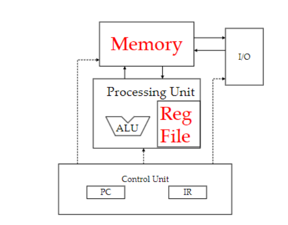
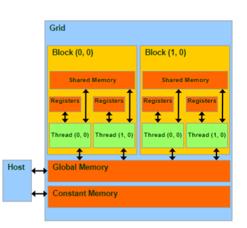
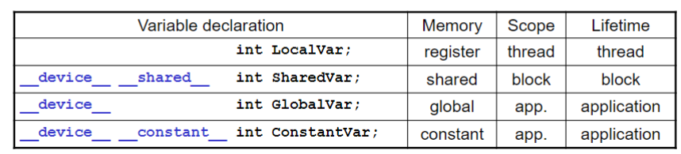

# CS 483

### Post-Dennard Technology Pivot - Parallelism and Heterogeneity

#### Dennard Scaling of Mos Devices

**Dennard Scaling:** the size of the chip affects the energy consumed and delays in a positive effect. However, as the products approach the limit under physical conditions, it has less effect.

#### Post-Dennard Pivoting

-   Multiple cores with more moderate clock frequencies(threads)
-   Heavy use of vector execution
-   Employ both latency-oriented and throughput-oriented cores
-   3D packaging for more memory badwidth

#### CPUs: Latency Proented Design

-   High clock frequence
-   Large caches
-   Sophisticated control: branch prediction and data forwarding
-   Powerful ALU

#### GPUs: Throughput Oriented Design

-   Moderate clock frequency
-   Small caches
-   Simple control
-   Energy efficient ALUs
-   Require a massive number of threads to tolerate latencies

CPU: sequential parts >>>>> 10+X >>>>>> GPU

GPU: parallel parts >>>>> 10+X >>>>>>> CPU

#### Parallel Programming Workflow

-   Identify compute intensicve parts of an application
-   Adopt/create scalable algorithms
-   Optimize data arrangements to maximize locality
-   Performance Tuning
-   Pay attention to code portability, scalability, and maintainability

**Load Balance:** the total amount of time to complete a parallel job is limited by the thread that takes the longest to finish

### Introduction to CUDA C and Data Parallel Programming

#### Threads

**Multiple threads:** doing completely different tasks but may use the same data.

#### Cuda/OpenCL - Execution Model

Integrated host + device app C program

-   Serial or modestly parallel parts in host C code
-   Highly parallel parts in device SPMD kernel C code

A CUDA kernel is executed as a grid (array) of threads

-   All threads in a grid run the same kernel code
-   Single Program Multiple Data (SPMD model)
-   Each thread has a unique index that it uses to compute memory addresses and make control decisions. 

Each CUDA kernel is executed by a grid, a 3D array of thread blocks, which are 3D arrays of threads.

Each thread executes the same program on distinct data inputs, a single-program, multiple-data model (SPMD).

ThreadIdx tuple is unique to each thread **within a block**.

#### Thread Blocks: Scalable Cooperation

-   Threads within a block cooperate via shared memory, atomic operations, and barrier synchronization
-   Threads in different blocks cooperate less

#### Blockidx and threadidx

-   Thread block and thread organization
    -   simplifies memory addressing 
    -   when processing multidimensional data

-   Example: image processing, vectors, matrices , tensors, solving PDEs on volumes

#### Partial Overview of CUDA Memories

-   Device code can:
    -   R/W per-thread registers
    -   R/W per-grid global memory
-   Host code can
    -   Transfer data to/from per grid global memory

#### CUDA Device Memory Management API functions

**cudaMalloc()**

-   Allocates objects in the device's global memory
-   Two parameter 
    -   Address of a pointer to then allocated object
    -   Size of the allocated object in terms of bytes

**cudaFree()**

-   Frees object from device global memory
    -   Pointer to freed object

**cudaMemcpy()**

-   Memory data transfer
-   Requires four parameters: Pointer to destination; Pointer to source; Number of bytes copied; Type/Direction of transfer


|                                 | Executed on the | Only callable from the |
| ------------------------------- | --------------- | ---------------------- |
| __device\_\_ float DeviceFunc() | Device          | Device                 |
| __global\_\_ void KernelFunc()  | Device          | Host                   |
| __host\_\_ float HostFunc()     | Host            | Host                   |

**__global\_\_** defines a kernel function, a kernel function must return void

**__device\_\_** and **_\_host\_\_**  can be used together


### Kernel-Based Data Parallel Execution Model

Review: Assume that we have $N=1000$ elements to do. Then, if we have block size = $256$, we have


However, this code is not efficient, since each thread will just focus on one operation. And allocate the thread itself is expensive. Thus, thread Assignment for vecAdd with Two Elements per Thread we have


#### Processing a Picture with a 2D Grid

For the index, we have

```c
int Col = threadIdx.x + blockIdx.x * blockDim.x;
int Row = threadIdx.y + blockIdx.y * blockDim.y;
```

#### Thread Blocks

-   All threads in a block execute the same kernel program (SPMD)
-   Programmer declares block:
    -   Block size 1 to 1024 concurrent threads
    -   Block shape 1D, 2D, or 3D
-   Threads within the block have thread index numbers.
-   Kernel code uses thread index and block index to select work and address shared data.
-   Threads in the same block share data and synchronize while doing their share of the work
-   Threads in different blocks cannot cooperate
-   Blocks execute in arbitrary order!

#### Executing Thread Blocks

Threads are assigned to Streaming Multiprocessors in block granularity.

-   Up to 32 blocks to each SM (resource limit for Maxwell)

-   Maxwell SM can take up to 2048 threads

Threads run concurrently

-   SM maintains thread/block id #s
-   SM manages/schedules thread execution

#### Thread Scheduling

Each block is executed as 32-thread warps

-   Each block is executed as 32-thread warps
-   Warps are divided based on their linearized thread index
-   Warps are scheduling units in SM

SM implements zero-overhead warp scheduling

-   Warps whose next instruction has its operands ready for consumption are eligible for execution
-   Eligible warps are selected for execution on a prioritized scheduling policy
-   All threads in a warp execute the same instruction when selected

#### Pitfall: Control/Branch Divergence

**branch divergence**

occurs when different threads within a warp take different execution paths (e.g., in an `if-else` statement). This situation forces the GPU to execute these different paths one after another rather than in parallel. This serialization of execution paths results in performance degradation because it reduces the parallel efficiency of the GPU.

-   threads in a warp take different paths in the program
-   main performance concern with control flow

**Predicated Execution**

This is a technique or solution that GPUs use to handle the branch divergence issue. Instead of executing only one path and discarding others, **predicated execution** executes all paths but masks out the operations that don't apply to certain threads (based on the condition results).

-   Multiple paths taken by threads in a warp are executed serially!
-   Each thread computes a yes/no answer for each path.

#### Avoiding Branch Divergence

Try to make branch granularity a multiple of warp size


### Memory Model

#### The Von-Neumann Model



Instruction are stored in memory:

- Every instruction needs to be fetched from memory, decoded, then executed
- Instruction processing breaks into steps: Fetch | Decode | Execute | Memory
- Instructions come in three flavors: Operate, Data Transfer, and Control Flow

#### Examples

**Processing a ADD Instruction**

Example of an (LC-3) data transfer instruction 

ADD R1, R2, R3

1. Read R2 and R3
2. Add them as unsigned/2’s complement
3. Write sum to R1

**Processing a LOAD Instruction**

Example of an (LC-3) data transfer instruction

LDR R4, R6, #3	; a load

1. Read R6
2. Add the number 3 to it
3. Load the contents of memory at the resulting address
4. Write the bits to R4

#### Register VS Memory

- Registers
  - Fast: 1 cycle; no memory access required
  - Few: hundreds for CPU, O(10k) for GPU SM
- Memory
  - Slow: hundreds of cycles
  - Huge: GB or more

### Programmer View of CUDA memories

Each thread can:

- read/ write per-thread registers  (~1 cycles)
- read/write per-block shared memory (~5 cycles)
- read/write per-grid global memory (~500 cycles)
- read/only per-grid constant memory (~5 cycles with caching)




#### CUDA Variable Type Qualifiers



- \_\_device__
  - optional with \_\_shared__ or \_\_constant__
  - not allowed by itself within functions
- Automatic variables with no qualifiers
  - in **registers** for primitive types and structures
  - in **global memory** for per-thread arrays

## Locality and Tiled Matrix Multiplication

#### Strategy

-   Global memory is implemented with DRAM - slow
-   To avoid Global memory bottleneck, tile the input data to take advantage of Shared Memory:
    -   Partition data into subsets (tiles) that fit into the smaller but faster shared memory.
    -   Handle each data subset with one thread block by:
        -   Loading the subset from global memory to shared memory, using multiple threads to exploit memory-level parallelism
        -   Performing the computation on the subset from shared memory, each thread can efficiently access any data element.
        -   Copying results from shared memory to global memory
    -   Tiles are also called blocks in the literature.
-   In a GPU, only threads in a block can use shared memory.
-   Thus, each block operated on shared tiles:
    -   Read tiles into shared memory using multiple threads to exploit memory-level parallelism.
    -   Compute based on shared memory tiles.
    -   Repeat
    -   Write results back to global memory.

####  Declare a Shared Memory


#### Bulk Synchronous Steps Based on Barriers

A barrier is a synchronization point:

-   each thread calls a function to enter the barrier;
-   Threads block (sleep) in barrier function until all threads have called
-   after last thread calls function, all threads continue past the barriers

#### Barrier Synchronization


### Convolution, Constant Memory and Constant Caching

#### Convolution Computation

An array operation where each output data element is a weighted sum of a collection of neighboring input elements.

The weights used in the weighted sum calculation are defined by an input mask array, commonly referred to as the convolution kernel.

#### Access Pattern for M

Elements of M are called mask (kernel, filter) coefficients

-   Calculation of all output P elements needs M
-   M is not changed during grid execution.

Bonus - M elements are accessed in the same order when calculating all P elements

M is a good candidate for Constant Memory 

**Since we have to go to global memory to access data all the time, the execution speed of GPUs would be limited by global memory bandwidth**.

#### Cache

An “array” of cache lines. When data is requested from the global memory, an entire cache line that includes the data being accessed is loaded into the cache, in an attempt to reduce global memory requests

**Memory Burts**: contain around 1024 bits (128B) from consecutive addresses. Or **line**.

-   Memory read produces a line
-   cache stores a copy of the line, and 
-   tag records line‘;’s memory address

#### Caches and Locality

**Spatial locality:** when the data elements stored in consecutive memory locations are accessed consecutively

**Temporal locality:** when the same data element is accessed multiple
times in short period of time

Both spatial locality and temporal locality improve the performance of caches

#### Memory Accesses Show Locality

An executing program

-   loads and store data from memory
-   consider the sequence of addresses accessed

Sequence usually shows both types of locality


When cache is full, it must make room for new line and usually by discareding least recently used line.

#### Shared Memory VS Cache

Shared memory in CUDA is another type of temporary storage used to relieve main memory contention. In terms of distance from the SMs, shared memory is similar to the L1 cache.

Unlike cache, shared memory does not necessarily hold a copy of data that is also in the main memory. Shared mem requires explicit data transfer instructions into
locations in the shared memory, whereas the cache doesn’t.


Modification to cached data needs to be (eventually) reflected back to the original data in global memory – Requires logic to track the modified status, etc.

Constant cache is a special cache for constant data that will not be modified during kernel execution by a grid

-   Data declared in the constant memory not modified during kernel
    execution.
-   Constant cache can be accessed with higher throughput than L1 cache
    for some common patterns


#### How to Use constant memory

Allocate device memory for M (the mask)

-   outside of all functions
-   using __constant__(tells GPU that caching is safe).

For copying to device memory, use

-   cudaMemcpyToSymbol(dest, src, size, offset = 0, kind = cudaMemcpyHostToDevice)
-   with destination defined as above.

### Tiled Convolution

Halo: The index that do not use (length of kernel) times. Then, it raise the question: do we need to include these values in our shared memory?

####  Access Halo from Global Memory

Threads read halo values directly from global memory

Pros: Optimize reuse of shared memory

Cons: Branch divergence! (Shared vs global reads) and Halo is too narrow to fill a memory burst

#### Load/Access Halo to/from Shared Memory

Load halos to shared memory

Pros: Coalesce global memory accesses and No branch divergence during computation 

Cons: Some threads must do  > 1 load, so some branch divergence in reading data and more shared memory needed

#### Three Tiling Strrategies


#### Strategy 1

For three different steps, load them depends on condition

```c
int radius = Mask_Width / 2;
int halo_index_left = (blockIdx.x - 1) * blockDim.x + threadIdx.x;
if (threadIdx.x >= (blockDim.x - radius)) {
  N_ds[threadIdx.x - (blockDim.x - radius)] =
  (halo_index_left < 0) ? 0 : N[halo_index_left];
}

int index = blockIdx.x * blockDim.x + threadIdx.x;
if ((blockIdx.x * blockDim.x + threadIdx.x) < Width)
  N_ds[radius + threadIdx.x] = N[index];
else
  N_ds[radius + threadIdx.x] = 0.0f;

int halo_index_right = (blockIdx.x + 1)*blockDim.x + threadIdx.x;
if (threadIdx.x < radius) {
  N_ds[radius + blockDim.x + threadIdx.x] = (halo_index_right >= Width) ? 0 : N[halo_index_right];
}
```

#### Strategy 2


