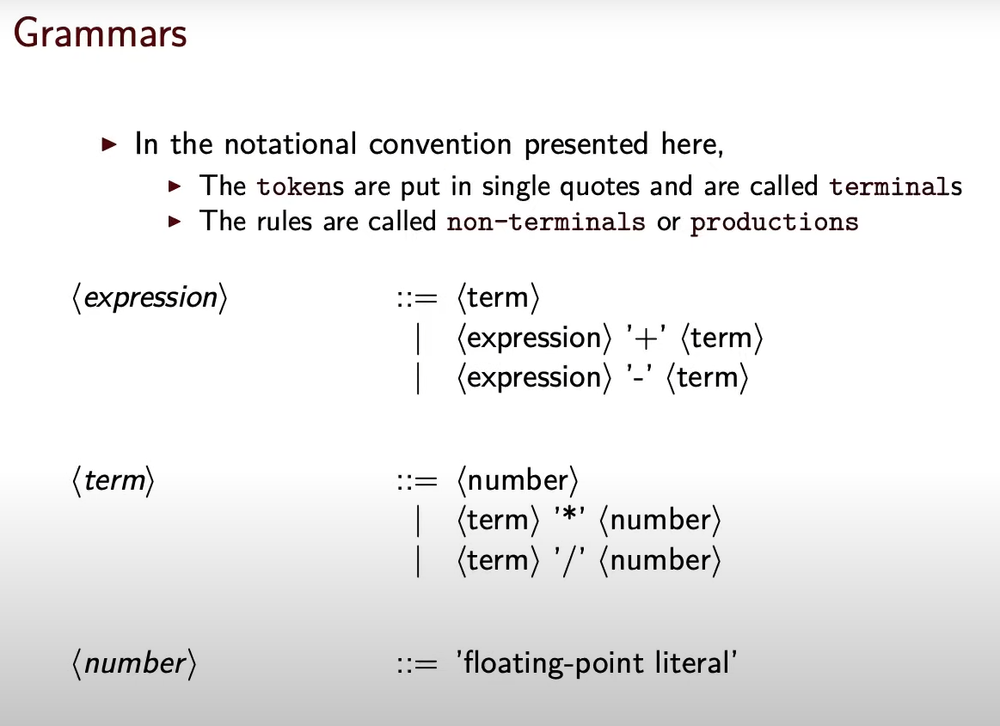
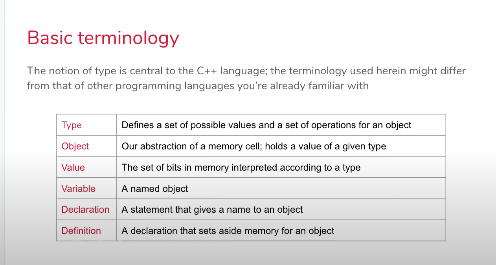
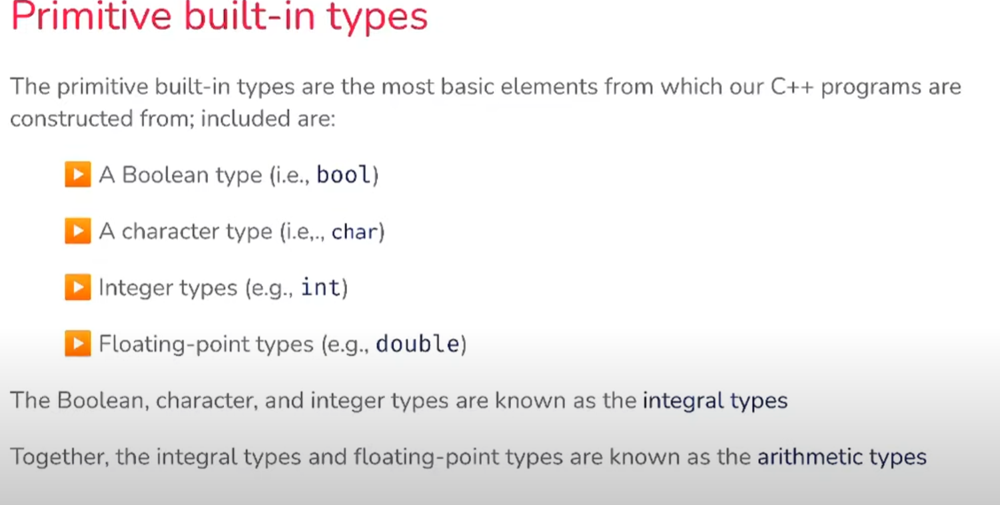
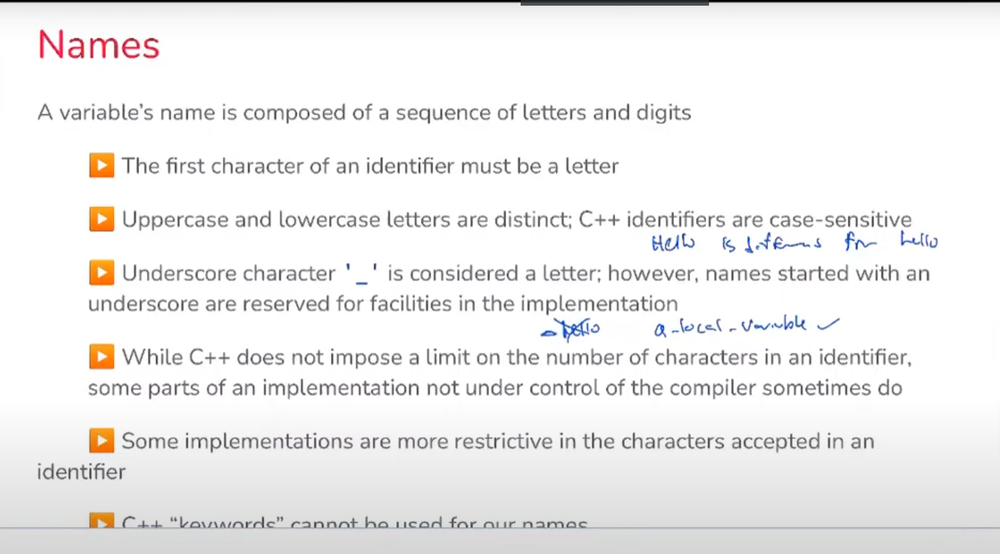
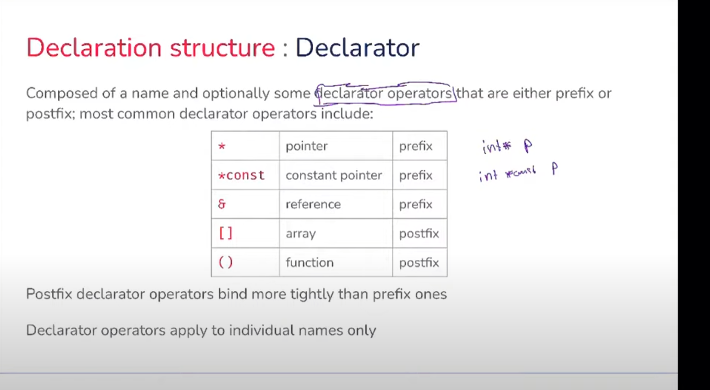

# CS 128

#### Grammars



#### Basic terminology



#### Primitive built-in types



#### Name



#### Declarator



#### Narrowing Conversion

A narrowing conversion happens when a variable converts into another type, which cannot state an even approximation of all values.   If the value is out of the scope of the new type, the new value will be meaningless. For example, double to floating is a narrowing conversion. Therefore, this conversion is unsafe.

#### Widening Conversion

A widening conversion happens when a variable converts into another type, including at least approximations of all values.  This means that the new variable will lose some precision since the new type cannot include all the values in the old type. For example, int to double is a widening conversion. During the process, the number after the decimal point will be eliminated. It is safe since the value is in the scope of the new type.

#### Implicit type conversion

Implicit type conversion happens when we write mixed-mode expressions. At this time, the system will change the narrower variable to widen type. This process is called coercion. For example,

~~~c++
5.0 + 10;	// will be double, 15.0
~~~

However, when it comes to defining a variable, it will change into the variable type with no exception. For example,

```c++
int i = 9.0/5.0;	//will be int, 1
double b;
b= 9/5;				//will be double, 1.0
```

#### Explicit type conversion

We can change the type manually. The code is

```c++
static_cast<type>(value);
static_cast<double>(5);		// will be come 5.0
```


