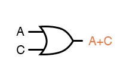
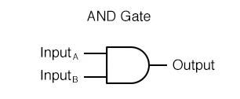

# CS 233

## Week 1: 

In the first week, the course is talking about the four representations of Boolean function: **Boolean algebraic expression**, **truth tables**, **circuit diagrams**, and **Verilog hardware description**. These four representations of Boolean functions can be transformed into other three representations. 

#### Truth table

We can represent the function as a truth table, which means showing all the output given all the combinations of inputs. Here is an example of a truth table of not.

| x    | f(x) |
| ---- | ---- |
| 1    | 0    |
| 0    | 1    |

#### Verilog hardware description

We use **Verilog hardware description** to explain the logic flowchart we create. Here is an example.

```verilog
out = x'y+xy
module circuit(out, x, y);
    output out;
    input  x, y;
    wire nx,nxy,xy;
    
    not n1(nx,x);
    and a1(nxy,nx,y);
    and a2(xy,x,y);
    or o1(out,nxy,xy);
   
   
endmodule // Bool2Verilog
```

#### not

"not" is a Boolean function. We can write it as $f(x)=x'$ which is a boolean algebraic expression. This function can turn "true" into "false" and "false" into "true". In HDLS form, we can write $not\ n1(f,x)$ where $n1$ is the name of the function, $f$ is the output, and $x$ is the input.



#### and

We can regard **and** as the product in the algorithm. This means that the output of the and function is true $iff$ both of the inputs are true. We can write it as $f(x，y)=x*y$ which is a boolean algebraic expression. In HDLS form, we can write $and\ a1(f,x,y)$ where $a1$ is the name of the function, $f$ is the output, and $x,y$ are the inputs.



#### or

We can regard **or** as the addition in the algorithm. This means that the output of the or function is false $iff$ both of the inputs are false. We can write it as $f(x，y)=x+y$ which is a boolean algebraic expression. In HDLS form, we can write $or\ o1(f,x,y)$ where $a1$ is the name of the function, $f$ is the output, and $x,y$ are the inputs.


#### Bitwise operators

**not**, **and**, **or** are all bitwise operators. Basically, these operators follow the rules above. When we write these operators, we use '~' to represent **not**, '&' to represent **and**, and '|' to represent **or**. XOR is another operator, written as '^'. This operator returns true $iff$ the number of true is odd.

#### Logical operators 

Not like the bitwise operators, Logical operators perform logical operations on entire bitstrings, treating 0 as false and everything that is not 0 as true. We have &&, ||, !. Note that when a bitstring contains a one(true), it is logically true. And It is logically false $iff$ all bits in bitstring is zero.
