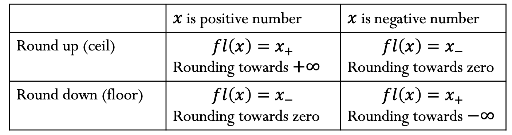

# CS 357

## Errors and Complexity

#### Absolute and Relative Error

We define that: Approximate Result = True Value + Error. Then, we can get our absolute error:
$$
Absolute Error = \abs{x-\hat{x}}.
$$
And, the relative error:
$$
Relative Error = \frac{Absolute Error}{\abs{x}} =\frac{\abs{x-\hat{x}}}{\abs{x}}
$$

#### Significant Digits/Figures

**Significant figures** of a number are digits that carry meaningful information. We define an approximate result $\hat{x}$ has $n$ **significant figures** of a true value $x$ if the absolute error has zeros in the first n decimal place counting from the leftmost nonzero (leading) digit pf $x$, followed by a digit from 0 to 4. Here is an example.

Assume $x=3.141592653$ and suppose $\hat{x}$ is the approximate result:
$$
\hat{x} = 3.14159 \rarr \abs{x-\hat{x}}=0.000002653\rarr\hat x \text{ has 6 significant figures}.
$$

$$
\hat{x} = 3.1415 \rarr \abs{x-\hat{x}}=0.000092653\rarr\hat x \text{ has 4 significant figures}.
$$

## Floating Point

#### Floating Point Numbers

A floating-point number can represent numbers of different orders of magnitude(very large and very small) with the same number of fixed digits.

More formally, we can define a floating-point number $x$ as:
$$
x=±q⋅2^m
$$

where:

- ± is the sign
- q is the significand
- m is the exponent

A number xx in a normalized binary floating-point system has the form
$$
x =±1.b_1b_2b_3\dots b_n \times 2^m = ±1.f \times2^m
$$
where **Digits**: $b_i \in {0,1}$,**Exponent range:** Integer $m\in [L,U]$, **Precision:** $p=n+1$, **Smallest positive normalized floating-point number:** $2^L$, **Largest positive normalized floating-point number:** $2^{U+1}(1-2^{-p})$

Outside the range will be considered as **overflow**.

#### Machine Epsilon

**Machine epsilon** ($\epsilon_m$) is defined as the distance (gap) between 1 and the next largest floating-point number. It does not depend on the exponent. 
$$
\epsilon_m = 2^{-n}
$$

## Rounding and Cancellation

Consider a real number in normalized floating-point form:
$$
x=\pm 1.b_1b_2b_3\dots b_n\dots\times 2^m
$$
Without loss of generality, let us assume $x$ is a positive number. In this case, we have:
$$
x_-=\pm 1.b_1b_2b_3\dots b_n\times 2^m
$$

$$
x_+=\pm 1.b_1b_2b_3\dots b_n\times 2^m + 0.\text{(n bits of 0)} \times 2^m
$$

#### Roundoff Errors

The difference between $x_-$ and $x_+$ is  $\epsilon_m \times 2^m$.

Hence we can use machine epsilon to bound the error in representing a real number as a machine number.

**Absolute error:**
$$
\abs{fl(x)-x} \le \abs{x_+-x_-} = \epsilon_m \times 2^m
$$
**Relative error:**
$$
\frac{\abs{fl(x)-x}}{\abs{x}} \le \frac{\epsilon_m \times 2^m}{\abs{x}}
$$

#### Floating Point Addition

The basic idea of adding is 

1.  Bring both numbers to a common exponent
2. Do grade-school addition from the front, until you run out of digits in your system
3. Round the result

There is no loss of significant digits with floating-point addition.

#### Floating Point Subtraction and Cancellation

Floating-point subtraction works much the same way that addition does. However, problems occur when you subtract two numbers of similar magnitude. There is an example
$$
a = 1.1011???? \times 2^1,b = 1.1010???? \times 2^1
$$

$$
a-b =0.0001???? \times 2^1
$$

Although the floating-point number will be stored with 4 digits in the fractional, it will only be accurate to a single significant digit. This loss of significant digits is known as **catastrophic cancellation**.

## Taylor Series

#### Infinite Taylor Series Expansion

A Taylor series is a representation of a function as an infinite sum of terms that are calculated from the values of the function’s derivatives at a single point. The Taylor series expansion about $x=x_0$ of a function $f(x)$ that is infinitely differentiable at $x_0$ is the power series
$$
f(x_0)+\frac{f'(x_0)}{1!}(x-x_0)+\frac{f''(x_0)}{2!}(x-x_0)^2+\frac{f'''(x_0)}{3!}(x-x_0)^3 + \dots
$$
Then, we can use summation notation 
$$
\sum_{k=0}^{\infin}\frac{f^{(k)}(x_0)}{k!}(x-x_0)^k.
$$

#### Error Bound when Truncating a Taylor Series

Suppose that $f(x)$ is an $n+1$ times differentiable function of $x$, and $T_n(x)$ is the Taylor polynomial of degree $n$ for $f(x) $ centered at $x_0$. Then When $h=\abs{x-x_0} \rarr0$, we obtain the truncation error bound by
$$
\abs{f(x)-T_n(x)}\le C \cdot h^{n+1}=O(h^{n+1})
$$

#### Taylor Remainder Theorem

Suppose that $f(x)$ is an $n_1$ times differentiable function of $x$. Let $R_n(x)$ denote the difference $f(x)$ and the Taylor polynomial of degree $n$ for $f(x)$ centered at $x_0$. Then
$$
R_n(x) = f(x)-T_n(x)= \frac{f^{n+1}(\mathcal{E})}{(n+1)!}(x-x_0)^{n+1}
$$
for some $\mathcal{E}$ between $x$ and $x_0$. Thus, the constant $C$ mentioned above is 
$$
\max_{\cal E} \frac{\abs{f^{(n+1)}(\cal E)}}{(n+1)!}
$$

#### Asymptotic behavior of the error

Let’s say we have $f(x)$ approximated using $t_n(x)$. Suppose the given interval is h1h1 between $x_0$ and $x$ and the error associated with it is $e_1$. Let’s say we have another interval $h2$ and we need to find the error $e_2$ associated with it.

Using the formula $e=O(h^{n+1})$, we get
$$
e_1 \propto h_1^{n+1}\\
e_2 \propto h_2^{n+1}\\
\frac{e_1}{e_2} = (\frac{h_1}{h_2})^{n+1}\\
e_2=(\frac{h_2}{h_1})^{n+1}e_1
$$
