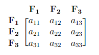
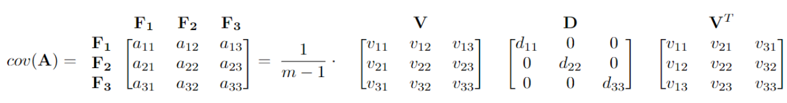

# CS 357

## Errors and Complexity

#### Absolute and Relative Error

We define that: Approximate Result = True Value + Error. Then, we can get our absolute error:
$$
Absolute Error = |{x-\hat{x}}|.
$$
And, the relative error:
$$
Relative Error = \frac{Absolute Error}{|{x}|} =\frac{|{x-\hat{x}}|}{|{x}|}
$$

#### Significant Digits/Figures

**Significant figures** of a number are digits that carry meaningful information. We define an approximate result $\hat{x}$ has $n$ **significant figures** of a true value $x$ if the absolute error has zeros in the first n decimal place counting from the leftmost nonzero (leading) digit pf $x$, followed by a digit from 0 to 4. Here is an example.

Assume $x=3.141592653$ and suppose $\hat{x}$ is the approximate result:
$$
\hat{x} = 3.14159 \rarr |{x-\hat{x}}|=0.000002653\rarr\hat x \text{ has 6 significant figures}.
$$

$$
\hat{x} = 3.1415 \rarr |{x-\hat{x}}|=0.000092653\rarr\hat x \text{ has 4 significant figures}.
$$

## Floating Point

#### Floating Point Numbers

A floating-point number can represent numbers of different orders of magnitude(very large and very small) with the same number of fixed digits.

More formally, we can define a floating-point number $x$ as:
$$
x=±q⋅2^m
$$


where:

- ± is the sign
- q is the significand
- m is the exponent

A number sx in a normalized binary floating-point system has the form
$$
x =±1.b_1b_2b_3\dots b_n \times 2^m = ±1.f \times2^m
$$
where **Digits**: $b_i \in {0,1}$,**Exponent range:** Integer $m\in [L,U]$, **Precision:** $p=n+1$, **Smallest positive normalized floating-point number:** $2^L$, **Largest positive normalized floating-point number:** $2^{U+1}(1-2^{-p})$

Outside the range will be considered as **overflow**.

#### Machine Epsilon

**Machine epsilon** ($\epsilon_m$) is defined as the distance (gap) between 1 and the next largest floating-point number. It does not depend on the exponent. 
$$
\epsilon_m = 2^{-n}
$$

## Rounding and Cancellation

Consider a real number in normalized floating-point form:
$$
x=\pm 1.b_1b_2b_3\dots b_n\dots\times 2^m
$$
Without loss of generality, let us assume $x$ is a positive number. In this case, we have:
$$
x_-=\pm 1.b_1b_2b_3\dots b_n\times 2^m
$$

$$
x_+=\pm 1.b_1b_2b_3\dots b_n\times 2^m + 0.\text{(n-1 bits of 0)1} \times 2^m
$$


#### Roundoff Errors

The difference between $x_-$ and $x_+$ is  $\epsilon_m \times 2^m$.

Hence we can use machine epsilon to bound the error in representing a real number as a machine number.

**Absolute error:**
$$
|{fl(x)-x}| \le |{x_+-x_-}| = \epsilon_m \times 2^m
$$
**Relative error:**
$$
\frac{|{fl(x)-x}|}{|{x}|} \le \frac{\epsilon_m \times 2^m}{|{x}|}
$$

#### Floating Point Addition

The basic idea of adding is 

1.  Bring both numbers to a common exponent
2. Do grade-school addition from the front, until you run out of digits in your system
3. Round the result

There is no loss of significant digits with floating-point addition.

#### Floating Point Subtraction and Cancellation

Floating-point subtraction works much the same way that addition does. However, problems occur when you subtract two numbers of similar magnitude. There is an example
$$
a = 1.1011???? \times 2^1,b = 1.1010???? \times 2^1
$$

$$
a-b =0.0001???? \times 2^1
$$

Although the floating-point number will be stored with 4 digits in the fractional, it will only be accurate to a single significant digit. This loss of significant digits is known as **catastrophic cancellation**.

## Taylor Series

#### Infinite Taylor Series Expansion

A Taylor series is a representation of a function as an infinite sum of terms that are calculated from the values of the function’s derivatives at a single point. The Taylor series expansion about $x=x_0$ of a function $f(x)$ that is infinitely differentiable at $x_0$ is the power series
$$
f(x_0)+\frac{f'(x_0)}{1!}(x-x_0)+\frac{f''(x_0)}{2!}(x-x_0)^2+\frac{f'''(x_0)}{3!}(x-x_0)^3 + \dots
$$
Then, we can use summation notation 
$$
\sum_{k=0}^{\infin}\frac{f^{(k)}(x_0)}{k!}(x-x_0)^k.
$$

#### Error Bound when Truncating a Taylor Series

Suppose that $f(x)$ is an $n+1$ times differentiable function of $x$, and $T_n(x)$ is the Taylor polynomial of degree $n$ for $f(x) $ centered at $x_0$. Then When $h=|{x-x_0}| \rarr0$, we obtain the truncation error bound by
$$
|{f(x)-T_n(x)}|\le C \cdot h^{n+1}=O(h^{n+1})
$$

#### Taylor Remainder Theorem

Suppose that $f(x)$ is an $n_1$ times differentiable function of $x$. Let $R_n(x)$ denote the difference $f(x)$ and the Taylor polynomial of degree $n$ for $f(x)$ centered at $x_0$. Then
$$
R_n(x) = f(x)-T_n(x)= \frac{f^{n+1}(\mathcal{E})}{(n+1)!}(x-x_0)^{n+1}
$$
for some $\mathcal{E}$ between $x$ and $x_0$. Thus, the constant $C$ mentioned above is 
$$
\max_{\cal E} \frac{|{f^{(n+1)}(\cal E)}|}{(n+1)!}
$$

#### Asymptotic behavior of the error

Let’s say we have $f(x)$ approximated using $t_n(x)$. Suppose the given interval is h1h1 between $x_0$ and $x$ and the error associated with it is $e_1$. Let’s say we have another interval $h_2$ and we need to find the error $e_2$ associated with it.

Using the formula $e=O(h^{n+1})$, we get
$$
e_1 \propto h_1^{n+1}\\
e_2 \propto h_2^{n+1}\\
\frac{e_1}{e_2} = (\frac{h_1}{h_2})^{n+1}\\
e_2=(\frac{h_2}{h_1})^{n+1}e_1
$$

#### Implement Taylor Series in Python

Here we need to import **sympy**, a package for symbolic computation with python.

```python
import sympy as sp
# We need to declear a variable name x
sp.var("x")
# Then, the x will become a variable instead of a char or name.
# We can create a function with variable x.
g = sp.sin(sp.sqrt(x) + 2) ** 2 
# Take a derivative, using .diff(x,the time of diff)
g.diff(x,2)
# Use .sub(x,...) and .evalf() to evaluate the expression for x = 1.
g.subs(x,1).evalf()
# print 0.019914856674817
```

After knowing the basic function of simply, we can implement our Taylor function:

~~~python
def taylor_ser(n,x0,f):
  tn = 0;
  for i in range(n+1):
      tn += f.diff(x, i).subs(x, x0)/factorial(i) * (x-x0)**i
  return tn;
# find the apporixmation
def taylor_appox(value,f):
  return f.subs(x,value).evalf()
~~~

## Random Numbers and Monte Carlo Methods

#### Randomness

```python
import numpy as np

np.random.seed(seed)						# fix the seed of generator
np.random.randint(low,high)			# random integer 
np.random.rand(num)							#	random float number within 0 to 1

np.random.choice([0,1])					# random 0,1 
```

#### Linear Congruential Generator

A **linear congruential generator** (LCG) is pseudorandom number generator of the form:
$$
x_k = (ax_{k-1}+c)\mod M
$$
where $a$ and cc are given integers and $x0$ is called the **seed**. The period of an LCG cannot exceed $M$. The quality depends on both aa and $c$, and the period may be less than $M$ depending on the values of $a$ and $c$.

#### Monte Carlo Methods

**Monte Carlo methods** are algorithms that rely on repeated random sampling to approximate a desired quantity. Monte Carlo methods are typically used in modeling the following types of problems:

- Nondeterministic processes
- Complicated deterministic systems and deterministic problems with high dimensionality (e.g., Monte Carlo integration)

 Therefore, the asymptotic behavior of the Monte Carlo method is $O(\frac{1}{\sqrt{n}})$ where n is the number of samples.
$$
err \rarr \frac{1}{\sqrt{n}}Z
$$

## Vector, Matrices, and Norms

The concept can follow the link [Course Note](https://courses.grainger.illinois.edu/cs357/sp2022/notes/ref-8-vec-mat.html). 

The $\infty$-norm is the $\max \sum^n_{j=0} x_{i,j}$ which is the max of abs sum of a row.

The 1-norm is the max of abs sum of a column.


## Linear System of Equation

 

Useful libraries for this notebook:

```PYTHON
import numpy as np
import numpy.linalg as la
import scipy.linalg as sla
import scipy.sparse as sparse


import matplotlib.pyplot as plt
%matplotlib inline

from PIL import Image

import seaborn as sns
sns.set(font_scale=2)
plt.style.use('seaborn-whitegrid')

from time import time
```

#### Transforming images using linear operators

```python
img = Image.open('ssn.png')
xmat = (255 - np.asarray(img).max(axis=2))/255

x = xmat.flatten()
x.shape # The shape is (x,)

```

We can construct a “blur ” matrix, this will blur our picture

```python
def blur_operator(m,n,radius):
    imat, jmat = np.meshgrid(np.arange(m), np.arange(n), indexing='ij')
    ivec = np.atleast_2d(imat.flatten())
    jvec = np.atleast_2d(jmat.flatten())
    A = np.fmax(0, 1 - np.sqrt((ivec.T - ivec)**2 + (jvec.T - jvec)**2)/radius)
    A /= A.sum(axis=1)
    return A
```

~~~python
A = blur_operator(xmat.shape[0],xmat.shape[1],5)
A.shape #(x,x)
~~~

Know, we have blur picture b, we know the transform matrix A, we can get our picture back using **np.linalg.solve**

```python
x_solve1 = la.solve(A,b)
x_solve1.shape
```

We can add some noise to our blur picture, this will make the process not invertible.

~~~python
b_noisy = b + 1e-3 * np.random.rand(b.size)

x_noisy = la.solve(A,b_noisy)

plt.imshow(x_noisy.reshape(xmat.shape))
~~~

#### Solving Triangular Systems

We have forward-substitution and backward-substitution. Using substitution, the running time of calculation is faster than directly finding the solution. Although the running time of finding LU takes more time than finding a solution, it is extremely useful when we need to calculate different variables when we have the same matrix.

```python
def my_forward_substitution(M,b):
    n = len(b)
    y = np.zeros(n)
    for i in range(n):
        tmp = b[i]
        for j in range(i):
            tmp -= y[j]*M[i,j]
        y[i]=tmp/M[i,i]
    return y

def my_backward_substitution(M,b):
    n = len(b)
    y = np.zeros(n)
    for i in range(n-1, -1, -1):
        tmp = b[i]
        for j in range(i+1, n):
            tmp -= y[j]*M[i,j]
        y[i] = tmp/M[i,i]
    return y
```

Using scipy, we can get the LU decomposition. Using **solve_triangular**,  we can get the solution of triangular matrix

```python
import scipy.linalg as sla
P, L, U = sla.lu(A)

y = sla.solve_triangular(L, P.T@b, lower=True)

x_solve = sla.solve_triangular(U, y)
```

## Sparse Matices

A $n\times n$ matrix is called dense of it has $O(n^2)$ non-zero entries.

A $n\times n$ matrix is called sparse of it has $O(n)$ non-zero entries.

**COO** (Coordinate Format) sores arrays of row indices, column indices, and the corresponding non-zero data values in any order. A COO stores three arrays, which are data, row, and col. They will have the same length and correspond a value in value for index n. For example, for arbitrary index $x$, (data = 1, row = 2, col = 1) means the data in row 2, col 1 is 1. 

**CSR** (Compressed Spare Row) encodes rows offsets, column indices, and the corresponding non-zero data values. A CSR also stores three arrays, which are data, col, row-try. Data and col will have the same length, while rowptr represent the number of value accumulative. For example, rowptr = [0, 2, 5, 9] means the first row has 2 non-zero entry and the second row have 3 non-zero entry, etc.

The example code of CSR.

```python
import numpy as np
def csr_mat_vec(A, x):
  Ax = np.zeros_like(x)
  for i in range(x.shape[0]):
    for k in range(A.rowptr[i], A.rowptr[i+1]):
      Ax[i] += A.data[k]*x[A.col[k]]
  return Ax

```

## Condition Numbers

The **condition number** of a square nonsingular matrix **A** is defined by $cond(A) = ||A||\ ||A^{-1}||$ which is also the condition number associated with solving the linear system $Ax=b$. Large condition number $\rarr$ **ill-conditioned**. **Well-condition** is $cond(A) = ||A||\ ||A^{-1}|| =1$

A is singular $\rarr$ $cond(A) = \infin$

We have the formula:
$$
\frac{||\Delta x||}{||x||} \leq cond(A) \frac{||\Delta b||}{||b||}
$$
Where  $\frac{||\Delta x||}{||x||}$ is the output and $\frac{||\Delta b||}{||b||}$ is the input.

We can also write:
$$
\frac{||\Delta b||}{||b||} \leq cond(A)\frac{||\Delta x||}{||x||}
$$

If ______, then is guaranteed to be ill-conditioned.

- (a) stretches some vectors by several orders of magnitude and shrinks others by several orders of magnitude
- (d) The result changes by a lot for a small pertubation in 
- (e) is very large

#### Residual vs Error

The **residual vector r** of approximate solution $\hat x$ for the linear system $Ax = b$ is defined as $r = b-A\hat x$.
$$
r =b-(b+\Delta b) = -\Delta b 
$$
Then, substitute with r, 
$$
\frac{||\Delta x||}{||x||} \leq cond(A) \frac{||r||}{||b||}
$$
Also, 
$$
||\Delta x|| \leq cond(A) \frac{||r||}{||A||}
$$


Gaussian Elimination (with Partial Pivoting) is Guaranteed to Produce a Small Residual.

#### Accuracy Rule of Thumb

In IEEE double-precision, $ϵ_{mach}≈2.2\times 10^{−16}$, which means the entries in A and b are accurate to $|\log_{10}⁡(2.2×10^{-16})|$≈16 decimal digits.

Then, using the rule of thumb, we know the entries in $\hat x$ will be accurate to about $16−10=6$ decimal digits.

## Eigenvalues and Eigenvectors

An **eigenvalue** of an $n×n$ matrix $A$ is a scalar $\lambda$ such that $Ax= \lambda x$ for some non-zero vector $x$.

We have $\det(A - \lambda I)=0$.

#### Eigenvalues of a Shifted Matrix

$$
(A-\sigma I)x= Ax-\sigma Ix = \lambda x - \sigma x = (\lambda - \sigma) x
$$

#### Eigenvalues of an Inverse

$$
Ax = \lambda  x \rarr A^{-1}Ax = \lambda A^{-1}x \rarr x = \lambda A^{-1}x \rarr A^{-1} x = \frac{1}{\lambda} x 
$$

#### Eigenvalues of a Shifted Inverse

$$
(A-\sigma I)^{-1} x = \frac{1}{\lambda-\sigma} x
$$

If an $n \times n$ matrix $A$ is diagonalizable, then we can write an arbitrary vector as a linear combination of the eigenvectors of $A$. Let $u_1,u_2,\dots,u_n$ be $n$ linearly independent eigenvectors of $A$; then an arbitrary vector $x_0$ can be written:
$$
x_0 = \alpha_1 u_1 + \alpha_2 u_2 + \dots + \alpha_n u_n
$$
If we apply the matrix $A$ to $x_0$:
$$
Ax_0 = A\alpha_1 u_1 + A\alpha_2 u_2 + \dots + A\alpha_n u_n \\ =  \alpha_1\lambda_1 u_1 + \alpha_2\lambda_2 u_2 + \dots + \alpha_n\lambda_n u_n \\ =\lambda_1 (\alpha_1 u_1 + \alpha_2\frac{\lambda_2}{\lambda_1} u_2 + \dots + \alpha_n\frac{\lambda_n}{\lambda_1} u_n)
$$
If we repeatedly apply $A$ We have
$$
A^kx_0 = \lambda_1^k (\alpha_1 u_1 + \alpha_2(\frac{\lambda_2}{\lambda_1})^k u_2 + \dots + \alpha_n(\frac{\lambda_n}{\lambda_1})^k u_n)
$$
In this case, we have $|\lambda_1| \gt|\lambda_2| \geq |\lambda_3| \geq \dots \geq |\lambda_n|$.

Notice that when $k \rarr \infin$, $(\frac{\lambda_i}{\lambda_1})^k$ towards to 0 for $i>1$. Therefore, we call $\alpha_1 u_1$ dominate term. This implies
$$
\lim_{k\rarr\infin} \frac{A^k x_0}{\lambda_1^k} = \alpha_1 u_1
$$
The largest eigenvalue could be positive, negative, or a complex number. In each case we will have:
$$
\lambda_1 \gt 0 \Rightarrow x_k \approx \frac{\alpha_1 u_1}{||\alpha_1 u_1||} \\
\lambda_1 \lt 0 \Rightarrow x_k \approx (-1)^k\frac{\alpha_1 u_1}{||\alpha_1 u_1||}\\
\lambda_1 = re^{i\theta} \Rightarrow x_k \approx e^{i\theta} \frac{\alpha_1 u_1}{||\alpha_1 u_1||}
$$

~~~python
import numpy as np
def power_iter(A, x_0, p):
  # A: nxn matrix, x_0: initial guess, p: type of norm
  x_0 = x_0/np.linalg.norm(x_0,p)
  x_k = x_0
  for i in range(max_iterations):
    y_k = A @ x_k
    x_k = y_k/np.linalg.norm(y_k,p)
  return x_k
~~~

## Graphs and Markov Chains

A **Markov chain** is a stochastic model where the probability of future (next) state depends only on the most recent (current) state. This memoryless property of a stochastic process is called **Markov property**. From a probability perspective, the Markov property implies that the conditional probability distribution of the future state (conditioned on both past and current states) depends only on the current state.

Simply, we can find the next state $x_{k+1}$ using the current state $x_{k}$:
$$
x_{k+1} = M x_{k}
$$

## Finite Difference Methods

#### Forward Finite Difference Method

$$
f'(x) = \frac{f(x+h)-f(x)}{h}
$$


#### Backward Finite Difference Method

$$
f'(x) = \frac{f(x)-f(x-h)}{h}
$$

#### Central Finite Difference Method

$$
f'(x) = \frac{f(x+h)-f(x-h)}{2h}
$$

## Solving Nonlinear Equations

$x \in \mathbb{R}$ Is called the **root** of $f$ is $f(x) = 0$.

Given $f : \mathbb{R}^n \rarr \mathbb{R} ^n$ we define the jacobian matrix $J_f$ as:
$$
J_f(x) =\begin{bmatrix}
\frac{\partial f_1}{\partial x_1} & \dots& \frac{\partial f_1}{\partial x_n}\\
\vdots & \ddots &\vdots \\
\frac{\partial f_n}{\partial x_1} &\dots & \frac{\partial f_n}{\partial x_n}
\end{bmatrix}.
$$


#### Bisection Method

The algorithm for bisection is analogous to binary search:

1. Take two points, $a$ and $b$, on each side of the root such that $f(a)$ and $f(b)$ have opposite signs.
2. Calculate the midpoint $c = \frac{a+b}{2}$
3. Evaluate $f(c)$ and use c to replace either $a$ or $b$, keeping the signs of the endpoints opposite.

With this algorithm we successively half the length of the interval known to contain the root each time. We can repeat this process until the length of the interval is less than the tolerance to which we want to know the root.

##### Computational Cost

Conceptually bisection method uses 2 function evaluations at each iteration. However, at each step either one of $a$ or $b$ stays the same. So, at each iteration (after the first iteration), one of $f(a)$ or $f(b)$ was computed during the previous iteration. Therefore, the bisection method requires only one new function evaluation per iteration. Depending on how costly the function is to evaluate, this can be significant cost savings.

##### Drawbacks

Require $sgn(f(a)) = - sgn(f(b))$

#### Newton’s Method

The Newton-Raphson Method (a.k.a. Newton’s Method) uses a Taylor series approximation of the function to find an approximate solution. Specifically, it takes the first 2 terms:
$$
f(x_k +h) \approx f(x_k) + f'(x_k)h
$$
Staring with the Taylor series above, we can find the root of this new function like so:
$$
f(x_k) + f'(x_k)h = 0\\h = -\frac{f(x_k)}{f'(x_k)}
$$
Then, we can find the next $x_{k+1}$ using current information:
$$
x_{k+1} = x_k +h = x_k - \frac{f(x_k)}{f'(x_l)}
$$

##### Computational Cost

With Newton’s method, at each iteration, we must evaluate both $f(x)$ and $f′(x)$.

##### Convergence

Typically, Newton’s Method has quadratic convergence.

##### Drawbacks

Although Newton’s Method converges quickly, the additional cost of evaluating the derivative makes each iteration slower to compute. Many functions are not easily differentiable, so Newton’s Method is not always possible. Even in cases when it is possible to evaluate the derivative, it may be quite costly.

Convergence only works well if you are already close to the root. Specifically, if started too far from the root Newton’s method may not converge at all.


#### Secant Method

Instead of computing the derivative, Secant method use the formular:
$$
f'(x_k) \approx \frac{f(x_k)-f(x_{k-1})}{x_k - x_{k-1}}
$$
The steps involved in the Secant Method are identical to those of the Newton Method, with the derivative replaced by an approximation for the slope of the tangent.

##### Computational Cost

Similar to bisection, although secant method conceptually requires 2 function evaluations per iteration, one of the function evaluations will have been computed in the previous iteration and can be reused. So, secant method requires 1 new function evaluation per iteration (after the first iteration).

##### Convergence

Secant method has superlinear convergence.

More specifically, the rate of convergence **r** is:
$$
r = \frac{1+ \sqrt{5}}{2} \approx 1.618
$$
This happens to be the golden ratio.

##### Drawbacks

This technique has many of the same drawbacks as Newton’s Method, but does not require a derivative. It does not converge as quickly as Newton’s Method. It also requires two starting guesses near the root.

## Solving Many Equations

Assume we need to solve $f(x) = 0$ for $f:\mathbb{R}^n \rarr \mathbb{R}^n$.

#### Newton’s Method

The multi-dimensional equivalent of Newton’s Method involves approximating a function as:
$$
f(x+s) \approx f(x) + J_f(x)s
$$
where $J_f$ is the **Jacobian matrix** of $f$.

By setting this to 0 and rearranging, we get:
$$
s = -J_f(x)^{-1}f(x)
$$

Newton's method for solving n nonlinear equations typically has quadratic convergence when close enough to the root. The cost of solving the nonlinear system of n equations for one iteration is $O(n^3)$. Newton's method will not always converge.

##### Algorithm

Similar to the way we solved for $x_{k+1}$  by $x_{k+1} = x_k + s_k$

##### Drawbacks

Just like in 1D, Newton’s Method only converges locally. It may also be expensive to compute Jf at each iteration and we must solve a linear system at each iteration.

## Optimization

#### Definition of Gradient and Hessian Matrix

$$
\begin{equation}\nabla f(x) =
	\begin{pmatrix}
	\frac{\part f}{\part x_1}\\
	\frac{\part f}{\part x_2}\\
	\vdots \\
	\frac{\part f}{\part x_n}\\
	\end{pmatrix}
\end{equation}
$$

$$
H_f(x) =\begin{bmatrix}
\frac{\partial^2 f}{\partial x_1^2} & \dots& \frac{\partial f}{\partial x_1 \part x_n}\\
\vdots & \ddots &\vdots \\
\frac{\partial^2 f}{\part x_n\partial x_1} &\dots & \frac{\partial^2 f}{\partial x_n^2}
\end{bmatrix}.
$$

### Optimization Techniques in 1-D

#### Newton’s Method

We define our iterative scheme as follows: $x_{k+1}= x_k - \frac{f'(x_k)}{f''(x_k)}$.The method converges quadratically, provided that $x_k$ is sufficiently close to the local minimum. Since we need to evaluate $f'(x_k)$ and $f''(x_k)$, so it requires 2 function evaluation per iteration.

- Newton's method requires two function calls per iteration.
-  Newton's method may fail to find the minimum if the start guess is close to a maximum.
- Newthon's method can usually achieve quadratic convergence when the start guess is near the minimum.
- Newton's method will fail if the second derivative of at some point is 0.
- The cost for calculating the Jacobian matrix is $O(n^2)$.
- Secant method and bisection method have similar computational cost per iteration after several iterations.
- The cost for calculating the Hessian matrix is $O(n^2)$.

#### Golden Section Search

Algorithm to find the minima of $f$:

1. If $f(x_1) \gt f(x_2)$ out new interval would be $(x_1, b)$
2. If $f(x_1) \le f(x_2)$ out new interval would be $(a, x_2)$

We use $\tau$ for each iteration to reduce the interval:
$$
\tau = \frac{\sqrt5 -1}{2} 
$$
Since the interval gets reduced by a fixed factor each time, it is linearly convergent. Notice that it only requrires 1 additional evaluation per iteration.

### Optimization in N Dimensions

#### Steepest Descent

We define our step of iteration:
$$
x_{k+1} = x_k + \alpha(-\nabla f(x_k))
$$


And we define $s$:
$$
s = -\nabla f(x_k)
$$
And we define $\alpha$:
$$
\min_a(f(x_k + as))
$$
The *steepest descent* method converges *linearly*.

#### Newton’s Method

We define our step of iteration:
$$
f(x_{k+1}) = f(x+s) \approx f(x) + \nabla f(x)^T s + \frac{1}{2} s^TH_f(x)s
$$
We define $s$:
$$
H_f(x) s =-\nabla f(x) \rarr s = - H_f(x)^{-1}\nabla f(x)
$$
Running time is $O(n^3)$

Line search in Steepest Descent Method finds the step length such that the gradient $\nabla f(x_{k+1})$ is orthogonal to $\nabla f(x_k)$.

The cost for calculating the Hessian matrix is $O(n^2)$.

Second derivatives are calculated in this method (Hessian).

##  Least Squares Data Fitting

Suppose we have a set of $m$ data points,$(t_1,y_1),(t_2,y_2),\dots,(t_m,y_m)$. And we want to find a stragight line that best fits these data points.
$$
y_i = x_1t_i+x_0
$$
And we can write in matrix form, the resulting linear system is
$$
\begin{bmatrix}
1 & t_1 \\
1 & t_2 \\
\vdots & \vdots\\
1 &t_m
\end{bmatrix}\begin{bmatrix}
x_0 \\
x_1 \\
\end{bmatrix} = \begin{bmatrix}
y_1 \\
y_2 \\
\vdots \\
y_m
\end{bmatrix}
$$
For an overdetermined system $Ax \cong b$, we are typically looking for a solution $x$   that minimizes that squared Euclidean norm of the residual vector $r = b- Ax$.
$$
\min_x ||r||_2^{2} = \min_x||b-Ax||_2^2
$$
solution $x$ is called **least-squares solution**.

#### Normal Equations

$$
\phi(x) = ||r||_2^2 = (b-Ax)^T(b-Ax) = b^Tb-2x^TA^Tb+x^TA^TAx
$$

To solve it , set it to zero/find a stationary point.
$$
\bigtriangledown\phi(x) = 0 \Longrightarrow -2A^Tb+2A^TAx=0
$$
Then, we get,
$$
A^TAx =A^Tb
$$

#### Computational complexity:

The overall computational complexity of the factorization is $O(n^3)$.

The construction of the matrix $A^TA$ have complexity $O(mn^2)$.

In typical data fitting problems, $m>>n$ and the overall complexity of the Normal Equations method is $O(mn^2)$.

#### Solving Least-Squares Problems Using SVD

We have $A =U\Sigma V^T$. Then, the the norm of residual becomes:
$$
||b-Ax||_2^2 = ||U^Tb-\Sigma V^Tx||_2^2
$$
After the proof, we get,
$$
x= V\Sigma^+U^Tb
$$
Or, in reduced form:
$$
x = V\Sigma_R^+U^T_Rb
$$

#### Complexity:

If the SVD is given, the running time of complexity $O(mn)$.

#### Find Residual for SVD

$$
||b-Ax||_2^2= \sum_{i=r+1}^{n}(u_i^Tb)^2
$$

## SVD

As we all know, A can be a  singular value decomposition write as:
$$
A = U \Sigma V^T
$$
where $U$ is. is an $m×m$ orthogonal matrix, $ V$ is an $n×n$ orthogonal matrix and $Σ$ is an $m×n$ diagonal matrix. Specifically,  $U$ is an $m×m$ an orthogonal matrix whose columns are eigenvectors of $AA^T$.
$$
AA^T =(U \Sigma V^T)(U \Sigma V^T)^T= U(\Sigma \Sigma^T)U^T
$$
We have the columns of $U$ are the eigenvectors of $AA^T$, with eigenvalues in the diagonal entries of $ΣΣ^T$.
$$
A^TA =(U \Sigma V^T)^T(U \Sigma V^T)= V(\Sigma^T \Sigma)V^T
$$

#### Reduced SVD

The SVD factorization of a non-square matrix $A$ of size $m \times n$ can be represented in a reduced format:

- For $m \geq n$: $U$ is $m\times n$, $\Sigma$ is $n\times n$, and $V$ is $n\times n$
- For $m \leq n$: $U$ is $m\times m$, $\Sigma$ is $m\times m$, and $V$ is $n\times m$ (not if $V$ is $n\times m$, then $V^T$ is $m\times n $)


In general, we will represent the reduced $SVD$ as:
$$
A = U_R\Sigma_RV_R^T
$$
where $U_R$ is a $m \times s$ Matrix, $V_R$ is a $n \times s$ Matrix, and $\Sigma_R$ is a $s \times s$ Matrix, and $s = \min(m,n)$.

#### Pseudoinverse

Define as 
$$
(\Sigma^+)_{ii} = \left\{ \begin{array}{rcl}
\frac{1}{\sigma_i} &\sigma_i \ne0 \\
0 &\sigma_i =0 \\
\end{array}\right.
$$

#### Euclidean norm of matrices

Normally,
$$
||A||_2 = \sigma_1
$$
For the inverse of matrices
$$
||A^{-1}||_2 = \frac{1}{\sigma_n}
$$

#### 2-Norm Condition Number

$$
\mbox{cond}_2(A) = ||A||_2||A^{-2}||_2 = \sigma_{max}/\sigma_{min}
$$

If the matrix $A$ is rank deficient, $\mbox{rank}(A) < \min(m,n)$, then $\mbox{cond}_2(A) = \infin$.

##### Low-rank Approximation

$$
A_K = \sigma_1 u_1 v_1^T + \dots \sigma_1 u_1 v_1^T
$$

Then, we have
$$
||A-A_k||_2 = ||\sum_{i=k+1}^n \sigma_i u_i v_i^T||_2 = \sigma_{k+1}
$$

#### Principal Component Analysis

**PCA**, or **Principal Component Analysis**, is an algorithm to reduce a large data set without loss of important information. **PCA** is defined as an orthogonal linear transformation that transforms the data to a new coordinate system such that the greatest variance by some scalar projection of the data comes to lie on the first coordinate (called the **first principal component**), the second greatest variance on the second coordinate, and so on.
$$
A=\begin{bmatrix}
\vdots & \vdots & \vdots\\
F_1 & \dots & F_{30} \\
\vdots & \vdots & \vdots\\
\end{bmatrix}
\Longrightarrow
A^* = \begin{bmatrix}
\vdots & \vdots & \vdots\\
F_1^* & F_2^* & F_{3}^* \\
\vdots & \vdots & \vdots\\
\end{bmatrix} \mbox{where } F_1^* = \sum_{i=1}^n a_iF_i
$$

#### Data Centering

The first step of PCA is to **center the data**. Using the code:

~~~python
A = (X - X.mean(axis = 0))
~~~

#### Covariance Matrix

$$
Cov(A) = \frac{1}{m-1}A^TA
$$

Consider a covariance matrix in the form below. From this matrix, we can obtain:

- $a_{ii} =$ the variance of each Fi (How Fi correlates with itself). Here $i=1,2,3$.
- $a_{11}+a_{22}+a_{33} =$ Overall variability (total variance).
- $\frac{a_{ii}}{a_{11}+a_{22}+a_{33}} =$ Percentage of the total variance that is explained by $F_i$. Here $ i=1,2,3.$



#### Diagonalization and Principal Components

$$
Cov(A)= \frac{1}{m-1}A^TA=\frac{1}{m-1}VDV^T.
$$

For the same covariance matrix in the above example, we can write it in the diagonalization form. Here, $\frac{1}{m-1} \times (d_{11}+d_{22}+d_{33})$sums up to $a_{11}+a_{22}+a_{33}$, which represents the overall variability. The first column of V is the *first principal component*, and it represents the direction of the maximum variance $\frac{1}{m-1} \times d_{11}$. Here, the first principal component accounts for $\frac{d_{11}}{d_{11}+d_{22}+d_{33}}$ of the variability of the question.



#### SVD and Data Transforming

$$
A^* :=AV= U\Sigma
$$

#### Summary of PCA Algorithm

Suppose we are given a large data set $A$ of dimension $m×n$, and we want to reduce the data set to a smaller one $A^∗ $of dimension $m×k$ without loss of important information. We can achieve this by carrying out PCA algorithm with the following steps:

1. Shift the data Set $A$ So shtat it has zero mean: $A=A-A.mean()$.
2. Compute SVD for the original data set:  $A = U \Sigma V^T$
3. Note that the variance of the data set is determined by the singular values of $A$($\sigma_1,\dots,\sigma_n$).
4. Note that the columns of $V$ represent the principal directions of the data set.
5. Out new data set is $A^* := AV = U \Sigma$.
6. Sometimes we want to reduce the dimension of the data set, and we only use the most important $k$ principal directions, or the first $k$ columns of $V$. Thus we have, where $A^*$ has the desired dimension $m\times k$.

$$
A^* = AV \Longrightarrow A^* = AV_k
$$

#### Quiz 6

Time complexity 

Both SVD, matrix-matrix multiplication, and LU cost $O(n^3)$. However, they are different:

- Matrix-matrix multiplication costs $O(n^3)$
- SVD costs $O(\alpha n^3)$
- LU costs $O(\frac{2}{3}n^3)$

Note that norm-2 of a matrix is the largest singular value of A.
$$
Ax = U\Sigma V^Tx=b \\
x = V\Sigma^+U^Tb
$$
