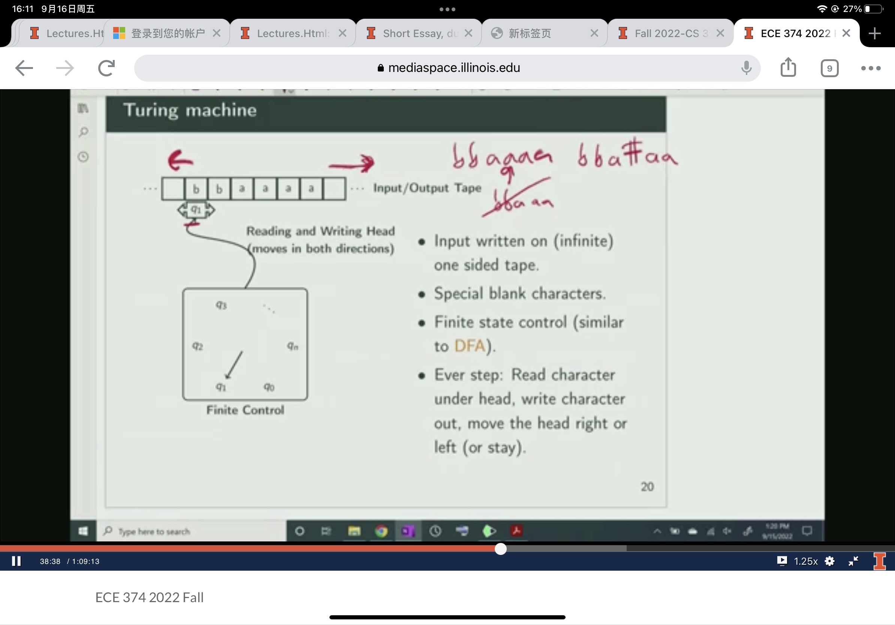

# CS 374

This course introduces three distinct fields of computer science research: **computational complexity**, **algorithms**, and **limits of computation**.

## Week 1

#### Definition

1. An algorithm is a step-by-step way to solve a problem. 

2. A problem is some questions that we’d like answered given some input. It should be a decision problem of the form ”Does a given input fulfill property X.” 
3. A Language is a set of strings. Given an alphabet, Σ a language is a subset of Σ$^*$. A language is a formal realization of this problem. 

#### Strings

An alphabet is a **finite** set of symbols.

A string over $\Sigma$ is a finite sequence of symbols over $\Sigma$. For integer $n \geq 0, \Sigma^n$ is set of all strings over $\Sigma$ of length $n$. $\Sigma^*$ is set of all strings over $\Sigma$.

##### Emptiness

$\epsilon$ is a string containing no symbols. It is not a set.  $\empty$ is a string of a empty set. Differ than, {$\epsilon$} or {$\empty$}

##### Concatenation and properties

We denote $xy$ or $x \cdot y$, **Concatenation** is defined recursively:

- $xy=y$ if $x = \epsilon$
- $xy = a(wy)$ if $x = aw$

Concatenation is associative: $(uv)w = u(vw)$, hence write $uvw \equiv(uv)w = u(vw)$

**Not** commutative: $uv$ not necessarily equal to $vu$.

The identity element is the empty string $\epsilon$:
$$
\epsilon u = u \epsilon  = u.
$$

#### Substrings, prefixes, Suffixes

$v$ is substring of $w$ $\iff$ there exist strings $x,y$ such that $w= xvy$.

- If $x = \epsilon$ then $v$ is a prefix of $w$
- If $y = \epsilon$ then $v$ is a suffix of $w$

If $w$ is a string, then $w$ n is defined inductively as follows:

- $w^n = \epsilon$ if $n =0$
- $w^n = ww^{n-1}$ if $n > 0$

#### Subsequence

A subsequence of a string w[1...n] is either a subsequence of w[2...n] or w[1] followed by a subsequence of w[2...n].

#### Language

  A language L is a set of strings over Σ. In other words L ⊆ Σ$^*$. In other words L ⊆ Σ$^*$. Standard set operations apply to languages.

Given two sets X and Y of strings (over some common alphabet Σ) the concatenation of X and Y is
$$
XY =\{xy \mid x \in X, y\in Y\}
$$
Note that $\Sigma^+=\cup_{n\ge1}\Sigma^n$.

 

#### Inductive proofs on Strings

The reverse $w^R$ of a string $w$ is defined as follows:

- $w^R = \epsilon$ if $w = \epsilon$
- $w^R = x^Ra$ if $w = ax$ for some $a \in \Sigma$ and string $x$

#### String Induction 

Here is the our current lemma

Here is the question;

##### Question 1:

Induction Hypothesis: Let w be any string. Assume there is x such that $|x| < |w|$ such that $|x| = |x^R|$

Base case: When $w = \epsilon$, we have $|w|= 0$. Also, $w^R = \epsilon$, then $|w^R| = 0 = |w|$.

Inductive step: Assume $w= ax$, for some string x and for some symbol a. We have
$$
|w| = |a\cdot x| = |a| + |x| \\
|w^R| = |x^R \cdot a| =|x^R|+ |a|
$$
Since we already know that $|x^R| = |x|$, we have
$$
|w^R| = |x^R \cdot a| =|x^R|+ |a| = |a| + |x| = |w|
$$
Therefore, we conclude that $|w| = |w^R|$.$\blacksquare$

##### Question 2:

Induction Hypothesis: Let w and z be any string. 

Base case: When $w=\epsilon$, we have 
$$
(w\cdot z)^R = (\epsilon \cdot z)^R = z^R = z^R \cdot \epsilon^R = z^R \cdot w^R
$$
Inductive step: Assume for some string $x$ and for some symbol a, $w = ax$ and $(x\cdot z)^R = z^R\cdot x^R$.

Then, we have
$$
(w\cdot z)^R = (ax \cdot z)^R = [a(x\cdot z)]^R
$$
Treat $x\cdot z$ as one string, we have
$$
(w\cdot z)^R =[a(x\cdot z)]^R = (x\cdot z)^R \cdot a = z^R \cdot x^R \cdot a = z^R \cdot (x^R \cdot a) = z^R \cdot w^R
$$
Then, we can conclude $(w\cdot z)^R = z^R \cdot w^R$.$\blacksquare$

##### Quesiton 3:

Induction Hypothesis: Let w be any string. Assume for some string x and some symbol a, w = ax that $(x^R)^R = x$.

Base case: When $w = \epsilon$, we have $w^R = \epsilon = \epsilon^R=(w^R)^R $.

Inductive step: Assume for some string x and some symbol a, w = ax that $(x^R)^R = x$.

We have
$$
(w^R)^R = (x^R\cdot a)^R = a^R \cdot (x^R)^R = a \cdot x = w
$$
Then, we can conclude $w = (w^R)^R$.$\blacksquare$

##### Question 4

$$
\#(a,w) = \left\{
\begin{array}{ll}
        0 & if \ w = \epsilon \\
        1 + \#(a,x) & if  \ w = bx \ \text{and} \ a = b \\
        \#(a,x)	& if  \ w = bx \ \text{and} \ a \neq b \\
    \end{array}
\right.
$$

### Regular Language

**Kleene’s Theorem**	A language is regular if and only if it can be obtained from finite languages by applying the three operations:

- Union
- Concatenation
- Repetition

a finite number of times.

##### Base Case

$\empty$ , $\{\epsilon\}$, and $\{a\}$is a regular language

##### Inductive step

If $L_1$, $L_2$ are  regular, then $L_1 \cup L_2$ is regular

If $L_1$, $L_2$ are  regular, then $L_1 L_2$ is regular

If $L$ is regular, then $L^* = \cup_{n \ge0} L^n$ is regular. The $^*$ operator name is **Kleene star**.

If $L$ is regular, then so is $\overline L = \Sigma^* \backslash L$

Regular languages are **closed** under **operations** of union, concatenation, and Kleene star.

Any language generated by a finite sequence of such operations is regular.

#### Regular Expression

Inductive case: If $r_1$ and $r_2$ are regular expressions denoting languages $R_1$ and $R_2$ respectively then,

- $(r_1+r_2)$ denotes the language $R_1 \cup R_2$
- $(r_1 \cdot r_2) = r_1 \cdot r_2 = (r_1r_2) $ denotes the language $R_1R_2$
- $(r_1)^*$ denotes the language $R^*_1$

##  Week 2

### DFAs

DFAs also called Finite State Machines, which have programs with fixed memory.

#### Graphical Representation

Directed graph with nodes representing states and edges representing transitions labeled by symbols in $\Sigma$.

For each state(vertex) $q$ and symbol $a\in \Sigma$ there is exactly one outgoing edge labeled by $a$.

Start state has a pointer

Some states with double circles labeled as accepting/final states.

#### Definition

A DFA $M$ accepts a string $w$ $iff$ the unique walk starting at the start state and spelling out $w$ ends in an accepting state.

##### Formal definition

A determiniistic finite automata(DFA) $M = (Q,\Sigma, \delta, s, A)$ is a five-tuple where 

- $Q$ is a finite set whose elements are called states.
- $\Sigma$ is a finite set called input alphabet
- $\delta : Q \times \Sigma \rarr Q $   is the transition function
- $s \in Q$ is the start state
- $A \sube Q$ is the set of accepting/final states

#### Constructing DFAs

The language $L(M)$ accepted by a DFA $M = (Q,\Sigma, \delta, s, A)$  is 
$$
\{w\in \Sigma^* | \delta^*(s,w)\in A\}.
$$

Languages accepted by DFAs are closed under complement.

### NFAs

#### Non-determinism in computing

**Informal definition:** An NFA $N$ accepts s string $w$ $\iff$ some accepting state is reached by $N$ from the state on input $w$

For NFAs transition function, we have

$\delta: Q \times\Sigma \cup\{\epsilon\} \rarr P(Q)$ is the transition function of NFA, where $P(Q)$ is the power set of $Q$.

###  RegExp-DFA-NFA Equivalence

Languages accepted by DFAs, NFAs, and regular expressions arethe same.

- DFAs are special cases of NFAs (easy)
- NFAs accept regular expressions (seen)
- DFAs accept languages accepted by NFAs (shortly)
- Regular expressions for languages accepted by DFAs (shown previously)

#### Regular Expression to NFA

Thompson’s algorithm: Given two NFAs $s$ and $t$,

#### Conversion of NFA to DFA

For every NFA $N$ there is a DFA $M$ such that $L(M ) = L(N )$.

- DFA knows only its current state.
- The state is the memory.
- To design a DFA, answer the question: What minimal info needed to solve problem.

NFA $N = (Q ,Σ,s ,δ,A).$ We create a DFA $D = (Q',Σ,δ',s',A')$ as follows:

### Proving non-regularity: Methods

#### Three methods

##### **Pumping lemma**

It is sometimes an easier proof technique to apply, but not as general as the fooling set technique.

##### **Closure**

Using existing non-regular language and regular languages to prove that some new languages is non-regular.

##### **Fooling sets**

A method of distinguishing suffixes. To prove that some new language is non-regular.

Number of regular languages is **countably infinite**; Number of languages is **uncountably infinite**

Example: $L = \{0^n1^n | n \ge 0\}$ is not regular. 

**Intuition:** any program to recognize L seems to require counting number of zero in input which cannot be done with fixed memory.

Proof by contradiction

Let L be a language. Define: strings $x$ and $y$ are distinguishable $\iff$ $\exist z, x z\in L \text{ and } y z\notin L$

Let $M = (Q,\epsilon, \delta, s, A)$. Notation $\triangledown x$ for a string $x$ is the state $\delta^* (s,x)$

**Lemma 1**  		if x and y are distinguishable for $L(M)$ then  $\triangledown x \neq \triangledown y$.

**Definition	**	Two states $p,q \in Q$ are equivalent if for all string $w \in \Sigma^*$ , we have that 
$$
\delta^*(p,w) \in A \iff  \delta^*(q,w) \in A
$$

**Definition**		Two states $p,q \in Q$ are distinguishable if there exists a sring $w \in \Sigma^*$ , such that 
$$
\delta^*(p,w) \in A \text{ and }  \delta^*(q,w) \notin A \\ \text{or}\\
\delta^*(p,w) \notin A \text{ and }  \delta^*(q,w) \in A
$$

#### Fooling Sets

##### Definition

For a language $L$ over $\Sigma$ a set of string $F$ (Could be infinite) is a fooling set or distinguishing set for $L$ if every two distinct strings $x,y \in F$ are distinguishable.

**Theorem**	Suppose $F$ is a fooling set for L. If $F$ is finite then there is no DFA $M$ that accepts $L$ with less than $|F|$ states.

 **Corollary**	If $L$ has an infinite fooling set $F$ then $L$ is not regular.

##### Closure Properties

We can use contradiction to prove non-regularity via closure properties. Here is a example:

$H = \{\text{bit strings with equal number of 0s and 1s}\}$

$H' = \{0^k1^k | k \ge 0\}$

Suppose $H$ is regular. Then since $L(0^*1^*)$ is regular, and regular languages are closed under intersection, $H'$ also would be regular. 
$$
H' = H \cap L(0^*1^*)
$$

But we know $H'$ is not regular, a contradiction. Therefore, $H$ is non-regular. 

**Example**: Prove: $L = \{ww^R|w\in \{0,1\}^*\}$ is non-regular

### Context-free Language and Grammars

Regular languages could be constructed using a finite number of 

- Unnoins
- Concatenations
- Repetitions

With context-free languages we have a much more powerful tool: Subsitution.

#### Formal Definition of CFGS

A CFG is a quadruple $G=(V,T,P,S)$ where is variables, terminals, productions, start var.

- $V$ is a finite set of **non-terminal (variable) symbols**

- $T$ is a finite set of **terminal symbols**(alphabet)

- $P$ is a finite set of **productions**, each of the form

  $A \rarr \alpha$ where $A \in V$ and $\alpha$ is a string in $(V\cup T)^*$ Formally, $P \sub V \times (V \cup T)^*$

- $S \in V$ is a start symbol

#### “Derives” relation

Let $G = (V,T,P,S)$ be a CFG. For strings $a_1,a_2 \in (V \cup T)^*$ we say $a_1$ **derives** $a_2$ denoted by $a_1 \leadsto_G a_2$  if there exist string $\beta,\gamma, \delta$ in $(V \cup T)^*$ such that

- $a_1 = \beta A \delta$
- $a_2$ = $\beta \gamma \delta$
- $A \rarr \gamma$ is in $P$

##### Definition

For integer $k \ge 0$, $a_1 \leadsto^k a_2$ inductive defined:

- $a_1 \leadsto^0 a_2$ if $a_1 = a_2$
- $a_1 \leadsto^k a_2$ if $a_1 \leadsto \beta_2 $ and $\beta_1 \leadsto^{k-1} a_2$.
- **Alternative definition:** $a_1 \leadsto ^k a_2$ if $a_1 \leadsto^{k-1} \beta_1$ and $\beta_1 \leadsto a_2$

$\leadsto^*$ is the reflexive and transitive closure of $\leadsto$.

$a_1 \leadsto^k a_2$ if $a_1 \leadsto^k a_2 $ for some $k$

#### Context Free Languages

The language generated by CFG $G = (V,T,P,S)$ is denoted by $L(G)$ where $L(G) = \{w\in T^*| S \leadsto^* w\} $

A language $L$ is context-free if it is generated by context-free grammar. That is, there is a CFG G such that $L = L (G)$

##### Lemma

For a regular language $L$, there us a context-free grammar(CFG) that generates it.

### Push-down automata

A non-deterministic push_down automata $P=(Q,\Sigma,\Gamma, \delta,s,A)$ is a six tuple where

- $Q$ is a finite set whose elements are called states,
- $\Sigma$ is a finite set called the input alphabet,
- $\Gamma$ is a finite set called the stack alphabet
- $\delta: Q \times \Sigma \cup \{\epsilon\} \times \Gamma \cup\{\epsilon\} \rarr P(Q \times (\Gamma \cup \{\epsilon\}))$ is the transition function
- $s$ is the start state
- $A$ is the set of accepting states.

Example:

We have $0,0 \rarr\$ $

The first 0 means that consume a 0, you can fire this iff the next symbol in your string is 0.

The second 0 means that the elements that will be crossing out.

The $ means that what we will write to stack.

#### Closure Properties of CFLs

$G_1= (V_1,T,P_1,S_1)$ and $G_2 = (V_2,T,P_2,S_2)$

**Theorem**	CFLs are closed under union. $L_1,L_2$ CFLs implies $L_1 \cup L_2$ is a CFL

**Theorem**	CFLs are closed under concatenation. $L_1,L_2$ CFLs implies $L_1 * L_2$ is a CFL

**Theorem**	CFLs are closed under Kleene star. If $L$ is a CFL $\Longrightarrow L^*$ is a CFL

**Theorem**	CFLs are not closed under intersection.

### Turing Machines

Language accepted by a Turing machine
$$
L(M) = \{x\in \Sigma | \text{on input $x,M$ reach $q_{acc}$ and halts }\}
$$
If $x\in L(M)$

- $M$ might reject $M$ by reaching $q_{red}$.
-  or $M$ might not halt at all, $M$ diverges on x.

#### Recursive vs. Recursively Enumberable

- Recursively enumerable language
  $$
  Re = \{L(M) | M \text{ is TM}\}
  $$

- Recursive

$$
DEC = \{L(M) | \text{$M$ some Turning machine that halts on all inputs}\}
$$

### RAM Model

This is the standard programming model that you are used in programming languages such as Java/C++. We have already seen the Turning Machine model.

#### Unit-Cost Ram Model

- Basic data type is an integer number
- Number in input fit in a word
- Arithmetic/comparison operation on words take constant time
- Arrays allow random access (A[i] cost contant time)
- Pointer based data structures via storing array indexes in a
  word

#### Algorithmic problem

An algorithmic problem is simply to compute a function $f:\Sigma^* \rightarrow\Sigma^* $ over string of a finite alphabet.

Algorithm $A$ solves $f$ if for all input strings $w$, A outputs $f (w )$.

We will broadly see three types of problems.

- Decision Problem: Is the inpit a YES or NO input?
- Search Problem: Find a **solution** if input is a YES input.
- Optimization Problem: Find a **best** solution among all solutions for the input.

##### Analysis

Given a problem $P$ and an algorithm $A$ for $P$ we want to know:

- Does $A$ correstly solve problem $P$?
- What is the asymptotic worst-case running time of $A$?
- What is the asymptotic worst-case space used by $A$?

Asymptotic running-time analysis: $A$ runs in $O(f(n))$ time if:

“for all $n$ and for all inputs $I$ of size $n$, $A$ on input $I$ terminates after $O(f(n))$ primitive steps”

#### Reduction

Reducing problem $A$ to problem $B$:

- Algorithm for $A$ uses algorithm for $B$ as a **black box**.

Example: Given an array $A$ of $n$ integers, are there any duplicaties in $A$?

Suppose problem A reduces to problem B

- Positive direction: Algorithm for B implies an algorithm for A
- Negative direction: Suppose there is no “efficient” algorithmfor A then it implies no efficient algorithm for B (technical condition for reduction time necessary for this)

#### Recursion

It is a special reduction.

- Recursion is a very powerful and fundamental technique
- Basis for several other methods
  - Divide and conquer
  - Dynamic programming
  - Enumeration and branch and bound etc
  - Some classes of greedy algorithms
- Makes proof of correctness easy (via induction)
- Recurrences arise in analysis

#### Binary Search

It can be used in sorted array, finding whether a given value exists in the array.

Analysis: $T(n) = T(\lfloor n/2 \rfloor) + O(1) \Longrightarrow T(n) = O(\log n)$ 

#### Quick Sort

The step of quick sort:

1. Prick a pivot element from array
2. Split array into 3 subarrays: those smller than pivot,, those lager than pivot, and pivot itself.
3. Recursibely sort the subarrays, and concatenate them.

For **step 2**, linear scan of array does it. Time is $O(n)$

##### Time analysis

Then, we have the time analysis: Let $k$ be the rank of the chosen pivot.
$$
T(n) = T(k-1) +O(n) +T(n-k)
$$
If $k=\lceil n/2 \rceil$, then
$$
T(n) = T(\lceil n/2 \rceil-1) +O(n)+T(\lfloor n/2 \rfloor) \Longrightarrow T(n) = O(n \log n)
$$
Typically, pivot is the first or last element of array. Then, 
$$
T(n) = \max_{1\le k \le n}(T(k-1)+T(n-k)+O(n))
$$
In the worst case $T(n) = T(n-1)+O(n)$, which means $T(n) = O(n^2)$. This happens if array is already sorted and pivot is always first element.

##### Selecting in Unsorted Lists

Since we know that the time cost of quick sort is vary depending on the selection of pivot element, we would like to choose the pivot that minimize the cost, or median. Then, we have the question: what is the cost of finding the median in the given array?

Of course, we will sort it than use the index to find the median. Then, it will cost $O(n\log n)$, which is expensive.

#### Quickselect

- Pick a pivot element $a$ from $A$

- Partition $A$ based on $a$. $A_{less} = \{x \in A | x \le a\}$ and $A_{greater} = \{x \in A | x >a\}$ 

  - $|A_{less}| = j$: returan a

  - $|A_{less}| > j$: recursively find $j$th smallest elemnt in $A_{less}$

  - $|A_{less}| < j$: recursively find $k$th smallest elemnt in $A_{greater}$

    where $k = j - |A_{less}|$

##### Time Anaylsis

It is $O(n^2)$. It is too exapensive, since the worest case of Quicksort is $O(n^2)$. Then, we need to find another way to solve this question. It seems that we do not need to find the exact median: as soon as we find the value of k which approach to median, we could improve the cost of time. But how?

#### Median of Medians

##### Divide and Conquer Apporach

The idea of Divide and Conquer Approach:

- Break input $A$ into may subarrays: $L_1, \dots, L_k$
- Find median $m_i$ in each subarray $L_i$
- Find the median $x$ of the medians $m_1, \dots, m_k$.
- Intuition: The median $x$ should be close to being a good median of all the numbers in $A$.
- Use $x$ as pivot in previous algorithm.

#### Meidan of Medians:

There are at least $3n/10$ elemnts smailler than the meidan of medians $b$. 

Then, we will have the running time of deterministic median selection: 
$$
T(n) \le T(\lceil n/5\rceil) + max\{T(|A_{less}|),T(||A_{greater})\} + O(n)
$$
Fom Lemma,
$$
T(n) \le T(\lceil n/5\rceil) + T(\lfloor 7n/10 \rfloor) + O(n)
$$
and
$$
T(n) = O(1) \qquad n< 10
$$

#### Multiplication Using Divide and Conquer

Assume $n$ is a power of 2 for simplicity and numbers are in decimal. Split each number into two numbers with equal number of digits.

-   $b=b_{n-1} b_{n-2}\dots b_0$ and $c=c_{n-1} c_{c-2}\dots c_0$ 
-   $b =b_{n-1} \dots b_{n/2}0 \dots 0+b_{n/2-1} \dots b_0$
-   $b(x) = b_Lx+b_R$, where $x = 10^{n/2}$, $b_L = b_{n-1}\dots b_{n/2}$ and $b_R = b_{n/2-1}\dots b_{0}$
-   Similarly $c(x) = c_Lx+c_R$, where $c_L = c_{n-1}\dots c_{n/2}$ and $c_R = c_{n/2-1}\dots c_{0}$

where $x = 10^2$

##### Time Analysis 

4 recursive multiplications of number of size $n/2$ each plus 4 additions and left shifts (adding enough 0’s to the right)
$$
T(n) = 4 T(n/2)+O(n) \qquad T(1) =O(1)
$$
$O(n^2)$ Not good enough

#### Karatsuba algorithm

The karatsuba algorithm is a fast multiplication algorithm. The basic idea is that
$$
ad + bc = (a+b)(c+d)-ac-bd
$$
It reduces the time of multiplication! Combine it with divide and conquer we have
$$
p(x) = ax+b \text{ and } q(x) = cx+d \Longrightarrow p(x) q(x) = acx^2+(ad+bc)x+bd
\\ p(x)q(x) = acx^2+[(a+b)(c+d)-ac-bd]x+bd
$$
We recursively compute only $ac, bd, (a+b)(c+d)$.

##### Time Analysis

$$
T(n) = 3T(n/2)+O(n)  \qquad T(1) = O(1)
$$

which means $T(n) = O(n^{\log_23}) = O(n^{1.585})$

### BackTracking

#### Longest Increasing Sub-sequence

### Recursion and Memorization

Dynamic Programming: Finding a recursion that can be effectively/efficiently memorized.

#### Explicit vs Implicit Memoization

Explicit memoization(on the way to iterative algorithm) preferred:

-   analyze problem ahead of time
-   allows for efficient memory allocation and access

Implicit (automatic) memoization:

-   problem structure or algorithm is not well understood
-   need to pay overhead of data-structure
-   functional languages automatically do memoization, usualy via hashing based dictionaries.

## Graph Theory

#### Directed Acyclic Graphs

A directed graph $G$ is a DAG if there is no directed cycle in $G$

-    A vertiex $u$ is a source if it is no in-coming edge
-   A vertex $u$ is  a sink if it has no out-going edges.

Every DAG $G$ has at least one source and at least one sink

Order or strict total order on a set $X$ is a binary relation $\prec$ on $X$, such that

-   Transitivity, $x \prec y$ and $y \prec x \Longrightarrow x \prec z$  
-   $x \prec y, y \prec x$ or $x= y$

#### Topological ordering

This algorithm will run $O(m+n)$ time.

A directed graph $G$ can be topologically ordered $\Longrightarrow$ $G$ is a DGA

#### DFS

