# CS 444

These are the required topics for this course. Finished assignments will be stored inside [CS-444.assets folder](./CS-444.assets).

| **Progress**   | **Topic**                                                    | **Assignments**                                              |
| -------------- | ------------------------------------------------------------ | ------------------------------------------------------------ |
| Finish reading | Convolutional networks: **[PPTX](https://slazebni.cs.illinois.edu/spring23/lec07_cnn.pptx)**, **[PDF](https://slazebni.cs.illinois.edu/spring23/lec07_cnn.pdf)** | **[Assignment 2](https://slazebni.cs.illinois.edu/spring23/assignment2.html)** |
| Done           | PyTorch tutorial                                             | **[Jupyter notebook](.//CS-444.assets/slazebni.cs.illinois.edu_spring23_pytorch_tutorial_cs444sp23.ipynb)** |
|                | Object detection: **[PPTX](https://slazebni.cs.illinois.edu/spring23/lec10_detection.pptx)**, **[PDF](https://slazebni.cs.illinois.edu/spring23/lec10_detection.pdf)** |                                                              |
|                | Dense prediction: **[PPTX](https://slazebni.cs.illinois.edu/spring23/lec11_dense.pptx)**, **[PDF](https://slazebni.cs.illinois.edu/spring23/lec11_dense.pdf)** | **[Assignment 3](https://slazebni.cs.illinois.edu/spring23/assignment3.html)** |

## Convolutional neural networks

#### Padding and Stride

**Padding:** Since we basically do the dot product for each patch that has the same since of the filter, this results in smaller output feature maps compared to the input. Thus, with no padding, we will get a output that has less dimension than the input. However, if we have the padding, we will extend the input matrix with given value so than we will get the feature than is near the edge.

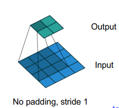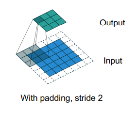

**Stride:** it is the step size or the number of pixels by which the convolutional kernel moves across the input during the convolution operation.

With padding, spatial resolution remains the same if stride of 1 is used, is reduced by factor of 1/s if stride of s is used

#### Elementwise nonlinearity

Elementwise nonlinearity is a mathematical operation applied independently to each element of a vector, matrix, or tensor. The primary purpose of applying elementwise nonlinearities in neural networks is to introduce nonlinearity into the model. It introduce the nonlinear function into the neural network so that it has the ability to learn and represent complex patterns and relationships

After we do the convolution for a image/data with K filter, it will always follow by the elementwise nonlinearity or “activation function”. The common Elementwise nonlinearity:

ReLU: $\max(0,x)$/ Leaky ReLU: $\max(0.1x, x)$ ELU: $x$ if $x\ge 0$ otherwise $a(e^x -1)$

#### Three-dimensional convolutions

When we have 3-D convolutions, we just add the dimension of the filter to fit the input.

And here is the example:

We have a $7 \times 7 \times 3$ input and a $3\times 3 \times 3$ filter.

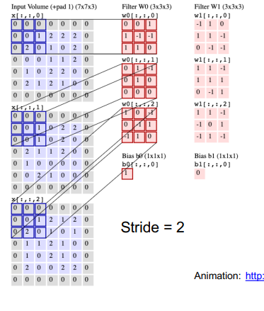

Assuming the input feature maps have spatial resolution $H×W$, how many operations are needed to compute the output feature volume?

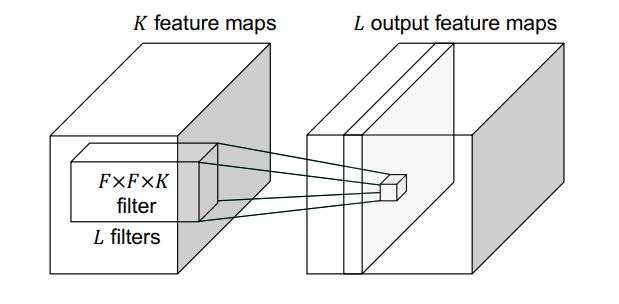

Note that we have $F \times F \times K$ filters. So for each data in $H \times W$, we have in total $F^2KHW$ operation needed for one ouput feature. We have $L$ filters, then $F^2KHWL$

#### 1x1 convolutional layer/ Depthwise convolutions

Mainly to reduce the number of weights and opeartion

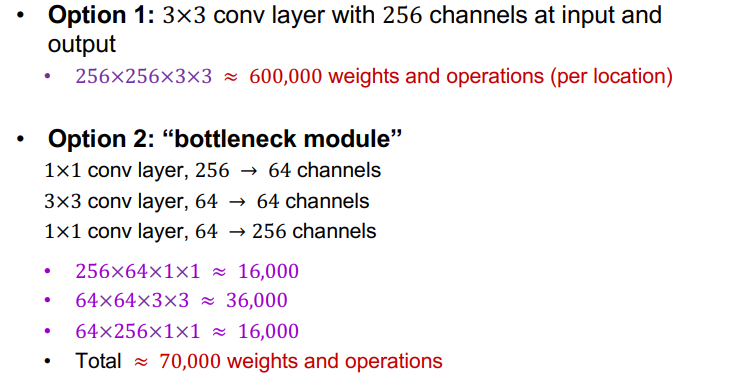

Not sure what’s happen here, but it do increase the speed of calculation when we use 1 by 1 layer.

#### More generally: Groupwise convolutions

Split up the K feature maps into G groups, perform convolutions within each group separately, concatenate the results

#### Convolutional layer: Backward pass

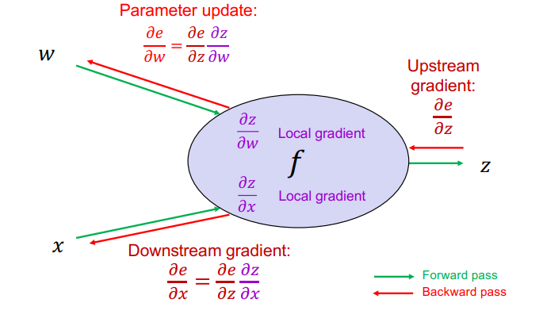

Then, for $x$, we have
$$
\frac{\partial e }{\partial x} = \frac{\partial e }{\partial z}\frac{\partial z }{\partial x}
$$
where we have $1\times n$ given by $1 \times n \cdot n \times n$. With respect to $x$,  we have $\frac{\partial e }{\partial x^i} = \sum _{j=1}^N\frac{\partial e }{\partial z^j}\frac{\partial z^j }{\partial x^i}$

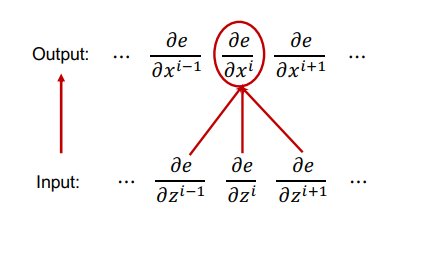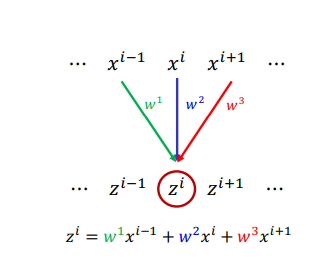

Given by the example, we have
$$
\frac{\partial e }{\partial x^i} = \sum _{j=1}^N\frac{\partial e }{\partial z^j}\frac{\partial z^j }{\partial x^i} = \frac{\partial e }{\partial z^{i-1}}\frac{\partial z^{i-1} }{\partial x^i} + \frac{\partial e }{\partial z^i}\frac{\partial z^{i} }{\partial x^i} + \frac{\partial e }{\partial z^{i+1}}\frac{\partial z^{i+1} }{\partial x^i} \\= w^1\frac{\partial z^{i-1} }{\partial x^i} +w^2\frac{\partial z^{i} }{\partial x^i} + w^3\frac{\partial z^{i+1} }{\partial x^i}
$$
This is called a **transposed convolution**

And, for $w$, we have
$$
\frac{\partial e }{\partial w} = \frac{\partial e }{\partial z}\frac{\partial z }{\partial w}
$$
Given by the example, we have
$$
\frac{\partial e }{\partial w^1} = \sum_i\frac{\partial e }{\partial z_i}\frac{\partial z_i }{\partial w_1} = \sum_i\frac{\partial e }{\partial z_i}x^{i-1}
$$
Similar for $w^2,w^3$.

#### Max pooling layer

A Max Pooling layer is a common layer used for down-sampling and reducing the spatial dimensions of feature maps. It helps in reducing computational complexity, controlling overfitting, and capturing the most important features from the input data.

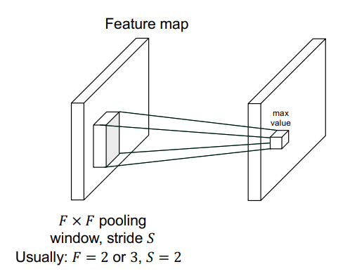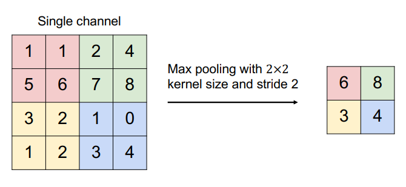

Note that in Backward pass: upstream gradient is passed back only to the unit with max value

#### Receptive field

The receptive field of a unit is the region of the input feature map whose values contribute to the response of that unit (either in the previous layer or in the initial image) 

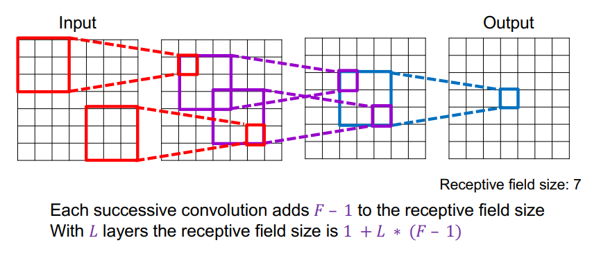

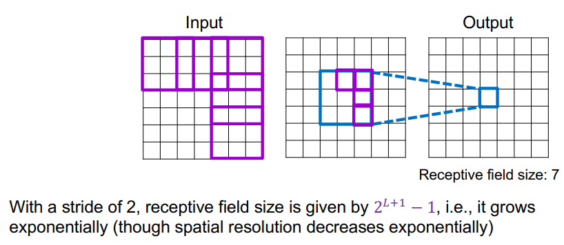

## PyTorch Tutorial

### PyTorch Tensors

Just like `Numpy` arrays

```python
x = torch.rand(5, 3) 
x = torch.zeros(5, 3, dtype=torch.long)
x = torch.tensor([1, 2, 3])
x.dtype
x = x.new_ones(5, 3) # will return the same type and device
```

A `torch.device` is an object representing the device on which a torch.Tensor is or will be allocated.

```python
x = torch.randn_like(x, dtype=torch.float)  
```

Operations on tensors just like `Numpy`

```python
x = torch.ones(5, 3)
y = torch.ones(5, 3)
print("x + y:", x + y)
print("torch.add(x, y):", torch.add(x, y))
print("x:", x)
y.add_(x) # directly affect y
print(y)

x = torch.randn(5, 3, 2)
print(x.shape)
print(x.permute(1,2,0).shape) # change the shape of the torch

a = torch.ones(3, 3, dtype=torch.double)
print(a)
b = a.long()
print(b.type())
c = a.int()
print(c) # change the type and casting
```

#### Broadcasting Semantics

Two tensors are broadcastable if

- both tensor have at least one dimension
- When iterating, the dimension sizes must either be **equal**, **one of them is 1**, or **one of them don’t exist**

Here are the example from [this link](https://pytorch.org/docs/stable/notes/broadcasting.html)

```python
x=torch.empty(5,7,3)
y=torch.empty(5,7,3)
# same shapes are always broadcastable (i.e. the above rules always hold)

x=torch.empty((0,))
y=torch.empty(2,2)
# x and y are not broadcastable, because x does not have at least 1 dimension

# can line up trailing dimensions
x=torch.empty(5,3,4,1)
y=torch.empty(  3,1,1)
# x and y are broadcastable.
# 1st trailing dimension: both have size 1
# 2nd trailing dimension: y has size 1
# 3rd trailing dimension: x size == y size
# 4th trailing dimension: y dimension doesn't exist

# but:
x=torch.empty(5,2,4,1)
y=torch.empty(  3,1,1)
# x and y are not broadcastable, because in the 3rd trailing dimension 2 != 3
```

If two tensors $x,y$ are broadcastable, then the result size of the tensor will be calculated as follows

- if the number of dimensions of `x` and `y` are not equal, perpend 1 to the dimension of fewer-dimension tensor.
- Then, for each dimension size, the resulting dimension size is`max(x-dim,y-dim)` (along that dimension)

```python
x=torch.empty(5,3,4,1)
y=torch.empty(3,1,1)
(x.add_(y)).size()
torch.Size([5, 3, 4, 1])

# but:
x=torch.empty(1,3,1)
y=torch.empty(3,1,7)
(x.add_(y)).size()

# RuntimeError: The expanded size of the tensor (1) must match the existing size (7) at non-singleton dimension 2.
```

#### **More useful PyTorch Tensor operations**

`.view()` function can resize/reshape tensors

```python
x = torch.randn(4, 4)
y = x.view(16)
z = x.view(-1, 8)  # the size -1 is inferred from other dimensions
print(x.size(), y.size(), z.size())
```

`.item()` give a python number

 `torch.cat()` concatenating two matrices together

```python
x = torch.ones(5, 3)
y = torch.zeros(5, 2)
print(torch.cat([x, y], dim=1))
# wrong:
# print(torch.cat([x, y], dim=0))
```

####  Numpy arrays $\Longleftrightarrow$ PyTorch Tensors

Note: both arrays will share the same address/location. Changing one of them will change both.

 ```python
 a = torch.ones(5)
 b = a.numpy()
 a.add_(1) # change both
 
 a = np.ones(5)
 b = torch.from_numpy(a)
 np.add(a, 1, out=a) # change both
 ```

#### CUDA Tensors (on GPU)

PyTorch tensors have the added benefit that they can easily be placed on a GPU to speed up computations.

If CUDA is available, these is the Query information about the GPU,

```python
if torch.cuda.is_available():
    !nvidia-smi
```

`torch.device` use to move tensors to and from the GPU

```PYTHON
if torch.cuda.is_available():
    device = torch.device("cuda")          # a CUDA device object
    y = torch.ones_like(x, device=device)  # directly create a tensor on GPU
    x = x.to(device)                       # or just use strings `.to("cuda")`
    z = x + y
    print(z)
    print(z.to("cpu", torch.double))       # `.to` can also change dtype
```

`torch.cuda.set_device(device)` set the default device

### Autograd: Automatic Differentiation

It provides automatic differentiation for all operations on Tensors. 

Set `requires_grad ` as True to keep track of operations for automatic differentiation. `.backward()` will return all the gradients computed automatically. `.grad` will accumulate all the gradient for the tensor. To stop, use `.detach()`.

`Function` is a class that use for autograd implementation. Tensor and Function are interconnected, build an acyclic graph that encodes the history of computation. Tensor has `.grad_fn` that references a Function that has created the Tensor.

`.backward()` compute the derivatives on a Tensor.

```python
x = torch.ones(2, 2, requires_grad=True) # no .grad_fn since we create it
y = x + 2	# has .grad_fn
z = y * y * 3	# has .grad_fn
out = z.mean()	# has .grad_fn
```

`.requires_grad_()` changes the existing Tensor’s `requires_grad` flag. Default: false

#### Gradients

```python
out.backward() # same as out.backward(torch.tensor(1))
print(x.grad) # give a matrix of 4.5
```

Using `with torch.no_grad()` to stop from tracking history

```
print(x.requires_grad)
print((x ** 2).requires_grad)

with torch.no_grad():
	print((x ** 2).requires_grad)
```

### Neural Networks

An `nn.Module` contains layers, and a method `forward(input)` that returns the `output`.

A typical training procedure for a neural network is as follows:

- Define the neural network that has some learnable parameters (or
  weights)
- Iterate over a dataset of inputs
- Process input through the network
- Compute the loss (how far is the output from being correct)
- Propagate gradients back into the network’s parameters
- Update the weights of the network, typically using a simple update rule: `weight = weight - learning_rate * gradient`

#### Define the network

Whenever you extend the `nn.Module` class (e.g. with the `Net` class below) you will need to call the superclass constructor or an error will be thrown. In this example below this line is: `super().__init__()` 

```python
import torch
import torch.nn as nn
import torch.nn.functional as F


class Net(nn.Module):

    def __init__(self):
        super().__init__()
        # 1 input image channel, 6 output channels, 5x5 convolution kernel
        self.conv1 = nn.Conv2d(1, 6, 5)
        self.conv2 = nn.Conv2d(6, 16, 5)
        # Affine operation: y = Wx + b
        self.fc1 = nn.Linear(16 * 5 * 5, 120)
        self.fc2 = nn.Linear(120, 84)
        self.fc3 = nn.Linear(84, 10)

    def forward(self, x):
        # Max pooling over a (2, 2) window
        x = F.max_pool2d(F.relu(self.conv1(x)), 2)
        x = F.max_pool2d(F.relu(self.conv2(x)), 2)
        x = x.flatten(start_dim=1)
        x = F.relu(self.fc1(x))
        x = F.relu(self.fc2(x))
        x = self.fc3(x)
        return x


net = Net()
print(net)
```

Once we define `forward()` function, `backward()` function will automatically defined.

The learnable parameters of a model are returned by `net.parameters()`

```python
params = list(net.parameters())
print(len(params))
print(params[0].size())  # conv1's .weight

input = torch.randn(1, 1, 32, 32)
out = net(input)	#tyring 32 by 32 input
```

- Zero the gradient buffers of all parameters
- To calculate the gradient of all the parameters that used to compute `out` w.r.t. some random value

```python
net.zero_grad()  # important, since gradient is accumulated
out.backward(torch.randn(1, 10))
```

`nn.Sequential` model can be helpful to define blocks succinctly or avoid creating a new `nn.module` class for a small network. The `.forward()` function will be automatically defined by running modules in the order they are passed in to `nn.Sequential`. 

```python
conv_layers = nn.Sequential(
                nn.Conv2d(1, 6, 5),
                nn.ReLU(),
                nn.Conv2d(6, 16, 5),
                nn.ReLU()
            )
```

#### Loss Function

A loss function takes the (output, target) pair of inputs, and computes a value that estimates how far away the output is from the target.

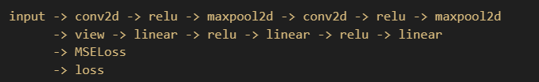

```python
output = net(input)
target = torch.randn(10)  # a dummy target, for example
target = target.view(1, -1)  # make it the same shape as output
criterion = nn.MSELoss()

loss = criterion(output, target)
print(loss)

print(loss.grad_fn)  # MSELoss
print(loss.grad_fn.next_functions[0][0])  # Linear
print(loss.grad_fn.next_functions[0][0].next_functions[1][0])  # ReLU
```

#### Backprop

To backpropagate the error all we have to do is call `loss.backward()`. You need to clear the existing gradients though, otherwise the gradients will be accumulated to existing gradients.

```python
net.zero_grad()  # zeroes the gradient buffers of all parameters

print('conv1.bias.grad before backward')
print(net.conv1.bias.grad)

loss.backward()

print('conv1.bias.grad after backward')
print(net.conv1.bias.grad)
```

#### Update the weights

PyTorch has a small package: `torch.optim` that implements all these methods. Using it is very simple:

```python
import torch.optim as optim

# Create your optimizer
optimizer = optim.SGD(net.parameters(), lr=0.01)

# In your training loop:
optimizer.zero_grad()             # zero the gradient buffers
output = net(input)               # compute the forward pass
loss = criterion(output, target)  # compute the loss
loss.backward()                   # compute the gradients
optimizer.step()                  # update the parameters

print(loss)
```

### Training a Classifer

Given the image, text, audio, or video data, we can firstly covert the data into a Numpy array and convert the array into a `torch.*Tensor`

**Already go through the tutorial** and keep the `net` file but delete the dataset.

#### Checklist for common PyTorch mistakes

Did you set `shuffle=True` in your train dataloader?

Did you properly set `net.train()` and `net.eval()` in your training and evaluation code?

Did you call `zero_grad()` in your training loop before `.backward()` to prevent gradients from accumulating?

#### Other tips

Have you visualized your loaded images? This is the best way to catch data loader issues.

If you are getting a CUDA out of memory error, first try decreasing the batch size. If you are still getting the same error, your network may simply be too large, or you could be accidentally allocating a large array in memory.

Getting CUDA errors that are hard to understand? Sometimes error messages will be simpler if you switch your network to cpu memory to debug the forward and backward passes. 

#### **More Tensor operations**

The `torch.einsum` function offers a compact way to express various matrix transformations and products. Many of common matrix and vector computations can be easily expressed elegantly with a call to this function. 

```python
x = torch.arange(6).reshape(2, 3)
print('x: ', x)

# matrix transpose
out = torch.einsum('ij->ji', [x])
print(out)

# sum all the rows in a matrix
out = torch.einsum('ij->i', [x])
print(out)

# sum all the values in a matrix
out = torch.einsum('ij->', [x])
print(out)
```

Operations on two matrices:

```python
x = torch.arange(9).reshape(3, 3)
y = torch.arange(9).reshape(3, 3)
print('x: ', x)
print('y: ', y)

# element-wise multiplication
out = torch.einsum('ij,ij->ij', [x, y])
print(out)

# matrix multiplication
out = torch.einsum('ik,kj->ij', [x, y])
print(out)
```

## Object Detection

### Task definition and evaluation

#### Evaluation

During the test, we predict bounding boxes, class labels , and confidence scores. And For each detection, we check whether it is a true or false positive. For multiple detections of the same ground truth box, only one is considered a true positive

PASCAL criterion: Area(GT $\cap$ Det) / Area (GT $\cup$ Det) > 0.5

It means that the overlap of the GT box and detection box divided by the union of them should greater than 0.5.

For each class, sort detections from highest to lowest confidence, plot **Recall-Precision curve** and compute **Average Precision** (area under the curve).

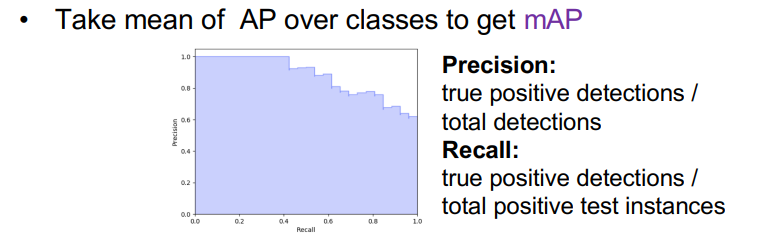

### Two-stage detectors

#### R-CNN: Region Proposals + CNN features

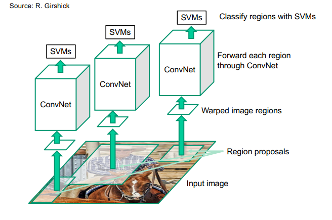

#### Pros and Cons

Pros:

- More accurate than previous approaches
- any deep architecture can immediately be plugged in

Cons:

- Not a single end-to-end system
  - Fine-Tune network with softmax classifier (log loss)
  - Train post-hoc linear SVMs (hinge loss)
  - Train post-hoc bounding-box regressions (least squares)
- traning is slow
- detection is slow 

#### Fast R-CNN

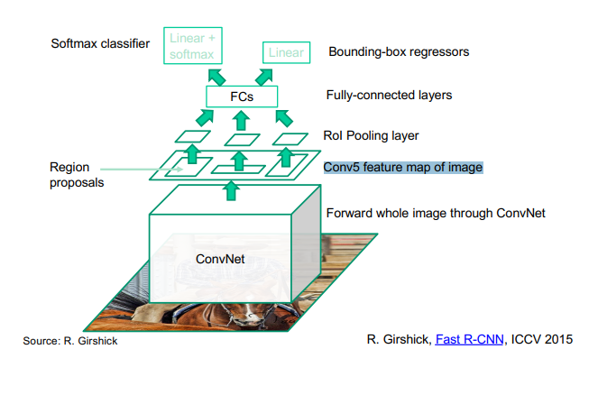

#### Rol Pooling

“Crop and resample” a fixed-size feature representing a region of interest out of the outputs of the last conv layer

For each Rol pooling, network predicts probabilities for $C+1$ classes where $C_0$ is background and four bounding box offsets for $C$ classes 

#### Muti-task Loss

Loss for ground truth class $y$, predicted class probabilities $P(y)$, ground truth box $b$, and predicted box $\hat b$:
$$
L(y, P,b,\hat b) = -\log P(y) + \lambda1[y \ge 1] L_{reg}(b,\hat b)
$$
Regression loss: smooth $L_1$ loss on top of log space offsets relative to proposal
$$
L_{reg} (b,\hat b) = \sum_{i = \set{x,y,w,h}} \text{smooth}_{L_1}(b_i - \hat b_i)
$$
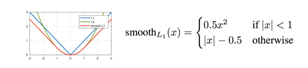


#### ROI pooling: Backpropagation

Similar to max pooling, but has to take into account overlap of pooling regions

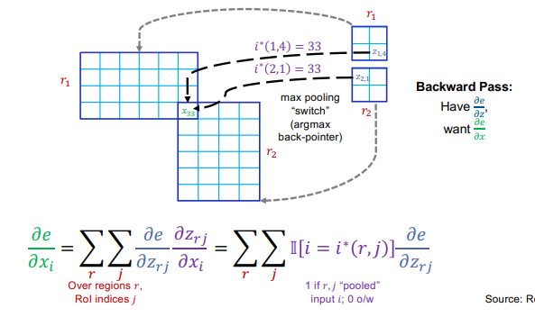

#### Faster R-CNN

##### Region proposal network (RPN)

Idea: put an “anchor box” of fixed size over each position in the feature map and try to predict whether this box is likely to contain an object

have anchor boxes with multiple scales and ratios to handle a wider range of object size and shapes

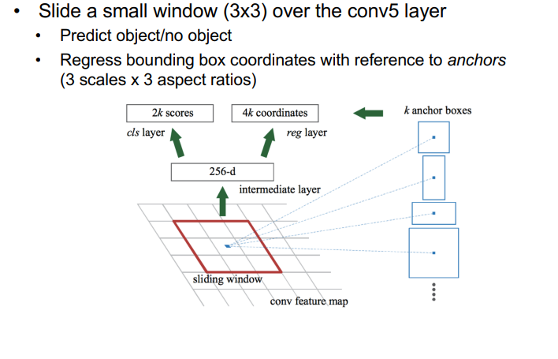

### Single-stage and multi-resolution detectors

#### Streamlined detection architectures

The Faster R-CNN has a series of steps which separates proposal generation and region classification. 

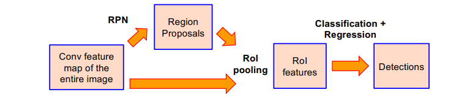

#### YOLO

Divide the image into a coarse grid and directly predict class label and a few candidate boxes for each grid cell

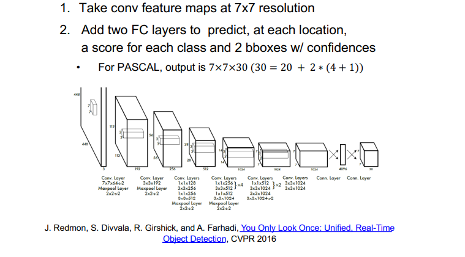

`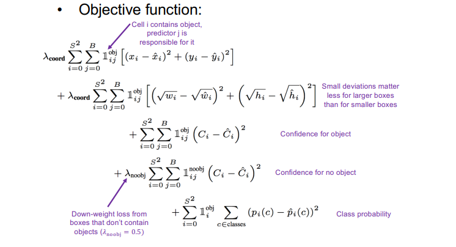

- Each grid cell predicts only two boxes and can only have one class – this limits the number of nearby objects that can be predicted
- Localization accuracy suffers compared to Fast(er) R-CNN due to coarser features, errors on small boxes
- 7x speedup over Faster R-CNN

#### YOLO v2

- Compared to YOLO, it remove FC layer, do convolutional prediction with anchor boxes instead,
- Increase resolution of input images and conv feature maps
- Improve accuracy using batch normalization and other tricks

#### Multi-Resolution Prediction: SSD

- Predict boxes of different size from different conv maps 
- Each level of resolution has its own predictor

#### Feature pyramid networks

- Improve predictive power of lower-level feature maps by adding contextual information from higher-level feature maps 
- Predict different sizes of bounding boxes from different levels of the pyramid (but share parameters of predictors)

#### RetinaNet

Combine feature pyramid network with focal loss to reduce the standard cross-entropy loss for well-classified examples

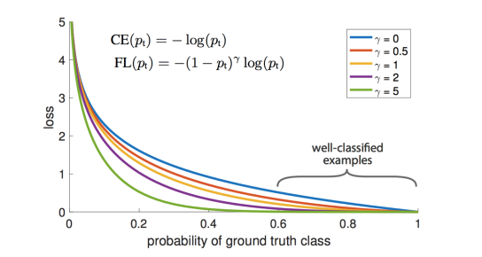

### Recent trends
