# CS 445 - Computational Photography

## linear filtering

The most widely used type of neighborhood operator is a linear filter, where an output pixel’s value is a weighted sum of pixel values within a small neighborhood N
$$
g(i,j) = \sum_{k,l} f(i+k,j+l)h(k,l)
$$
The entries in the weight kernel or mask h(k, l) are often called the filter coefficients. The correlation operator can be notated as
$$
g =  f \otimes h
$$
A common variant on this formula is
$$
g(i,j) = \sum_{k,l} f(i-k,j-l)h(k,l)
$$
where the sign of the offsets in f has been reversed, This is called the convolution operator
$$
g = f* h
$$
Both correlation and convolution are linear shift-invariant (LSI) operators, which obey both the superposition principle,
$$
h \circ(f_0+f_1) = h \circ f_0+ h \circ f_1
$$
and the shift invariance principle,
$$
g(i,j) = f(i+k,j+l) \iff (h \circ g) (i,j) =(h \circ f)(i+k,j+l)
$$
The correlation will produce a result that is smaller than the original image. There are some ways to "compensate" the missing pixels:

- zero: set all pixels outside the source image to 0 (a good choice for alpha-matted cutout images);
- constant (border color): set all pixels outside the source image to a specified border value; 
- clamp (replicate or clamp to edge): repeat edge pixels indefinitely; 
- (cyclic) wrap (repeat or tile): loop “around” the image in a “toroidal” configuration;
-  mirror: reflect pixels across the image edge
- extend: extend the signal by subtracting the mirrored version of the signal from the edge pixel value

####  Separable filtering

The idea of "Separable filtering" is to reduce the time of process by separate the filter into 2 perpendicular 1-D vectors. Normally, we will SVD to find the vectors. The time will become O(M+N) instead of O(M*N).

## Thinking in Frequency

#### Fourier Transform

Fourier transform stores the magnitude and phase at each frequency

- Magnitude encodes how much signal there is at a particular frequency
- Phase encodes spatial information
- For mathematical convenience, this is often notated in terms of complex numbers

$$
Amplitude: A =\pm \sqrt{R(\omega)^2 + I(\omega)^2}  \\
Phase : \phi = \tan^{-1} \frac{I(\omega)}{R(\omega)}\\
Euler's formula: e^{inx} = \cos(nx) +i \sin(nx)
$$

#### The Convolution Theorem

The Fourier transform of the convolution of two functions is the product of their Fourier transforms

The inverse Fourier transform of the product pf two Fourier transforms is the convolution of the two inverse Fourier transforms.

Convolution in spatial domain is equivalent to multiplication in frequency domain.

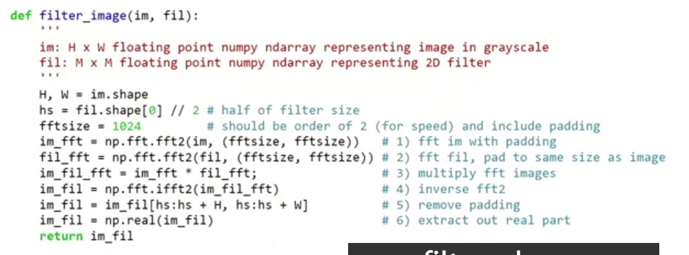

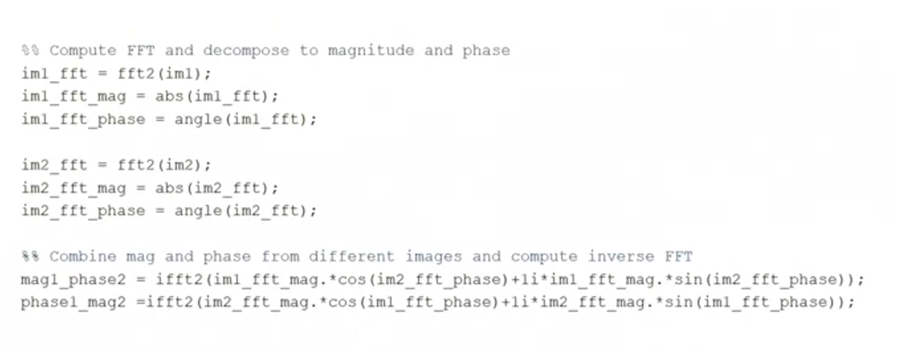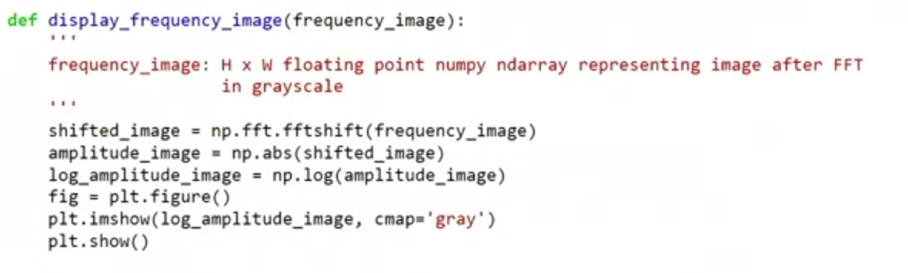

## Color Balancing

#### Color balancing via linear adjustment

Simple idea: multiply R,G, and B values by separate constants

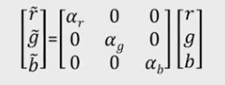

Note: better for gray picture than RGB picture

#### Global Operator

$$
L_{display} = \frac{L_{world}}{1+L_{world}}
$$

#### Point processing

we can use log function or gamma adjustment to apply the function to all the point.

## Histogram Equalization

Basic idea: reassign values so that the number of pixels with each value is more evenly distributed

Histogram: a count of how many pixels have each value
$$
h_i = \sum_j 1(p_j == 1)
$$
Cumulative histogram: count of number of pixels less than or equal to each value

Goal: Given image with pixel values $0 ≤ p_j ≤ 255, 𝑗 = 0. . 𝑁$ specify function $f(𝑖)$ that remaps pixel values, so that the new values are more broadly distributed.

1. Compute cumulative histogram: $c(i), i = 0..255$
   $$
   h(i) = \sum_j 1(p_j == i), c(i) =c(i-1) +h(i)
   $$

2. $f(i) = \alpha \cdot \frac{c(i)}{N} \cdot 255 + (1-\alpha) \cdot i$ where $i$ is the intensity of the pixels

– Blends between original image and image with equalized histogram

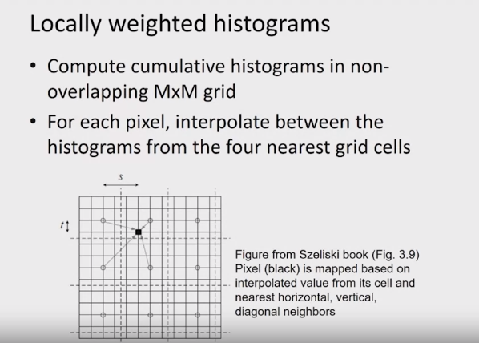

## Texture Synthesis

#### Details

How to match patches? Gaussian-weighted SSD (more emphasis on nearby pixels)

What order to fill in new pixels?

- “Onion skin” order: pixels with most neighbors are synthesized first
- To synthesize from scratch, start with a randomly selected small patch from the source texture

How big should the patches be?

#### Algorithm

While image not filled

1. Get unfilled pixels with filled neighbors, sorted by number of filled neighbors

2. For each pixel, get top N matches based on visible neighbors

   Patch Distance: Gaussian-weighted SSD

3. Randomly select one of the matches and copy pixel from it

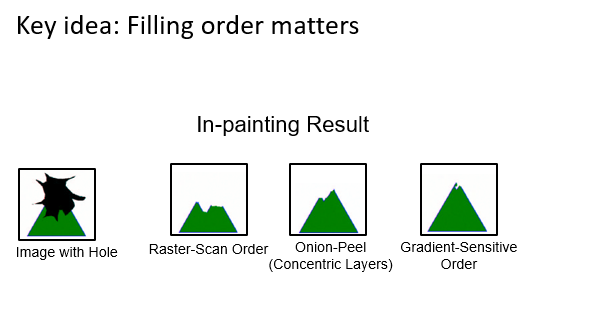

 Fill a pixel that:

1. Is surrounded by other known pixels 

2. Is a continuation of a strong gradient or edge

### Image Quilting

**Idea:** **unit of synthesis = block**

​	Exactly the same but now we want P(**B**|N(**B**))

​	Much faster: synthesize all pixels in a block at once

Using the block, we will have the seam between the block and block. We have minimal error boundary cut to solve this problem.

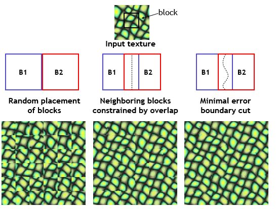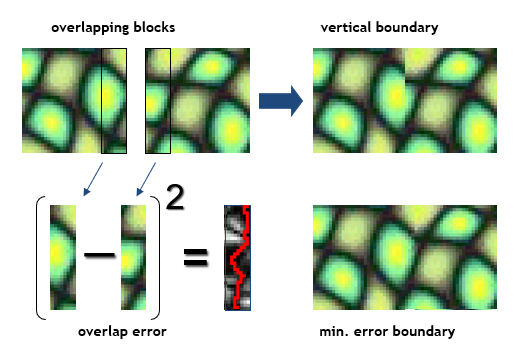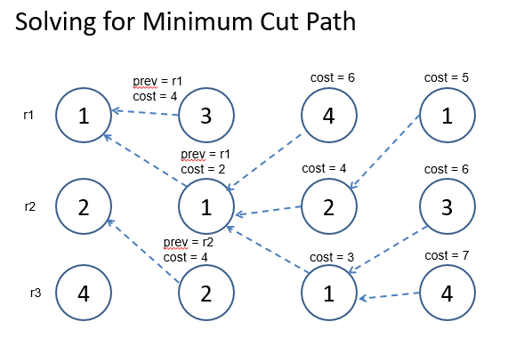

### Texture Transfer

Same as texture synthesis, except an additional constraint:

1. Consistency of texture 

2. Patches from texture should correspond to patches from constraint in some way. Typical example: blur luminance, use SSD for distance

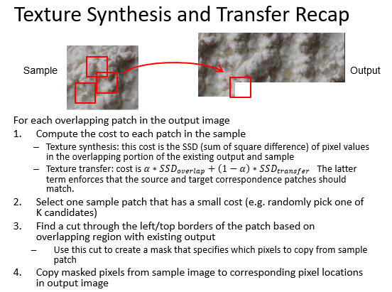

#### PatchMatch

More efficient search:

1. Randomly initialize matches

2. See if neighbor’s offsets are better

3. Randomly search a local window for better matches

4. Repeat 3, 4 across image several times

#### Image analogies

- Define a similarity between A and B
- For each patch in B:
  - Find a matching patch in A, whose corresponding A’ also fits in well with existing patches in B’
  - Copy the patch in A’ to B’
- Algorithm is done iteratively, coarse-to-fine

Here are some interesting, related paper: [Image-to-Image Translation with Conditional Adversarial Nets](https://phillipi.github.io/pix2pix/), [Unpaired Image-to-Image Translation using Cycle-Consistent Adversarial](https://junyanz.github.io/CycleGAN/)

## Cutting: Intelligent Scissors and Graph Cuts

**What makes a good region？**

- Contains small range of color/texture 
- Looks different than background 
- Compact

**What makes a good boundary?**

1. High gradient along boundary: high discrepancy
2. Gradient in right direction
3. Smooth

### Intelligent Scissors

A good image boundary has a short path through the graph. And we need to find the good boundary between seed points

- Minimize interaction time
- Define what makes a good boundary
- Efficiently find it

#### Method 

1. Define boundary cost between neighboring pixels 

   - Lower if edge is present
   - lower if gradient is strong
   - lower if gradient is in direction of boundary

2. User specifies a starting point (seed) 

   - Snapping

3. Compute lowest cost from seed to each other pixel

   - Dijkstra's shortest path algorithm 

   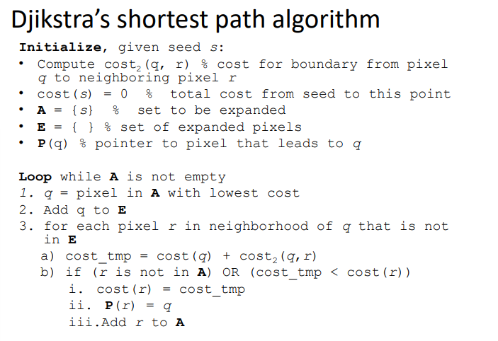

4.  Get path from seed to cursor, choose new seed, repeat

#### improving interaction 

1. Snap when placing first seed 
2. Automatically adjust to boundary as user drags 
3. Freeze stable boundary points to make new seeds

### GrabCut

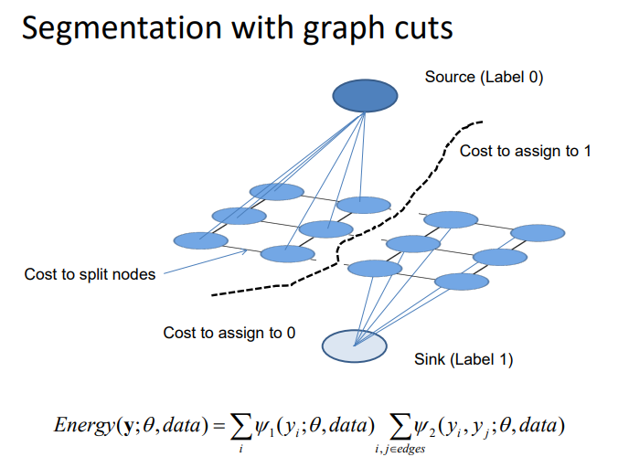

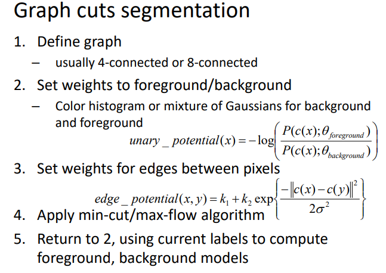

#### Limitations of Graph Cuts

-  Requires associative graphs
  - Connected nodes should prefer to have the same label 
- Is optimal only for binary problems

#### Other Applications

**Seam Carving**: Find shortest path from top to bottom (or left to right), where cost = gradient magnitude

**Stitching:** Ideal boundary: 1. Similar color in both images 2. High gradient in both images

#### Summary of big ideas

-  Treat image as a graph 
  - Pixels are nodes
  - Between-pixel edge weights based on gradients
  - Sometimes per-pixel weights for affinity to foreground/background
- Good boundaries are a short path through the graph (Intelligent Scissors, Seam Carving)
- Good regions are produced by a low-cost cut (GrabCuts, Graph Cut Stitching)

## Pasting: Compositing and Blending

Three ways:

#### Cut the Paste

- Small segmentation errors noticeable
- Pixels are too blocky
- Won’t work for semi-transparent materials

##### Feathering

Near object boundary pixel values come partly from foreground and partly from background

##### Alpha compositing

We have Output = foreground * mask + background (1- mask)

#### Laplacian Pyramid Blending

Implementation:

1. Build laplacian pyramids for each image

2. Build a Gaussian pyramid of region mask

3. Blend each level of pyramid using region mask from the same level
   $$
   L^i_{12} = L^i_1 \cdot R^i + L^i_2 \cdot(1-R^i)
   $$
   
4. Collapse the pyramid to get the final blended image

#### Poisson Blending

A good blend should preserve gradients of source region without changing the background.

Treat pixels as variabes to be solved

- Minimize squared difference between gradients pf foreground region and gradients of target region
- Keep background pixels constant

##### Gradient-domain editing

Creation of image = least squares problem in terms of

1. pixel intensities 
2. differences of pixel intensities

$$
v = \arg \min _{v} \sum _{i \in S, j \in N \cap \not S}((v_i-v_j)-(s_i - s_j))^2 +\sum _{i \in S, j \in N \cap \not S}((v_i-t_j)-(s_i - s_j))^2
$$

The first constrain say that the target image should have the same difference of intensities in source image between neighbor pixel. The second means the target image should have the same difference of intensities in the source image between the pixels in the modified region and the one outside the region.

# Image Transformations

 Image filtering: change range of image

Image warping: change domain of image 
$$
p' = T(p)
$$

$T$ is global: is the same for any point $p$ and can be described by just a few numbers

##### Scaling

- *Scaling* a coordinate means multiplying each of its components by a scalar

- *Uniform scaling* means this scalar is the same for all components
- *Non-uniform scaling*: different scalars per component

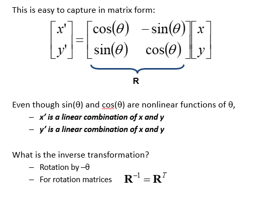

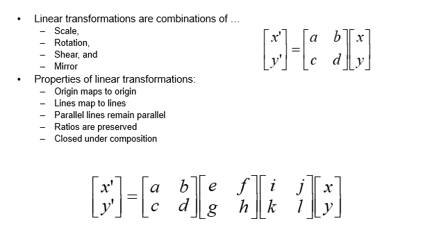

#### Homogeneous Coordinates

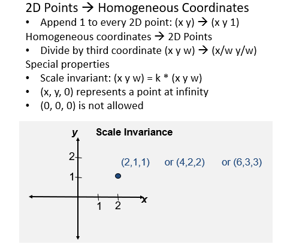

#### Affine Transformations

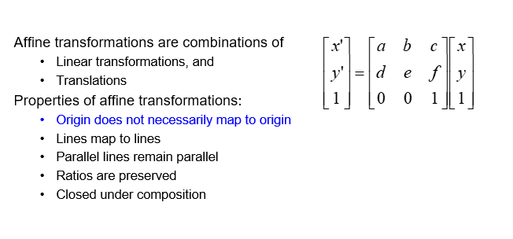

#### Projective Transformations

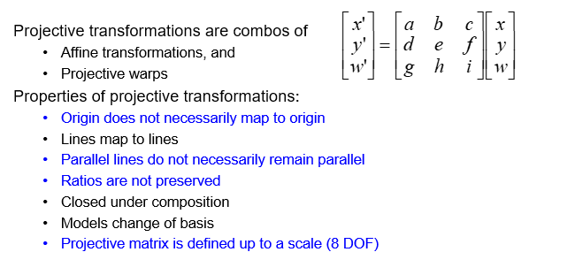

#### Overall

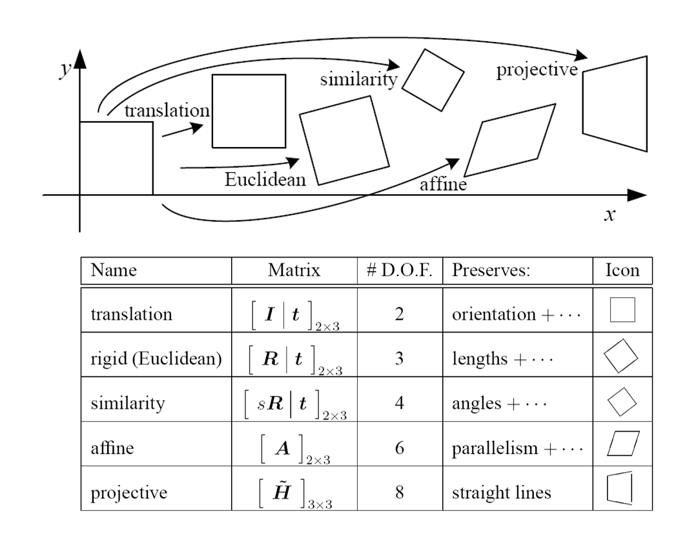

#### Calibrating the Camera

Method 1: Use an object (calibration grid) with known geometry

- Corresponding image points to 3d points
- Get lest squares solution (or non-linear solution)

Method 2:  Using vanishing points

- Find vanishing points corresponding to orthogonal directions

### How can we measure the size of 3D objects from an image?

#### Measuring height without a giant ruler

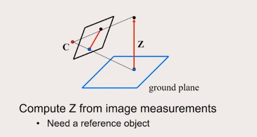

#### The Cross Ratio

A Projective Invariant

Something that does not change under projective transformations (including perspective projection)

The cross-ratio of 4 collinear points

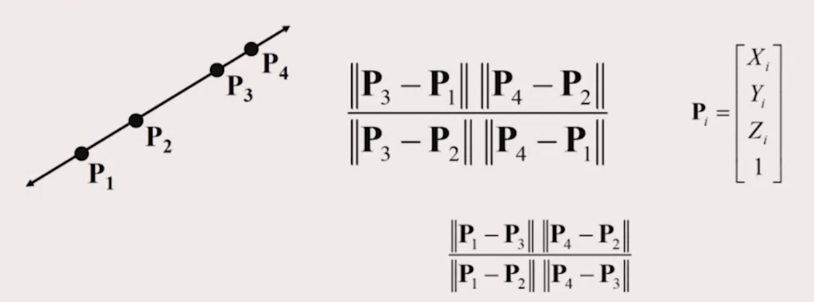

Can permute the point ordering

- 4! = 24 different orders (but only 6 distinct values)

This is the fundamental invariant of projective geometry

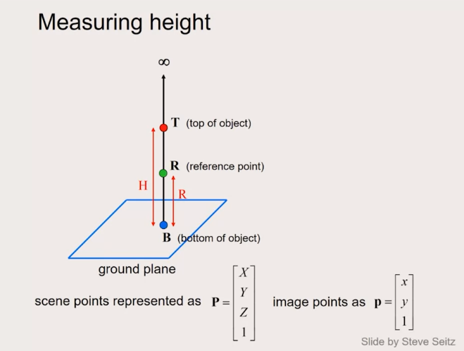

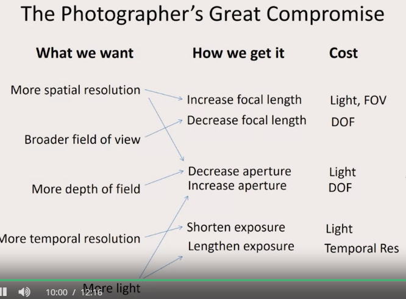
