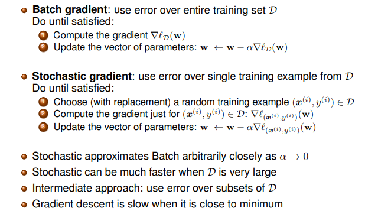
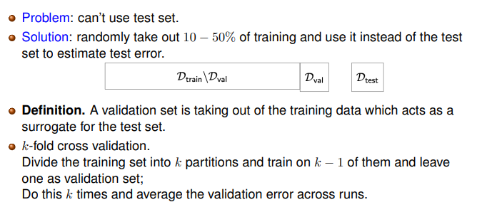

# CS 446 Machine Learning

**How do we formulate the learning problem?**

-   Input data/value/vector: $x^{(i)}$
-   Label/output: $y^{(i)}$

**How do we call this process?**

-   Inference
-   Prediction

#### Problem Class

-   Unsupervised learning
-   Supervised learning
-   Sequence learning
-   Reinforcement learning

### Nearest Neighbor-Basics

-   Dataset: $D = \{(x^{(i)},y^{(i)})\}^N_{i=1}$
-   New datapoint: $x$
-   Label of new data point: $y$

How to choose $y$?

$y = y^{(k)}$ where $k = arg\min_{i\in \set{1, \dots , N}} ||x^{(i)}-x ||^2_2 = arg\min_{i\in \set{1, \dots , N}} d(x^{(i)},x)$

We will that $k$ nearest neighbors. And take the majority vote or the average of nearest neighbors.

We can neasure the closeness or nearby by distance measurement, such as Euclidean distance, Hamming distance, cosine distance, etc.

##### Shortcomings

-   Computationally expensive
-   Curse of dimensionality. Nearest neighbor breaks down in high-dimensional spaces because the “neighborhood” become very large
-   Memory issue
-   Sensitive to outliers and easily fooled by irrelevant attributes.

### Probability and Estimation

#### Conditional Probability

$$
P(A|B) = \frac{P(A \cap B)}{P(B)} \iff P(A \cap B) = P(A|B)P(B) \iff P(A \cap B) = P(B|A)P(A)
$$

#### Bayes Rule

$$
P(A|B) = \frac{P(B|A)P(A)}{P(B)}
$$

We write $P(A)$ as Prior and $P(A|B)$ as Posterior

#### Joint Probability Distribution

Be smart about how we estimate probabilities from sparse data

-   Maximum Likelihood Estimation
-   Maximum a Posteriori Estimation

Be smart on how to model the joint distributions

-   Conditional Independence
-   Graphical models

#### Principles for Estimating Probabilities

##### Maximum Likelihood Estimate(MLE)

Choose $\theta$ that maximizes the probability of observed data
$$
\hat \theta = arg \max_\theta P(D|\theta)
$$

#####  Maximum a Posteriori (MAP) Estimate

Choose $\theta$ that is most probable given prior probability of $\theta$ and observed data
$$
\hat \theta = arg \max_\theta P(\theta|D) = arg\max_\theta \frac{P(D| \theta)P(\theta)}{P(D)} = arg\max_\theta P(D|\theta)P(\theta)
$$

#### Dirichlet Distribution

If prior is Dirichlet distribution,
$$
P(\theta) = \frac{\theta_1^{\beta_1-1}\theta_2^{\beta_2-1}\dots\theta_m^{\beta_m-1}}{B(\beta_1,\dots, \beta_m)} \sim Dirichlet(\beta_1,\dots, \beta_m)
$$

### Introduction to Optimization

The problem more generally:
$$
min_w \quad f_0(w) \\

s.t.\quad f_i(w) \le0 \quad \forall i \in \set{1,\dots,C} 
$$

#### Least Squares Program

$$
\min_w \frac{1}{2} \sum_{(x^{(i)},y^{(i)}) pin D} (y^{(i)}-\phi(x^{(i)})^Tw)^2
$$

#### Linear Program

$$
\min_w c^Tw \quad s.t. \quad Aw<b
$$

#### Convex Program

When all $f_i$ convex
$$
\min_w f_0(w) \quad s.t \quad f_i(w) \le0 \quad \forall i \in \set{1,\dots,C}
$$
Convex Set: A set is convex if for any two points $w_1,w_2$ in the set, the line segment $\lambda w_1+(1-\lambda)w_2$ for $\lambda \in [0,1]$ also lines in the set.

Convex Function: A function $f$ is convex if its domain is a convex set and for any points $w_1,w_2$ in the domain and any $\lambda \in [0,1]$
$$
f((1-\lambda)w_1+\lambda w_2) \le (1-\lambda)f(w_1)+ \lambda f(w_2)
$$
If $f$ is differentiable, then $f$ is convex if and only if its domain is convex and $f(w_1)\ge f(w_2)+\triangledown f(w_2)^T(w_1-w_2) \forall w_1,w_2$ in the domain.

If $f$ is differentiable, then $f$ is convex if and only if its domain is convex and $\forall w_1,w_2$ in the domain
$$
(\triangledown f(w_1)-\triangledown f(w_2))^T(w_1-w_2)\ge 0 \qquad \text{monotone mapping}
$$
If $f$ is twice differentiable, then $f$ is convex if and only if its domain is convex and $\triangledown^2f(w)  \succeq 0 \forall w$ in the domain. 

#### Optimality of convex optimiztion

$$
\triangledown f = 0\  \&\ \triangledown^2 f \ge 0 \implies \text{local min}
$$

A point $w^*$ is locally optimial if $f(w^*) \le f(w)\  \forall w$ in  a neighborhood of $w^*$; globally optimal if $f(w^*) \le f(w)\  \forall w$

#### Algorithm

We start with initial guess $w$, iterate $k=1,2,3, \dots$

-   Select direction $d_k$ and stepsize $\alpha_k$ 
-   $w \leftarrow w+\alpha_kd_k$
-   check whether we should stop

#### Choose direction

Steepest descent: $d_k = - \triangledown f(w_k) $

Scaled gradient: $d_k = - D_k\triangledown f(w_k)$ for $D_k \succ 0$

-   Newton’s methodL $D_k = [\triangledown^2 f(w_k)]^{-1}$

#### Choose stepsize

Exact: $\alpha_k = arg\min_{\alpha\ge0}f(w_k+\alpha d_k)$

Constant: $\alpha_k=1/L$  for suitable $L$

Diminishing: $\alpha_k \rightarrow 0$ but $\sum_k \alpha_k = \infin$ (e.g., $\alpha_k = 1/k$)

Armijo Rule: scary with $\alpha = s$ and continue with $\alpha = \beta s, \alpha = \beta^2s, \dots$, until $\alpha = \beta^ms$ falls within the set of $\alpha$ with
$$
f(w_k+\alpha d_k) = f(w_k) \le \sigma \alpha \triangledown f(w_k)^T d_k
$$

#### Convergence time

 If Stong convexity 
$$
k \ge O(\log(1/\epsilon))
$$
If not
$$
k \ge O(1/ \epsilon)
$$

#### Optimal?

Polyak’s method (heavy ball)
$$
w_{k+1} = w_k -\alpha \triangledown f(w_k)+\beta_k(w_k-w_{k-1})
$$
Momentum method in deep learning
$$
v_{k+1} = \beta v_k +\triangledown f(w_k)\\
w_{k+1} = w_k - \alpha v_{k+1}
$$

#### Analysis

Batch gradient descent:

-   Convergence rate: $O(\log 1 / \epsilon)$
-   Iteration complexity: linear in $|D|$

Stochastic gradient descent:

-   Convergence rate: $O( 1 / \epsilon)$
-   Iteration complexity: independent  in $|D|$, linear in $|B_k|$

### Principal Component Analysis & Singular Value Decomposition

The goal of PCA: Find that lower dimensional linear subspace in which the projected data have the highest variance
$$
\max_{w_1, \dots, w_d: w_i^Tw_j = \delta_{ij}}\sum_{i=1}^d w_i^T\Sigma w_i
$$
Algorithm:

-   Work sequentially one vector at a time
-   Compute a matrix eigenvalue decomposition

1. Collect all subspace direction
   $$
   U = [w_1 \  \dots\ w_d]
   $$

2. Project points into subspace
   $$
   \hat x = U^T(x-\mu)
   $$

3. Approximately reconstructed data
   $$
   \tilde x = U\hat x + \mu
   $$

##### Alternnative view of PCA:

PCA finds the axis which minimizes the sum of squared distances from points to their orthogonal projections on that axis 
$$
\min_{w:||w||^2_2=1}\frac1{|D|}\sum_{i=1}^{|D|}||x^{(i)} - ww^Tx^{(i)}||^2_2 \implies \min_{w:||w||^2_2=1}Tr(\Sigma) - Tr(\Sigma ww^T) \implies \min_{w:||w||^2_2=1} w^T \Sigma w
$$

#####  Frobenius norm:

$$
||A||^2_F = \sum_{i,j} a^2_{i,j} = Tr(A^TA)
$$

where $Tr(M) = \sum_{i=1}^dM_{ii}$ and $M$  is a $d\times d$ matrix.

##### Rewriting the Objective

$$
\frac1{|D|}\sum_{i=1}^{|D|}||x^{(i)} - ww^Tx^{(i)}||^2_2 \implies \frac1{|D|}||\hat X - ww^T\hat X||^2_F\\
\implies \frac1{|D|} Tr((P\hat X)^T(P\hat X)) \qquad \text{where } P = I - ww^T \\
\implies Tr(\Sigma P)
$$

#### Singular Value Decomposition to compute PCA

Computational cheap than find eigenvector directly.
$$
\frac{1}{|\sqrt D|} \bar X = USV^T
$$
We get 
$$
\Sigma = USV^TVsU^T
$$
 where the left singular vectors $U$ of $\frac{1}{|\sqrt D|}$ are needed

### K-Means Clustering

kMeans/Lloyd’s Algorithm:

-   Initialize: prick $K$ random points as cluster centers $\mu_k$
-   Iterate:
    -   Assign data points $x^{(i)}$ to closest cluster center according to some metric
    -   updat=e the cluster center to be the average of its assignment change
    -   Stopping criterion: when no points’ assignments change

What cost function does kMeans optimize?
$$
\min_{\mu} \min_{r} \sum_{i \in D} \sum _{k=1}^K\frac{1}{2}r_{ik}||x^{(i)} - \mu_k||^2_2 \quad s.t. \left \{ \begin{array}{rcl}
 r_{ike} \in \{0,1\} \qquad \forall i,k \\
 \sum^K_{k=1} r_{ik} = 1 \qquad \forall i

\end{array}\right.
$$

### Expectation Maximization

Generally, where $\theta$ are all the variables to maximize the likelihood:
$$
\ln p_{\theta} (x^{(i)}) = \ln \sum_{z_i} p_\theta(x^{(i)},z_i)
$$
We have two option

-   Evidence Lower Bound
-   Concave-convex Procedure/Majorize-Minimize

#### Evidence Lower Bound

Goal: maximize likelihood
$$
\ln p_{\theta} (x^{(i)}) = \ln \sum_{z_i} p_\theta(x^{(i)},z_i)
$$
There is a distribution $q(z)$ and rewrite
$$
\ln p_{\theta} (x^{(i)}) = \mathcal L (p_\theta(x^{(i)},z), q(z)) +D_{KL} (q(z), p_\theta(z|x^{(i)}))
$$
where 
$$
\mathcal L (p_\theta(x^{(i)},z), q(z)) = \sum_z q(z) \ln \frac{p_\theta(x^{(i)},z)}{q(z)} \\
 D_{KL} (q(z), p_\theta(z|x^{(i)})) =  \sum_z q(z) \ln \frac{q(z)}{p_\theta(z|x^{(i)})}
$$
Then, we proved $ D_{KL} (q(z), p_\theta(z|x^{(i)})) \ge 0$, we know $\mathcal L (p_\theta(x^{(i)},z), q(z))$ is the lower bound.

Alternating optimization:

##### Maximize w.r.t. $q$:

$$
\implies q(z) = p_\theta(z|x^{(i)})
$$

 

## KNN

It is based on the assumption that **similar points have similar labels.** The overall algorithm cost $O(Nd)$ which is quit expensive.

#### Algorithm

1.  Store the training data $\mathcal D \{(x^{(i)}, y^{(i)}\}^N_{i=1}$ 

2.  For a test input $x$, calculate the distance to every training point 
    $$
    d(x^{(i)},x), \text{ for } i \in \{1, \dots, N\}
    $$

3.  Assign the most common label among its $k$ closest training inputs

#### Backwards

-   It might have a memory issue. 
-   It is sensitive to outliers and easily fooled by irrelevant attributes.
-   If $d$ is large, **curse of dimensionality** 

### Curse of Dimensionality

*Low-dimensional visualizations are misleading! High-dimensional spaces are empty, and “most" points are far apart*.

Assume we have the data lives in $[0,1]^d$, and all training data is sampled uniformly. 

Then, we have a small cube with $l$ length. Then, the probability for a data point inside this small cube will be $l^d$ (Volume of the cube divided by the space volume). Intuitively, length $l$ is a number from 0 to 1. With higher dimensions, larger $d$, $l^d$ will be smaller.

Empirically, the probability of sampling a point inside the small cube is roughly $\frac{k}{N}$. Thus, to estimate $l$, we have
$$
l ^d = \frac{k}{N}  \implies l \approx (\frac{k}{N})^\frac 1 d 
$$
Then, with different $l$, we have

With higher dimensions, $l$ is close to 1, which means the small box is almost equal to the space.

## Perceptron 

It is based on the assumption that

-   Binary classification: $y \in\set{-1, +1}$
-   Data is linearly separable

#### Notational Hack

If we add a 1 to the end of $x$, we can absorb the bias term $w_0$  into the weight vector. Intuitively, bias term will help use to shifting the decision boundary. Without it, the boundary will always pass through the origin $(0,0)$.

Observation, since $y^{(i)} \in\set{-1, +1}, y^{(i)}(w^T x^{(i)}) > 0 \iff x \text{ is classified correctly}$.

#### Algorithm 

**Question:** How often can a perceptron misclassify a point $x$ repeatedly?

We assume the perceptron will do $k$ times. Then, for each steps, we will $w_{i+1} \leftarrow w_i +yx$. Thus, we get $w_{final} = w_0 + kyx$. When $y^{(i)}(w^T x^{(i)}) \le 0 $, we know it is misclassified. Thus, we have
$$
y(w_0+kyx)^T x\le 0 \\ \implies y(w_0^Tx) + k||x||^2 \le 0 \\ \implies k||x||^2 \le  -y(w_0^Tx) \\ \implies k \le  y(w_0^Tx)/||x||^2
$$
To find $k$.

#### Performance

Three assumption:

1.  Linear separable
2.  $w$ and data point is normalized.
3.  Margin of a hyperplane $γ$ is defined as $γ$ = min $|w^{∗⊤}x ^{(i)} |, ∀x ^{(i)} ∈ D$

If all of the above holds, the perceptron algorithm makes at most $1/γ^2$ updates.

### Logistic Regression

#### Logistic Function

We have
$$
a = \frac{1}{1 + \exp(-b)}
$$
Then, we can write our probability:
$$
P(Y = 0 | X ) = \frac{1}{1+\exp (w_0 + \sum ^d _{j=1} w_j X_j)}
$$
 which learning $P(Y|X)$ directly.

#### Formula with discrete-valued

For $c < C$,
$$
P(Y = c | X) = \frac{\exp (w_{c0} +\sum_{j=1} ^d)w_{cj} X_j}{1+\sum _{k=1}^{C-1} \exp(w_{k0} + \sum_{j=1}^d w_{kj}X_j )}
$$
For $c = C$,
$$
P(Y = C | X) = \frac{1}{1+\sum _{k=1}^{C-1} \exp(w_{k0} + \sum_{j=1}^d w_{kj}X_j )}
$$

#### Training Logistic Regression: MCLE

Then, we can write our likelihood function:

And maximizing the likelihood function

#### Generative vs. Discriminative Classifiers

- Training classifiers involves estimating $f : X → Y$, or $P(Y |X)$
- Generative classifiers (e.g., Naive Bayes)
  - Assume some functional form for $P(Y ), P(X|Y )$
  - Estimate parameters of $P(X|Y ), P(Y )$ directly from training data
  - Use Bayes rule to calculate $P(Y = y|X = x)$
- Discriminative classifiers (e.g., Logistic regression)
  - Assume some functional form for $P(Y |X)$
  - $Estimate parameters of P(Y |X)$ directly from training data

We need to consider **Restrictiveness of modeling assumptions** (how well can we learn with infinite data?) and **Rate of convergence** (in amount of training data) toward asymptotic (infinite data) hypothesis when we choose NB or LR.

#### Minimize a convex, continuous and differentiable function

Gradient Descent:

Then, we need to define our step size: $\alpha$. Normally, small steps will make the algorithm inefficient while large steps will led some potentially bad results. 

A safe (but sometimes slow) choice is to set $\alpha = \frac{c}{t}$ , where $c$ is some constant and $t$ is the number of updates already taken. This guarantees that it will eventually become small enough to converge.

$\alpha \lambda w_j$ is called  regularization term

- helps reduce overfitting
- keep weights nearer to zero (if $P(w)$ is zero mean Gaussian prior), or whatever the prior suggests
- used very frequently in Logistic Regression

Depending on the dataset, GNB and LR have different performances. Even though LR and GNB2 can be expressed in the same way, LR has more flexibly to learn parameters that fit the data

#### Summary: Naive Bayes vs. Logistic Regression

- GNB2 and LR both use linear decision surfaces, GNB need not
- Given infinite data, LR is better than GNB2 because training procedure does not make assumptions 1 or 2 (though our derivation of the form of $P(Y |X)$ did)
- But GNB2 converges more quickly to its perhaps-less-accurate asymptotic error
- GNB is both more biased (assumption1) and less (no assumption 2) than LR, so either might beat the other
- Logistic regression is a classification algorithm

### Regression

Wish to learn $f : X → Y$ , where $Y$ is continuous (weight, height, stock price...)

Training data: ${(x (i) , y(i) )}^N_{i=1}, (x (i) ∈ \mathbb R^d , y (i) ∈ \mathbb R)$

Approach:

1. choose some parameterized form for $P(Y|X,w)$
2. Derive learning algorithm as MLE or MAP estimate for $w$

### Linear Regression

Assume $f(x)$ is linear function of $x$,

- $f(x) = w^Tx + w_0, w ∈ \mathbb R ^ d , w_0 ∈ R$
- $ p(y|x) = N (w^Tx + w_0, σ^2 )$

#### Training Linear Regression: Estimating with MLE

#### Closed form of $\arg \min_w l(w)$

$$
w = (X^TX)^{-1}X^Ty
$$

Estimating with MAP

MAP with Gaussian prior (mean 0, variance $τ^ 2$ ) equivalent to ridge regression (L2 penalty). Closed-form solution:
$$
 0 = -2X^Ty + 2X^TX w + 2\lambda w \implies
w = (X^TX + \lambda I)^{-1} X^Ty
$$

#### Summary: Linear regression

- MLE corresponds to minimizing sum of squared prediction errors
- MAP estimate minimizes sum of squared prediction errors plus some penalty on weights
- Again, learning is an optimization problem once we choose our objective function (MLE or MAP)
- We can use gradient descent as a general learning algorithm
  - as long as our objective is differentiable wrt $w$
  - though we might learn local optima ins

### Support Vector Machine

We want to maximize the margin - “Widest street approach": Separate the positive samples from negative samples as widest as possible

Given that $y^{(i)}(w^Tx^{(i)} +b) - 1= 0$ for $x^{(i)}$ in gutter, we have
$$
width = \frac{w^T}{||w||} (x^+-x^-) = \frac{2}{||w||} \implies \max \frac{1}{||x||} \implies \min \frac{1}{2} ||w||^2
$$
Then, we have
$$
\arg \min_{w,b} \frac{1}{2} ||w||^2 \qquad s.t . \quad y^{(i)}(w^Tx^{(i)} +b) \ge 1  \quad \forall i \in \set{1, \dots, N}
$$

#### The SVM Lagrangian

Lagrangian (with Lagrange multipliers $\alpha_i \ge 0$):
$$
L(w,b, \alpha) = \frac{1}{2}||w||^2_2 + \sum_{i=1}^N\alpha_i(1-y^{(i)}(w^Tx^{(i)} +b) \quad \forall i \in \set{1, \dots, N}
$$
Then, we have Lagrangian duality: $\max_\alpha \min_{w,b} L(w,b ,\alpha)$

 

Plugging $w = \sum_{i=1}^N \alpha_i y^{(i)} x^{(i)}, \sum ^N_{i=1} \alpha_i y ^{(i)} = 0$ onto $L(w,b,\alpha)$
$$
L(w,b,\alpha) =- \frac{1}{2} \sum_{i=1}^N \sum_{j=1}^N  \alpha_i \alpha_j y^{(i)}y^{(j)}x^{(i)T} x^{(j)}+ \sum^N_{i=1} \alpha_i
$$

#### What if data is not linearly separable? Soft-margin SVM

$$
\arg \min_{w,b,\epsilon} \frac{1}{2}||w||^2_2 + C\sum^N_{i=1} \epsilon_i \qquad s.t. \ y^{(i)}(w^Tx^{(i)}+b) \ge 1 - \epsilon_i, \epsilon_i \ge 0
$$

-   Still QP
-   $C:$ trade-off parameter between error and margin; $C = \infin - $ hard margin SVM
-   $\epsilon_i :$ “slack variables”; pay a linear penalty if mistake 

$$
\epsilon_i = \left \{ \begin{array}{rcl}    1- y^{(i)}(w^Tx^{(i)}+b) \quad \text{if } y^{(i)}(w^Tx^{(i)}+b)< 1
\\ 0 \quad \text{if } y^{(i)}(w^Tx^{(i)}+b)\ge 1
\end{array}\right.
$$

##### Hinge Loss

### Kernel Methods

#### Linear Regression

#### Key Ingredients of Dual Solution

**Step 1:** Compute $$\alpha -  (K + \lambda I )^{-1}y$$ where $K = XX^T$, $K_{ij} = x^{(i)^T}x^{(j)}$

**Step 2:** Evaluate on new point $x^{new}$ by $\hat y = \sum_{i=1}^N \alpha_i  x^{new^T}x^{(i)}$

Both steps only involve inner products between input data points

#### Why useful?

- Dataset not linearly separable in original space may be linearly separable in higher dimensional space
- Kernel functions provide a way to manipulate data as though it was projected into a higher dimensional space, by operating on it in its original space
- Leads to major efficiencies, and ability to use very high dimensional (virtual) feature spaces

#### Which functions can be kernels?

- Not all functions are kernels. A valid kernel κ corresponds to an inner product in some feature space.
- Initially kernels were defined over data points in Euclidean space, but more recently over strings, over trees, over graphs,... 
- How to test without explicitly constructing feature vectors? (Mercer Theorem) Gram matrix K is positive semi-definite, where $K_{ij} = κ_{\phi}(x^{(i)},x^{(j)})$
- It is easy to construct kernels
  -  Construct kernels from scratch. 
  - Compose kernel into/from known kernels. (Nice theory on this.)

#### Key Points

- Many learning tasks are framed as optimization problems 
- Primal and Dual formulations of optimization problems 
- Dual version framed in terms of dot products between x’s Kernel functions κ provide a way to manipulate data as though it was projected into a higher dimensional space, by operating on it in its original space
- Leads to major efficiencies, and ability to use very high dimensional (virtual) feature spaces

### Learning Theory

What’s the true objective of machine learning? **Minimize error on unseen future example**

How good is the predictor f?

Key idea: the real learning objective. Our goal is to minimize error on unseen future examples.

Don’t have unseen examples; next best thing: Test set $D_{test}$ contains examples not used for training.

- As the hypothesis class size increases Approximation error decreases because: taking min over larger set
- Estimation error increases because: harder to estimate something more complex

#### How can we reduce overfitting?

#### Hyperparameters

Definition. Properties of the learning algorithms (feature, regularization parameter λ, number of iterations T, step size, etc)

How do we choose hyperparameters?

#### Validation

### Decision Tree Learning, Ensemble Methods

#### Top-Down Induction of Decision Trees

Main loop:

1. $X_j \leftarrow$ the “best” decision attribute for new node
2. Assign $X_j$ as decision attribute for node
3. For each value of $X_j$, create new descendant of node
4. Sort training examples to leaf nodes
5. If training examples perfectly classified, then stop; else iterate over new leaf nodes

#### Choosing an Attribute

Intuitively, a good attribute splits the examples into subsets that are (ideally) “all yes" or “all no"

**Impurity function**: measures the level of impurity in a group of examples

##### Impurity

Using KL Divergence to compute closeness between $p_1, \dotsm p_C$ and $q_1, \dots, q_C$, where $q_k = \frac{1}{C}$
$$
\max_p KL(p||q) = \max_p \sum_{k=1}^C p_k\log p_k + log C \\ = \min(-\sum_{k=1}^C p_k \log p_k) \\ =\min_p H(S)
$$
where $H(S) = - \sum_{k=1}^C p_k\log p_k$ is defined as sample entropy

###### 

#### Information Gain

**Information Gain** of $A$ is the reduction in entropy of target variable $Y$ for data sample $S$, due to sorting on variable $X$.
$$
Gain(S,A) = H(S) - \sum_{v \in \text{values}(A)} \frac{|S_v|}{|S|}H(S_v)
$$

#### Growing the tree: Stopping Criteria

Stop expanding a node further when: 

- The training examples associated with this node all have the same label (“pure" node) 
- No more attributes to test

#### Overfitting

- Stop growing when data split not statistically significant 
- Grow full tree, then post-prune

#### Reduced-error pruning

- Split data into training and validation set 
- Learn a tree that classifies training set correctly 
- Do until further pruning is harmful:
  - For each non-leaf node, evaluate impact on validation set of converting it to a leaf node
  -  Greedily select the node that would most improve validation set accuracy, and convert it to a leaf

This produces smallest version of most accurate (over the validation set) subtree

#### Summary of decision tree

- Decision trees are one of the most popular ML tools 
  - Easy to understand, implement, and use 
  - Computationally cheap, very fast at test time
-  Information gain to select attributes 
- Greedy top-down learning of decision trees 
- Decision trees will overfit
  - stop early 
  - post-pruning

#### What can we do with model ensembles?

#### Bagging

**Bagging = Bootstrap Aggregating**

#### Random Forests

#### Non-independent errors

#### Boosting

#### Bagging vs. Random forest vs. Boosting

**Bagging:** Run independent weak learners on subsampled data (sample with replacement) from the training set

**Random forest:** Train decision trees on subsampled data(sample with replacement) from the training set + using feature bagging (random subset of feature)

#### Boosting

Suppose you have a weak classifier i.e. error rate lower than 50%

**Idea:** train classifiers sequentially, run it multiple times on reweighed training data, then let learned classifiers vote.

On each iteration $t$:

1. weight $D_t(i)$ for each training example $i$, based on how incorrectly itwas classified.
2. Learn a weak hypothesis $f_i$
3. Compute a weight for this hypothesis $\alpha_t$

Output the final classifier

#### Learning from weighted data

Consider weighted dataset

- $D(i)$ - weight of $i$-th training example $(x^{(i)}, y ^{(i)})$

Interpretations:

- $i$-th training example counts as $D(i)$ examples
- If i were to resample data, I would get more samples of “heavier” data points

Not, in all calculations, whenever used, $i$- th training example counts as $D(i)$ examples

#### AdaBoost (Adaptive Boosting)

Construct a strong classifier $\hat f$ from weighted wak classifiers $f_1,f_2,f_3, \dots$ 
$$
\hat f = \text{sign}(a_1f_1 + a_2f_2 + \dots)
$$
where if $e > 0$, sign$(e) = 1$; otherwise, $= -1$

#### Weighted training error

$$
ϵ_t := \sum_{i=1}^N D_t(i)1(y (i) \ne f_t(x^{(i)}))
$$

- ϵt = 0 if ft perfectly classifies all weighted data points
- ϵt = 1 if ft perfectly wrong 
- ϵt = 0.5 random guessing

Boosting often (but not always) 

- robust to overfitting
-  test error rate continues to decrease even after training error is zero

If classes are well-separated, subsequent weak learners agree and hence more rounds does not necessarily imply that final classifier is getting more complex.

### Neural Networks

#### Activation Function

**ReLU** is a good default choice for most problems

### k-Means Clustering

kMeans/Lloyd’s Algorithm (informal): 

Initialize: pick K random points as cluster centers $\mu_k$

Iterate: 

-  Assign data points $x^{(i)}$ to closest cluster center according to some metric 
-  Update the cluster center to be the average of its assigned points 
-  Stopping criterion: when no points’ assignments change

#### Cost Function

$$
\min_{\mu} \min_r \sum_{i \in \mathcal D } \sum^K_{k=1} \frac{1}{2}r_{ik} || x^{(i)} - \mu_k ||^2_2  \quad s.t.  \quad \left \{  \begin{array}{rcl}  r_{ik}\in \set{0,1} \quad \forall i,k \\ \sum_{k=1}^K r_{ik} = 1 \quad \forall i \end{array} \right.
$$

#### Properties of Algorithm

- Local optimum is found
- Guaranteed to converge in a finite number of iterations 
- Running time per iteration:
  - Assign data points to closest cluster center: $O(KNd)$
  - Change the cluster center to the average of its assigned points: $O(Nd)$

#### Extension

**kMeans++:** How to initialize kMeans

- Randomly choose first center
- Pick new center with probability proportional to $||x^{(i)} - \mu_k||^2_2$ (contribution of $x^{(i)}$ to total error)
- Repeat until K centers are chosen

