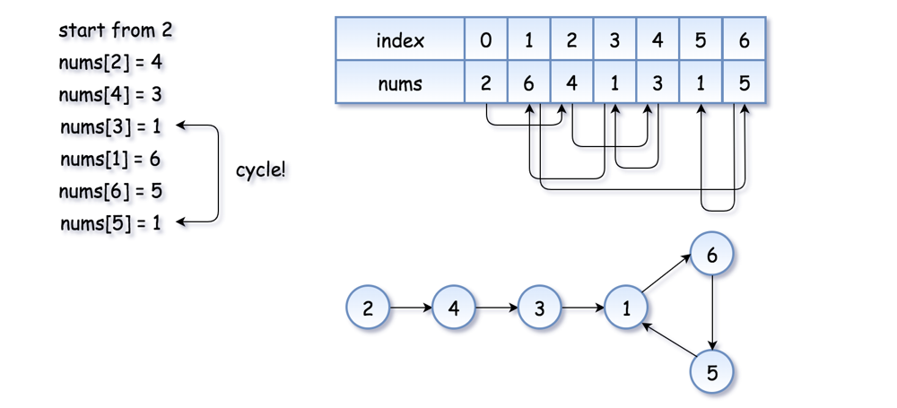
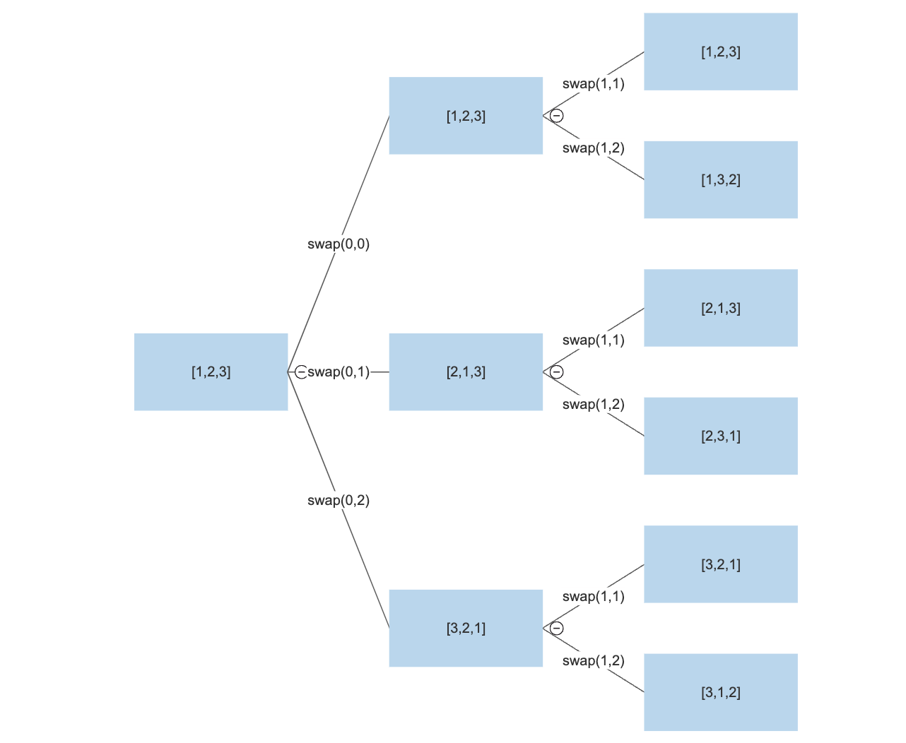

# LeetCode

## Arrays & Hashing

#### [**217 Contains Duplicate**](https://leetcode.com/problems/contains-duplicate/)

This question needs to find out whether a vector includes a duplicate. Note that using two for-loops will cause a timeout for a large dataset($O(n^2)$). In this question, we need to use the **set** to minimize the running time. Here is the [set doc](https://www.cplusplus.com/reference/set/set/).

##### CPP

```c++
#include <set>

class Solution {
public:
    bool containsDuplicate(vector<int>& nums) {
        std::set<int> check;
        for(int i = 0; i < nums.size(); i++){
            if(check.count(nums[i])){
                return true;
            }
            check.insert(nums[i]);
        }
        return false;
    }
};

//timeout example
bool containsDuplicate(vector<int>& nums) {
  for(int i = 0; i < nums.size() -1; i++){
    for (int j = i + 1; j < nums.size(); j ++){
      if(nums[i] == nums[j]){
        return true;
      }
    }
  }
  return false;
}
```

##### JAVA

```java
class Solution {
    public boolean containsDuplicate(int[] nums) {
        Set<Integer> numbers = new HashSet<Integer>();
        for (int num : nums) {
            if (numbers.contains(num)) return true;
            numbers.add(num);
        }
        return false;
    }
}
```

##### PYTHON

```py
class Solution(object):
    def containsDuplicate(self, nums):
        hashset = set()
        for n in nums:
            if n in hashset:
                return True
            hashset.add(n)
        return False
```


#### [**242 Valid Anagram**](https://leetcode.com/problems/valid-anagram/)

An **Anagram** is a word or phrase formed by rearranging the letters of a different word or phrase, typically using all the original letters exactly once.

In this question, we choose to use the function **str.find_first_of(key)** to check the char in **t** is in **s**. Then, we erase the according to the character in **t**. However, we use **erase** function in the coding. It is not ideal since removing an element from a string cost about $O(n)$ time. (String is an array, and deleting an element need to resize the string).

Second way: the easiest way to do this is sort two strings so that will be much eaiser to compare. The sort time complexity will be $O(nlogn)$ which will be quick. 

##### CPP

```c++
class Solution {
public:
    bool isAnagram(string s, string t) {
        if(s.length() != t.length()) return false;
        for(auto i : t){
            size_t idx = s.find_first_of(i);
            if(idx==std::string::npos){
                return false;
            }
            s.erase(s.begin()+idx);
        }
        return true;
    }
};

//second way
#include<bits/stdc++.h>
using namespace std;

class Solution {
public:
    bool isAnagram(string s, string t) {
        sort(s.begin(), s.end());
        sort(t.begin(), t.end());
        cout << s;
        cout << t;
        if (s != t) {
            return false;
        }
        return true;
    }
};
```


##### JAVA

```java
import java.util.Arrays;

class Solution {
    public boolean isAnagram(String s, String t) {
        char Array1[] = s.toCharArray();
        char Array2[] = t.toCharArray();
        Arrays.sort(Array1);
        Arrays.sort(Array2);
        String str1 = new String(Array1);
        String str2 = new String(Array2);
        
        return str1.equals(str2);
    }
}
```

##### PYTHON

```pyth
class Solution(object):
    def isAnagram(self, s, t):
        a = sorted(s)
        b = sorted(t)
        if a == b:
            return True
        return False
```


#### [**1. Two Sum**](https://leetcode.com/problems/two-sum/)

Basic question, here is the code.

```c++
class Solution {
public:
    vector<int> twoSum(vector<int>& nums, int target) {
        for(int i = 0; i < nums.size() -1; i++){
            for(int j = i+1; j < nums.size(); j++){
                if(nums[i] + nums[j] == target){
                    return vector<int>{i, j};
                }
            }
        }
        return vector<int>();
    }
};
```

#### [**49. Group Anagrams**](https://leetcode.com/problems/group-anagrams/)

Trying to use one additional vector to consist of a map causes a timeout.

```c++
class Solution {
public:
    vector<vector<string>> groupAnagrams(vector<string>& strs) {
        vector<vector<string>> out;
        vector<string> head;
        for(auto i : strs){
            bool a = false;
            size_t index = 0;
            for(int j = 0; j < head.size(); j ++){
                if(isAnagram(i,head[j])){
                    a = true;
                    index = j;
                    break;
                }
            }
            if(a){
                out[index].push_back(i);
            } else {
                head.push_back(i);
                vector<string> c;
                c.push_back(i);
                out.push_back(c);
            }
        }
        return out;
    }
    
    bool isAnagram(string s, string t) {
        if(s.length() != t.length()) return false;
        for(auto i : t){
            size_t idx = s.find_first_of(i);
            if(idx==std::string::npos){
                return false;
            }
            s.erase(s.begin()+idx);
        }
        return true;
    }
};
```

We can utilize more in-build functions to minimize the running time of our coding. We can change the string into a list of char. Then, we sort the list and compare each key in the map to find the word which is anamgrams.

```c++
class Solution {
public:
    vector<vector<string>> groupAnagrams(vector<string>& strs) {
        vector<vector<string>> out;
        map<list<char>,vector<string>> check;
        for(auto i : strs){
            list<char> a(i.begin(), i.end());
            a.sort();
            if(check.find(a) != check.end()){
                check[a].push_back(i);
            } else {
                check[a] = vector<string>();
                check[a].push_back(i);
            }
        }
        for(auto & i : check){
            out.push_back(i.second);
        }
        return out;
    }
    
};
```

#### [**347. Top K Frequent Elements**](https://leetcode.com/problems/top-k-frequent-elements/)

When we need to find the frequency, we need to count the variable. Therefore, the map is a good choice. We just need to spend $O(n)$ time to finish the count. Using a map, we can correspond the number and its frequency. Also, we need to find the top k frequency in the map, which cannot be completed using the in-build function. In this question, we use **std::max_element** to find the largest value.

```c++
bool compare(const pair<int, int>&a, const pair<int, int>&b){
    return a.second<b.second;
}
class Solution {
public:
    
    vector<int> topKFrequent(vector<int>& nums, int k) {
        map<int, int> check;
        for( auto i : nums){
            if(check.find(i) != check.end()){
                check[i] += 1;
            } else {
                check[i] = 1;
            }
        }
        vector<int> out;
        for(int i = 0; i < k; i++) {
             auto a = max_element(check.begin(), check.end(), compare)->first;
            check[a] = 0;
            out.push_back(a);
        }
        return out;
    }
};
```

#### [**238. Product of Array Except Self**](https://leetcode.com/problems/product-of-array-except-self/)

We need to implement a solution without division, given $O(n)$ time. This means that we cannot use double for-loop. Therefore, we need to save the answer for each time in back and forth. The **answer[i]** will be the according element in two vector.

```c++
class Solution {
public:
    vector<int> productExceptSelf(vector<int>& nums) {
        vector<int> front(nums.size());
        front[0] = nums[0];
        vector<int> back(nums.size());
        back[nums.size()-1] = nums[nums.size()-1];
        
        for(int i = 1; i < nums.size(); i++) {
            front[i] = (front[i-1]*nums[i]);
        }
        for(int i = nums.size()-2; i > 0; i--) {
            back[i] = (back[i+1]*nums[i]);
        }
        vector<int> out;
        for (int i = 0; i < nums.size(); i++){
            if(i == 0)  out.push_back(back[i+1]);
            else if(i == nums.size()-1) out.push_back(front[i-1]);
            else out.push_back(front[i-1]*back[i+1]);
        }
        return out;
    }
};
```

#### [**36. Valid Sudoku**](https://leetcode.com/problems/valid-sudoku/)

Since it is likely that there is a sparse matrix given from the question, we could check the valid number cell each time.  When we iterate a valid cell, check its row and column. And We check the sub-box.

```c++
class Solution {
public:
    bool isValidSudoku(vector<vector<char>>& board) {
        for(int i = 0; i < 9; i++){
            for(int j =0; j < 9; j++){
               if(board[i][j] != '.'){
                   for(int k = 0; k < 9; k++){
                       if(board[i][k] == board[i][j] && j != k){
                           return false;
                       }
                       if(board[k][j] == board[i][j] && i != k){
                           return false;
                       }
                       
                   }
                   int xp = i/3*3;
                   int yp = j/3*3;
                   for(int p =0; p < 3; p++) {
                       for(int q = 0; q < 3; q++){
                           int x =p + xp;
                           int y =q + yp;
                           if(board[x][y] == board[i][j] && (j != y || i != x)){
                               return false;
                            }
                       }
                   }
               } 
            }
        }
        return true;
    }
};
```


#### [**Encode and Decode Strings**](https://www.lintcode.com/problem/659/)

Although we could choose the divided mark by ourselves,  the outcome after encoding and decoding must be the same. For example, if we use “:” to divide the string, we need to handle the situation that “:” is already existed in string.

**substr** takes two arguments, the start position, and the substring length! **NOT THE END POSITION!!!!**

The difference between **find** and **find_first_of**: **find** is to find the first appeared given string, while **find_first_of** is to find the first appeared character among the given string.

```c++
class Solution {
public:
    /*
     * @param strs: a list of strings
     * @return: encodes a list of strings to a single string.
     */
    string encode(vector<string> &strs) {
        // write your code here
        string out = "";
        if(strs.size() == 0) return out;
        if(strs.size() == 1) return strs[0];
        out += strs[0];
        size_t idx = 1;
        for(int i = 1; i < strs.size(); i++){
            out += ":;";
            string check = strs[i];
            size_t found = check.find(':');
            while(found != string::npos){
                check.replace(found,1,"::");
                found = check.find(':', found+2);
            }
            out += check;
        }
        cout << out << endl;
        return out;
    }

    /*
     * @param str: A string
     * @return: dcodes a single string to a list of strings
     */
    vector<string> decode(string &str) {
        // write your code here
        if(str.length() == 0) return vector<string>();
        vector<string> out;
        size_t start = 0;
        size_t found = str.find(":;");
        while(found != string::npos){
            string input = str.substr(start,found-start);
            size_t check = input.find("::");
            if(check != string::npos){
                input.replace(check,2,":");
            }
            start = found + 2;
            out.push_back(input);
            found = str.find(":;", found+2);
            cout<< input << endl;
        }
        string input = str.substr(start,str.length());
        size_t check = input.find("::");
        if(check != string::npos){
            input.replace(check,2,":");
        }
        out.push_back(input);
        return out;
    }
};
```

#### [**128. Longest Consecutive Sequence**](https://leetcode.com/problems/longest-consecutive-sequence/)

We need to find the longest consecutive sequence given $O(n)$ time. This means that we can not use double loops, but we can sort the given vector and traverse the sorted vector to gain $O(2n)$ time. Use **count** to check the largest count number and **check** to trace each consecutive sequence. There may exist some improvement for the variable boolean **start**. 

**sort** function is in STL library, which can sort the vector.

```c++
class Solution {
public:
    int longestConsecutive(vector<int>& nums) {
        sort(nums.begin(), nums.end());
        int count = 0;
        int check = 0;
        bool start = true;
        for(int i = 0; i < nums.size(); i++){
            if(start || nums[i-1]+1 == nums[i]){
                check++;
                start = false;
                
            } else if(!start && nums[i-1] == nums[i]){
                start = false;
            } else{
                if(count < check) {
                    count = check;
                }
                check = 1;
                start= false;
            }
        }
         if(count < check) {
                    count = check;
                }
        return count;
    }
};
```

## Two Pointers

**Two Pointers Technique**	Two pointers is really an easy and effective technique that is typically used for searching pairs in a **sorted** array.

#### [**125. Valid Palindrome**](https://leetcode.com/problems/valid-palindrome/)

A phrase is a **palindrome** if, after converting all uppercase letters into lowercase letters and removing all non-alphanumeric characters, it reads the same forward and backward. Alphanumeric characters include letters and numbers.

In this question, we need to do two preparations: change the string to lower case and remove all non-alphanumeric characters. We need to use the function **remove_if** to get the index of characters and use **erase** to delete the corresponding characters. Note that we can put the function as a parameter. Then, we can use the function **remove_if** in various conditions. For example:

```c++
auto it = remove_if(a,b,c);
//a as the start of the object
//b as the end of the object
//c as the judgement function, determine which elements need to remove.
```

**c** could be a boolean function to check the lowercase or non-alphanumeric characters.

Then, we need to get a new string that is the original reverse. Using the in-build function and string constructor, we can get the reverse. **rbegin()** and **rend()** is the reverse iteration of string.

```c++
//s is the orginal string
string rev = string(s.rbegin(), s.rend());
```

 Then, we check wether they are equal.

```c++
class Solution {
public:
    bool isPalindrome(string s) {
        auto it = remove_if(s.begin(),s.end(), [](char const & c){
            return !isalnum(c);
        });
        s.erase(it,s.end());
        std::transform(s.begin(), s.end(), s.begin(),
        [](unsigned char c){ return std::tolower(c); });
        string rev = string(s.rbegin(), s.rend());
        return rev == s;
    }
};
```

#### [**167. Two Sum II**](https://leetcode.com/problems/two-sum-ii-input-array-is-sorted/)

Similar to Two Sum. Note that it is a not-decreasing order vector, which means it has more information than the original question. To utilize this info, we can set the check celling for the vector and find the other number from the back. Since we know that the previous element is smaller or equal to the current element, the back elements checked from the previous loop are 100% invalid for the current one. Here is the example

```c++
a = [1,2,3,4,6,7,9];
target = 6;
//In the first loop, we will find the pair of number 1. We need to find the number of 5
//Check from the back, we know that sub-array = [6,7,9] are impossible since it is larger than 5
//This means for the following loop, we do not need to consider this sub-array because the number we need to find must be less than 5. Then, we set celling as 4.
//In the second loop, we will find the pair of number 2. We need to find the number of 4.
//Because we have the celling, we will hit the answer for the first find, which is 4.
```

This algorithm is beneficial. The running time will become $O(n)$. We do not need to consider the number hit (**may not** use the same element twice.) since we will find the right answer before the number hit.

```c++
class Solution {
public:
    vector<int> twoSum(vector<int>& numbers, int target) {
        int end  = numbers.size()-1;
        for(int i = 0; i < numbers.size(); i++) {
            int check = target - numbers[i];
            for(int j = end; j > i; j--){
                if(numbers[j] == check){
                    auto a = vector<int>();
                    a.push_back(i+1);
                    a.push_back(j+1);
                    return a;
                } else if(numbers[j] < check){
                    break;
                }
                end--;
            } 
        }
        return vector<int>();
    }
};
```

#### [**15. 3Sum**](https://leetcode.com/problems/3sum/)

We need to find a solution that is less than $O(n^3)$ or a time Exceeded will occur.  We can get the idea from **Two Sum II**, sorting the vector and using two pointers to find the possible solution. Then, the question will become $n$ times **Two Sum** questions. (Iterate each element in the vector and regard it as the **target**).

Also, we need to consider the duplicate problem. After the first iteration, we need to check whether the current element equals the last element. If the condition is true, pass the current iteration. This solution is not ideal, but it is the best answer I can get.

```c++
class Solution {
public:
    vector<vector<int>> threeSum(vector<int>& nums) {
        if(nums.size() < 3) return vector<vector<int>>();
        sort(nums.begin(), nums.end());
        vector<vector<int>> out;
        for(int i = 0; i < nums.size()-2; i++) {
            if(i > 0){
                if(nums[i] == nums[i-1]){
                    continue;
                }
            }
            int front = i + 1;
            int back = nums.size()-1;
            int current = 0;
            while(front < back){
                if(front > i + 1){
                    if(nums[front] == nums[front-1]){
                        front++;
                        continue;
                    }
                }                
                if(back < (nums.size()-1)){
                    if(nums[back] == nums[back+1]){
                        back--;
                        continue;
                    }
                }
                current = -(nums[front] + nums[back]);
                if(current > nums[i]){
                    front++;
                } else if(current < nums[i]){
                    back--;
                } else {
                    out.push_back({nums[i],nums[front],nums[back]});
                    back--;
                    front++;
                }
            }
        }
        return out;
    }
};
```

#### [**11. Container with Most Water**](https://leetcode.com/problems/container-with-most-water/)

In this question, of course, we can use two for-loops to solve the question, making a $O(n^2)$ running time. However, there is an algorithm that can reduce the running time to $O(n)$.

1. Set **front** as 0 and **back** as the last index of height.
2. calculate the area, change the max value if necessary
3. find the min(**front**, **back**), moving the index with a smaller value inward. (front++/back- -).
4. Repeat step 2 until **front** >= **back**.

As far as I could say,  each step we move is based on the current best situation. However, it is hard to prove.

```c++
class Solution {
public:
    int maxArea(vector<int>& height) {
        int front = 0;
        int back = height.size() - 1;
        int current = 0;
        int maxv = 0;
        while (front < back) {
            current = (back - front) * min(height[front], height[back]);
            maxv = max(maxv,current);
            if(height[front] > height[back]){
                back--;
            } else {
                front++;
            }
        }
        return maxv;
    }
    int min(int a, int b) {
        if (a > b) return b;
        return a;
    }
    int max(int a, int b) {
        if (a > b) return a;
        return b;
    }
};
```

#### [**42. Trapping Rain Water**](https://leetcode.com/problems/trapping-rain-water/)

The same type of question. We need two-pointers and choose the next step base on the current situation. When we need to solve this type  of question, we need to control our running time as $O(n)$. When we have two pointers, front and back, we can move one pointer each time to solve the piece of the problem.

```c++
class Solution {
public:
    int trap(vector<int>& height) {
        int level = 0;
        int front = 0;
        int back = height.size()-1;
        int sum = 0;
        while(front < back){
            if(height[front] < level) sum += (level - height[front]);
            if(height[back] < level) sum += (level - height[back]);
            if(height[front] < height[back]){
                level = max(height[front], level);
                front++;
            } else {
                level = max(height[back], level);
                back--;
            }
        }
        return sum;
    }
    int max(int a, int b){
        if(a > b) {
            return a;
        }
        return b;
    }
};
```

## Window Sliding

**Window Sliding Technique**	Window sliding is a computational technique that aims to reduce the use of nested loops and replace it with a single loop, thereby reducing the time complexity.

**Prerequisite to use Sliding window technique**	The use of Sliding Window technique can be done in a very specific scenario, where the **size of window** for computation is **fixed** throughout the complete nested loop. Only then the time complexity can be reduced. 

1. Find the size of window required 
2. Compute the result for 1st window, i.e. from start of data structure
3. Then use a loop to slide the window by 1, and keep computing the result window by window.

#### [**121. Best Time to Buy & Sell Stock**](https://leetcode.com/problems/best-time-to-buy-and-sell-stock/)

This question is not an ideal window sliding question. However, the running time can be reduced to $O(n)$ ;

Since we know that the selling date is after buying date, we can set our current selling date as the last day. When we iterate the array from behind. If we find another higher price(greater than the current max selling price), we can replace the max price. Or, we can regard the current day as buying date and calculate the profit.

```C++
class Solution {
public:
    int maxProfit(vector<int>& prices) {
        int maxi = prices[prices.size() -1];
        int profit = 0;
        for(int i = prices.size() -2; i > -1; i--) {
            if(prices[i] > maxi){
                maxi = prices[i];
            }
            int cur = maxi - prices[i];
            profit = max(cur, profit);
        }
        return profit;
    }
};
```

Also, we can set the current buying date as the first day and iterate the array. It seems that it is more efficient than we iterate backward.

```c++
class Solution {
public:
    int maxProfit(vector<int>& prices) {
        int mini = prices[0];
        int profit = 0;
        for(int i = 1; i < prices.size(); i++) {
            if(prices[i] < mini){
                mini = prices[i];
            }
            int cur = prices[i] - mini;
            profit = max(cur, profit);
        }
        return profit;
    }
};
```

#### [**3. Longest Substring Without Repeating Characters**](https://leetcode.com/problems/longest-substring-without-repeating-characters/)

The window can be changed in this question. When we use **std::string::find** to find a repeating character, we need to set our window to correct value. 

```c++
class Solution {
public:
    int lengthOfLongestSubstring(string s) {
        if(s.length() == 0) return 0;
        int a = 0;
        int b = 1;
        int l = 1;
        int count = 1;
        while (b < s.length()) {
            size_t c = s.substr(a,b-a).find(s[b]);
            if( c == std::string::npos){
                count++;
                if(count > l) l = count;
                b++;
            } else {
                if(count > l) {
                    l = count;
                }
                a = a+c+1;
                count = b-a + 1;
                b++;
            }
        }
        return l;

    }
};
```

#### [**424. Longest Repeating Character Replacement**](https://leetcode.com/problems/longest-repeating-character-replacement/) (Unable to Solve)

The solution to this problem is written based on the discussion from [link](https://leetcode.com/problems/longest-repeating-character-replacement/discuss/2130806/C%2B%2Beasy-to-understand). However, his solution is complicated and includes some meaningless lines. The code is improved to increase the readability and it can be divided into the following steps.

1. set the window (left and right), a number to count the current most frequent char, a number to count the length, and a map to count the frequency of chars.
2. Update the frequency in the map for the current char on the right.
3. check whether the current window is valid
   - if it is valid, check the current window length and update the outcome if it is smaller. Right++
   - if it is invalid, the current window needs to shrink. Left++, Right++, and update the frequency due to left change
4. Repeat step 2 if Right is less than size of string

```c++
class Solution {
public:
    int characterReplacement(string s, int k) {
        int l = 0;
        int r = 0;
        int out = 0;
        int count = 0;
        unordered_map<char,int> check;
        while (r < s.length()){
            check[s[r]]++;
            count = max(count, check[s[r]]);
            if((r-l+1-count)>k) {
                check[s[l]]--;
                l++;
                r++;
            } else {
                out = max(out, r-l+1);
                r++;
            }
        }
        return out;
    }
};
```

#### [**567. Permutation in String**](https://leetcode.com/problems/permutation-in-string/)

In this question, we still use unordered_map to solve the problem. We set a variable **count**, using **count** to check whether the current window is a premutation of **s1**. If **count** drops to zero, it means that we find the correct window. Note that in this question, the window is fixed. But we still use changeable variables, l and r, to set the window because we need to start to count at **s2** start.

```c++
class Solution {
public:
    bool checkInclusion(string s1, string s2) {
        unordered_map<char,int> check;
        for(auto a : s1){
            check[a]++;
        }
        int count = check.size();
        int l = 0;
        int r = 0;
        while(r < s2.size()){
            if(check.find(s2[r])  != check.end()){
                check[s2[r]]--;
                if(check[s2[r]] == 0){
                    count--;
                }
            }
            if((r-l+1) < s1.size()) r++;
            else if ((r-l+1) == s1.size()){
                if(count == 0) return true;
                if(check.find(s2[l]) != check.end()){
                    if(check[s2[l]] == 0) count++;
                    check[s2[l]]++;
                }
                l++;
                r++;
                
            }
        }
        return false;
    }
};
```

#### [**76. Minimum Window Substring**](https://leetcode.com/problems/minimum-window-substring/)

We can still use Sliding Window to solve this problem. However, there are a few adjustments to the window boundary. Here is the strategy:

- If the current window does not contain all the chars in **s**, Right++. Next iteration checks the right boundary.
- If the current window does contain all the chars in **s**, Left++. Next iteration checks the left boundary.
- When the **count** change from 0 to 1, it means that Left++ in the last iteration will cause an invalid window string. Therefore, the window in the last iteration is the valid optimized substring. Check it with the current minimum **len**.

```c++
class Solution {
public:
    string minWindow(string s, string t) {
        unordered_map<char,int> check;
        for(auto a : t) check[a]++;
        int l = 0;
        int r = 0;
        int ls = 0;
        int len = numeric_limits<int>::max();
        int count = check.size();
        int rc = true;
        int had = false;
        while (r < s.length()) {
            if(rc){
                if(check.find(s[r]) != check.end()){
                    check[s[r]]--;
                    if(check[s[r]] == 0){
                        count--;
                    }
                }
            } else {
                if(check.find(s[l-1]) != check.end()){
                    check[s[l-1]]++;
                    if(check[s[l-1]] == 1){
                        count++;
                        if(count == 1){
                            if (r-l+2 < len) {
                                len = r-l+2;
                                ls = l-1;
                                had = true;
                            }
                        }
                    }
                }
            }
            if(count == 0) {
                l++;
                rc = false;
                
            } else {
                r++;
                rc = true;
            }
        }
        if(had) return s.substr(ls,len);
        return "";
    }
};
```

#### [**239. Sliding Window Maximum**](https://leetcode.com/problems/sliding-window-maximum/)

Using **priority_queue** and **pair<int,int>**.

```c++
class Solution {
public:
    vector<int> maxSlidingWindow(vector<int>& nums, int k) {
        priority_queue<pair<int, int> > pq;
        vector<int> out;
        for(int i = 0; i < k; i++) {
            pq.push(make_pair(nums[i],i));
            
        }
        out.push_back(pq.top().first);
        for(int i = k; i < nums.size(); i++){
            pq.push(make_pair(nums[i],i));
            while(true){
                pair<int, int> top = pq.top();
                if(top.second < (i-k+1)) {
                    pq.pop();
                } else {
                    out.push_back(top.first);
                    break;
                }
            } 
        }
        return out;
    }
};
```

## Stack

Stacks are a type of container adaptors with **LIFO**(Last In First Out) type of working, where a new element is added at one end (top) and an element is removed from that end only.

#### [**20. Valid Parentheses**](https://leetcode.com/problems/valid-parentheses/)

We can divide chars in the string into 2 parts: “(, {, [” and “), }, ]”. When we iterate the first part, we add the element to the stack. When we iterate the second part, we check the top of the stack. If it is not the same group of parentheses, return false. Also, we need to check whether the stack is empty to make sure the action of pop/top is valid.

```c++
class Solution {
public:
    bool isValid(string s) {
        stack<char> a;
        for(auto b : s) {
            if(b == '(' || b == '[' || b == '{') {
                a.push(b);
            } else {
                if(a.empty()) return false;
                if(b == ')') {
                    if(a.top() != '(') {
                        return false;
                    }
                } else if(b == ']') {
                    if(a.top() != '[') {
                        return false;
                    }
                } else {
                    if(a.top() != '{') {
                        return false;
                    }
                }
                a.pop();
            }
        }
        if(!a.empty()) return false;
        return true;
    }
};
```

#### [**155. Min Stack**](https://leetcode.com/problems/min-stack/)

In this question, we need to implement all the functions and constructors in constant time. Most of the implementations can use an in-built **stack** to build. However, we need to handle the relation between **pop** and **getMin**. The max element will be removed when we called **pop**, and it is unrealistic that we find the second large element in the stack. Therefore, we need to use another stack to record the largest element for each iteration.  When the current max element is popped, we also pop the second stack and check the top. The current top will be the second-largest element that existed in the stack.

```c++
class MinStack {
public:
    MinStack() {
       b.push(INT_MAX); 
    }
    
    void push(int val) {
        a.push(val);
        if(val <= m) {
            m = val;
            b.push(m);
        }
    }
    
    void pop() {
        if(a.top() == b.top()) {
            b.pop();
            m = b.top();
        }
        a.pop();
    }
    
    int top() {
        return a.top();
    }
    
    int getMin() {
        return m;
    }
private:
    stack<int> a;
    stack<int> b;
    int m = INT_MAX;
};
```

#### [**150. Evaluate Reverse Polish Notation**](https://leetcode.com/problems/evaluate-reverse-polish-notation/)

Simple stack question.

```c++
class Solution {
public:
    int evalRPN(vector<string>& tokens) {
        stack<int> b;
        for(auto a : tokens) {
            if(a == "+") {
                int s = b.top();
                b.pop();
                int f = b.top();
                b.pop();
                b.push(f+s);
            } else if(a == "-") {
                int s = b.top();
                b.pop();
                int f = b.top();
                b.pop();
                b.push(f-s);
            } else if(a == "*") {
                int s = b.top();
                b.pop();
                int f = b.top();
                b.pop();
                b.push(f*s);
            } else if(a == "/") {
                int s = b.top();
                b.pop();
                int f = b.top();
                b.pop();
                b.push(f/s);
            } else {
                b.push(stoi(a));
            }
        }
        return b.top();
    }
};
```

#### [**22. Generate Parentheses**](https://leetcode.com/problems/generate-parentheses/) (Solved by Recursion)

In this question, we need to follow the basic rule to create a valid parenthesis.

- The number of “(” must be larger or equal to the number of “)”.

Since the variety of the string is not linear (string can add “(” or “)” when the above condition is true), we choose to use recursion.

```
class Solution {
public:
    vector<string> generateParenthesis(int n) {
        vector<string> out;
        
        help(out,"",0,0,n);
        return out;
    }
    void help(vector<string> & out, string cur, int a, int b,int n) {
        if(a == b) {
            if(a == n) {
                out.push_back(cur);
                return;
            }
            help(out, cur + '(', a+1, b, n);
        } else {
            if(a < n) {
                help(out, cur + '(', a+1, b, n);
            }
            help(out, cur + ')', a, b+1, n);
        }
        return;
    }
};
```

After we browsed the discussion website, we found that this method is called **Backtracking Algorithm**(The key words: find all the possible solutions). 

#### [**739. Daily Temperatures**](https://leetcode.com/problems/daily-temperatures/)(Solved by Priority_queue)

Due to the feature of priority_queue, we can find the day that has a colder temperature in the previous compared to the current temperature. 

```c++
class Solution {
public:
    vector<int> dailyTemperatures(vector<int>& temperatures) {
        priority_queue<pair<int,int>, vector<pair<int,int>>, greater<pair<int,int>> > pq;
        vector<int> out(temperatures.size());
        for(int i = 0; i < temperatures.size(); i++) {
            while(!pq.empty()) {
                auto a = pq.top();
                if(a.first < temperatures[i]) {
                    out[a.second] = i - a.second;
                    pq.pop();
                } else {
                    break;
                }
            }
            pq.push(make_pair(temperatures[i],i));
        }
        while(!pq.empty()) {
            auto a = pq.top();
            out[a.second] = 0;
            pq.pop();             
        }
        return out;
    }
};
```

We found that it is the subquestion of **Question 84**. Let’s try to solve it with the stack.

```c++
class Solution {
public:
    vector<int> dailyTemperatures(vector<int>& temperatures) {
        stack<int> a;
        vector<int> out(temperatures.size());
        for(int i = temperatures.size()-1; i >= 0 ; i--) {
            while(!a.empty() && temperatures[a.top()] <= temperatures[i]) a.pop();
            out[i] = a.empty()? 0:a.top()-i;
            a.push(i);
        }
        return out;
    }
};
```

#### [**853. Car Fleet**](https://leetcode.com/problems/car-fleet/)

In this question, the current car could only catch up with the car fleet that has the closest car that is also closer to the target. Then, for each car, we just need to find the right car fleet to check. Since it depends on the position, we need a sorted vector with pairs to store all the information. After the vector is descending, we use a stack to get the last car fleet for the current iteration.

```c++
class Solution {
public:
    int carFleet(int target, vector<int>& position, vector<int>& speed) {
        stack<pair<int,int>> a;
        vector<pair<int,int>> b;
        for(int i = 0; i < position.size(); i++) {
            b.push_back({position[i],speed[i]});
        }
        sort(b.begin(),b.end(),greater<pair<int,int>>());
        for(auto c : b) {
            if(a.empty()){
                a.push(c);
                continue;
            } else {
                auto d = a.top();
                if(((double)(target-d.first)/d.second) >= ((double)(target-c.first)/c.second)){
                    continue;
                } else {
                    a.push(c);
                }
            }
        }
        return a.size();
    }
};
```

#### [**84. Largest Rectangle in Histogram**](https://leetcode.com/problems/largest-rectangle-in-histogram/)(Unable to Solve)

The solution is from the discussion. It follows the basic rule: for each element, find the position of the nearest smaller element on the right and left. Then, we will get two vectors to show the width of the rectangle that can make for the current height. Finally, we just need to iterate all the elements to find the max area.

```c++
class Solution {
public:
    vector<int> left(vector<int> & a) {
        stack<int> b;
        vector<int> out(a.size());
        for(int i = 0; i < a.size(); i++) {
            while(!b.empty() && a[i] <= a[b.top()]) b.pop();
            
            int top=(b.empty())?-1:b.top();
            out[i] = top;
            b.push(i);
        }
        return out;
    }
    vector<int> right(vector<int> & a) {
        stack<int> b;
        vector<int> out(a.size());
        for(int i = a.size()-1; i >= 0; i--) {
            while(!b.empty() && a[i] <= a[b.top()]) b.pop();
            
            int top=(b.empty())?a.size():b.top();
            out[i] = top;
            b.push(i);
        }
        return out;
    }
    int largestRectangleArea(vector<int>& heights) {
        vector<int> a = left(heights);
        vector<int> b = right(heights);
        int out = 0;
        for(int i = 0; i < heights.size(); i++) {
            out = max(out,heights[i] * (b[i] - a[i] -1));
        }
        return out;
    }
};
```

## Binary Search

Binary Search can be used in a sorted vector/array. For each iteration, we will choose the middle of the scope to check. If it is larger than the target, the scope changes from the middle to the end. If it is smaller than the target, the scope changes from the beginning to the middle. The time cost of Binary Search is $O(\log n)$.

#### [**704. Binary Search**](https://leetcode.com/problems/binary-search/)

Basic Binary Search.

```c++
class Solution {
public:
    int search(vector<int>& nums, int target) {
        int l = 0;
        int r = nums.size() -1;
        while(r >= l){
          	int idx = (r+l)/2;
            if(nums[idx] > target) {
                r = idx - 1;
            } else if(nums[idx] < target) {
                l = idx + 1;
            } else {
                return idx;
            }
        }
        return -1;
    }
};
```

#### [**74. Search a 2D Matrix**](https://leetcode.com/problems/search-a-2d-matrix/)

It is just a 2D Binary Search. My original solution is not ideal since I need to check the boundary separately. In the new answer, I handle the change of boundary, making it more effective.

```c++
class Solution {
public:
    bool searchMatrix(vector<vector<int>>& matrix, int target) {
        int n = matrix.size();
        int m = matrix[0].size();
        int cell = 0;
        int floor = n - 1;
        while(floor >=cell) {
            int idxy = (floor + cell)/2;
            if(matrix[idxy][m-1] < target ) {
                cell = idxy +1;
            } else if(matrix[idxy][0] > target) {
                floor = idxy-1;
            } else {
                return search(matrix[idxy],target);
            }
        }
        return false;
    }
    bool search(vector<int>& nums, int target) {
        int idx = nums.size()/2;
        int l = 0;
        int r = nums.size() -1;
        while(r-l > 1){
            if(nums[idx] > target) {
                r = idx;
                idx = (idx+l)/2;
            } else if(nums[idx] < target) {
                l = idx;
                idx = (idx+r)/2;
            } else {
                return true;
            }
        }
        if(nums[r] == target) return true;
        if(nums[l] == target) return true;
        return false;
    }
};
```

#### [**875. Koko Eating Bananas**](https://leetcode.com/problems/koko-eating-bananas/)

Let's consider in what situation we need to use the binary search: Given a sorted array. In this question, the vector is not sorted. However, we do not need to find the answer within the given vector. We need to find the smallest speed of eating given the amount of banana. Then, we can infer that the speed is $0<x\leq\max$. Within this scope, all the elements are possible, and it is sorted. Therefore, we can utilize the binary search.

```c++
class Solution {
public:
    int minEatingSpeed(vector<int>& piles, int h) {
        int l = 1;
        int r = *max_element(piles.begin(), piles.end());
        while(r > l) {
            int mid = (r+l)/2;
            cout<<l << " " << r << endl;
            if(check(piles,mid,h)){
                r = mid;
            } else {
                l = mid+1;
            }
        }
        return r;
    }
    bool check(vector<int>& a, int speed, int h) {
        int timecost = 0;
        for(auto & b : a) {
            timecost+= b/speed + (b % speed != 0);
        }
        return timecost <= h;
    }
};
```

#### [**33. Search Rotated Sorted Array**](https://leetcode.com/problems/search-in-rotated-sorted-array/)

There are two steps of this question: 

1. Find the rotation index
2. Binary Search

```c++
class Solution {
public:
    int search(vector<int>& nums, int target) {
        int maxElementIndex = std::max_element(nums.begin(),nums.end()) - nums.begin();
        int index = nums.size() - 1 - maxElementIndex;
        int l = 0;
        int r = nums.size() - 1;
        while(r >= l) {
            int mid = (r+l)/2;
            int currentidx = changeidx(mid, maxElementIndex, index);
            if(nums[currentidx] > target) {
                r = mid - 1;
            } else if (nums[currentidx] < target) {
                l = mid + 1;    
            } else {
                return currentidx;
            }
        }
        return -1;
    }
    int changeidx(int & idx, int & maxElementIndex,int & index) { 
            if(idx >= index) return idx - index;
            else return idx + maxElementIndex + 1;
    }
};
```

#### [**153. Find Minimum in Rotated Sorted Array**](https://leetcode.com/problems/find-minimum-in-rotated-sorted-array/)

In this question, we need to check when does the boundary need to change given a rotated sorted array. When we know that the mid element is within the scope of both sides of the element, the left side is the min element. 

``` c++
class Solution {
public:
    int findMin(vector<int>& nums) {
        int l = 0;
        int r = nums.size()-1;
        while(r >= l) {
            int mid = (r+l)/2;
            if(check(nums, mid, r, l)){
                return nums[l];
            }
        } 
        return nums[0];
    }
    bool check(vector<int>& nums, int & idx, int & r, int & l) {
        if(nums[idx] >= nums[l] && nums[idx] > nums[r]) {
            l = idx + 1;
        } else if(nums[idx] >= nums[l] && nums[idx] <= nums[r]) {
            return true;
        } else if (nums[idx] <= nums[l] && nums[idx] < nums[r]) {
            r = idx;
        }
        return false;
    }
};
```

#### [**981. Time Based Key-Value Store**](https://leetcode.com/problems/time-based-key-value-store/)

Remember the timestamp is ascending, it means the vector we push_back is always sorted. This means we can use binary search.

```c++
class TimeMap {
public:
    TimeMap() {
        
    }
    
    void set(string key, string value, int timestamp) {
        a[key].push_back({timestamp,value});
    }
    
    string get(string key, int timestamp) {
        if(a.find(key) == a.end()) {
            return "";
        }
        int idx = search(a[key],timestamp);
        if(idx == -1) return "";
        return a[key][idx].second;
    }
private:
    unordered_map<string,vector<pair<int, string>>> a;
    int search(vector<pair<int, string>> & nums, int target) {
        int l = 0;
        int r = nums.size() -1;
        while(r >= l){
          	int idx = (r+l)/2;
            if(nums[idx].first > target) {
                r = idx - 1;
            } else if(nums[idx].first < target) {
                l = idx + 1;
            } else {
                return idx;
            }
            if(r < l) {
                if(idx == 0 && nums[idx].first > target) return -1;
                if( nums[idx].first > target) return idx-1;
                return idx;
            }
        }
        return l;
    }
    
};
```

#### [**4. Find Median of Two Sorted Arrays**](https://leetcode.com/problems/median-of-two-sorted-arrays/)(Unable to Solve)

No idea about this question. Here is a c++ solution from the discussion.

```c++
class Solution {
public:
    double findMedianSortedArrays(vector<int>& nums1, vector<int>& nums2) {
        int m = nums1.size();
        int n = nums2.size();
        if (m == 0 && n == 1) return (double) nums2[0];
        if (m == 1 && n == 0) return (double) nums1[0];
        
        int target = (m + n - 1) / 2;  
        int left = target - n > -1 ? target - n : -1;
        int right = target < m - 1 ? target : m - 1;
        int p1l;    //element at the left of the bar in nums1
        int p2l;    //element at the left of the bar in nums2
        int p1r;    //element at the right of the bar in nums1
        int p2r;    //element at the right of the bar in nums2
        
        while (left <= right) {
            int mid = left + (right - left) / 2;    //index in nums1
            int idx = target - mid - 1;    //corresponding index in nums2
            if (mid > -1) p1l = nums1[mid];
            else p1l = nums2[idx];
            if (idx > -1) p2l = nums2[idx];
            else p2l = nums1[mid];
            if (mid < m - 1) p1r = nums1[mid + 1];
            else p1r = nums2[idx + 1];
            if (idx < n - 1) p2r = nums2[idx + 1];
            else p2r = nums1[mid + 1];
            
            if (p1r < p2l) {
                left = mid + 1;
            }
            else if (p1l > p2r) {
                right = mid - 1;
            }
            else {
                break;
            }
        }
        
        if ((m + n) % 2 != 0) {
            return (double) (p1l > p2l ? p1l : p2l);
        }
        else {
            int pl = p1l > p2l ? p1l : p2l;
            int pr = p1r < p2r ? p1r : p2r;
            return (double) (pl + pr) / 2;
        }
    }
};
```

## Linked List

#### [**206. Reverse Linked List**](https://leetcode.com/problems/reverse-linked-list/)

Simple reverse question.

```c++
class Solution {
public:
    ListNode* reverseList(ListNode* head) {
        if(head == nullptr) return nullptr;
        ListNode* cur = head;
        ListNode* last = nullptr;
        while (cur != nullptr) {
            ListNode* nex = cur->next;
            cur->next = last;
            last = cur;
            cur = nex;
        }
        return last;
    }
};
```

#### [**21. Merge Two Linked Lists**](https://leetcode.com/problems/merge-two-sorted-lists/)

Simple Recursion Solution.

```c++
class Solution {
public:
    ListNode* mergeTwoLists(ListNode* list1, ListNode* list2) {
        if(list1 == nullptr && list2 == nullptr) return nullptr;
        else if (list1 == nullptr) return list2;
        else if (list2 == nullptr) return list1;
        if(list1 -> val > list2 -> val) {
            list2->next = mergeTwoLists(list1, list2->next);
            return list2;
        } else {
            list1->next = mergeTwoLists(list2, list1->next);
            return list1;
        }
    }
};
```

#### [**143. Reorder List**](https://leetcode.com/problems/reorder-list/)

In this question, we need to get the element from the back of the list. The stack will help us to do that. Also, we need to handle the termination when the element is ended.

```c++
class Solution {
public:
    void reorderList(ListNode* head) {
        if(head == nullptr) return;
        ListNode * l = head;
        stack<ListNode *> s;
        while(l != nullptr) {
            s.push(l);
            l = l -> next;
        }
        int n = s.size();
        ListNode* cur = head;
        ListNode* nex;
        for(int i = 0; i < n/2; i++){
            nex = cur->next;
            cur -> next = s.top();
            if(i == n/2-1 && n % 2 == 0) nex = nullptr;
            if(i == n/2-1 && n % 2 != 0) nex -> next = nullptr;
            cur->next->next = nex;
            
            cur = nex;
            s.pop();
        }
        
    }
};
```

#### [**19. Remove Nth Node from End of List**](https://leetcode.com/problems/remove-nth-node-from-end-of-list/)

Since it is a one-way linked list, we need one pass to count the size of the list. We could utilize the vector. The index of element is the position of element in the list.

```c++
class Solution {
public:
    ListNode* removeNthFromEnd(ListNode* head, int n) {
        if(head == nullptr) return nullptr;
        vector<ListNode*> check;
        auto cur = head;
        while(cur != nullptr) {
            check.push_back(cur);
            cur = cur -> next;
        }
        if(n == check.size()) return check.size() == 1 ? nullptr :check[1];
        auto cha = check[check.size()-n];
        auto last = check[check.size()-n-1];
        last->next = cha -> next;
        return check[0];
    }
    
};
```

#### [**138. Copy List with Random Pointer**](https://leetcode.com/problems/copy-list-with-random-pointer/)

We use unordered_map to store the according pointer for the copy list and new list. Then, when we do the deep copy for the random pointers, we can easily find the right point through map.

```c++
class Solution {
public:
    Node* copyRandomList(Node* head) {
        if(head == nullptr) return nullptr;
        unordered_map<Node*, Node*> check;
        Node* out = new Node(head -> val);
        check[head] = out;
        Node* cur = out;
        Node* cur2 = head -> next;
        while(cur2 != nullptr){
            cur -> next = new Node(cur2 -> val);
            cur = cur -> next;
            check[cur2] = cur;
            cur2 = cur2 -> next;
        }
        cur = out;
        cur2 = head;
        while(cur != nullptr) {
            cur->random = check[cur2 -> random];
            cur = cur -> next;
            cur2 = cur2 -> next;
        }
        return out;
    }
};
```

#### [**2. Add Two Numbers**](https://leetcode.com/problems/add-two-numbers/)

Remember to handle the situation when the sum of two nodes is larger than 10. Do not sum each linked list number because it will be out of bound.

```c++
class Solution {
public:
    ListNode* addTwoNumbers(ListNode* l1, ListNode* l2) {
        bool add1 = false;
        int sum = l1->val+l2->val;
        if(sum >= 10) {
            sum -= 10;
            add1 = true;
        }
        ListNode* out = new ListNode(sum);
        auto cur = out;
        l1 = l1 -> next;
        l2 = l2 -> next;
        while(l1 != nullptr &&  l2 != nullptr) {
            sum  = l1->val+l2->val + add1;
            if(sum >= 10) {
                sum -= 10;
                add1 = true;
            }else {
                add1 = false;
            }
            cur -> next = new ListNode(sum);
            cur = cur -> next;
            l1 = l1 -> next;
            l2 = l2 -> next;
        }
        while(l1 != nullptr) {
            sum = l1 -> val + add1;
            if(sum >= 10) {
                sum -= 10;
                add1 = true;
            }else {
                add1 = false;
            }
            cur -> next = new ListNode(sum);
            cur = cur -> next;
            l1 = l1 -> next;
        } 
        while (l2 != nullptr) {
            sum = l2 -> val + add1;
            if(sum >= 10) {
                sum -= 10;
                add1 = true;
            } else {
                add1 = false;
            }
            cur -> next = new ListNode(sum);
            cur = cur -> next;
            l2 = l2 -> next;
        }
        if(add1) {
            cur -> next = new ListNode(1);
        }
        return out;
    }
};
```

#### [**141. Linked List Cycle**](https://leetcode.com/problems/linked-list-cycle/)

Use a vector to store the passed pointers. It is not efficient but passed.

```c++
class Solution {
public:
    bool hasCycle(ListNode *head) {
        vector<ListNode*> check;
        while(head != nullptr) {
            auto it = find (check.begin(), check.end(), head);
            if (it != check.end()) {
                return true;
            }
            check.push_back(head);
            head = head -> next;
        }
        return false;
    }
};
```

#### [**287. Find the Duplicate Number**](https://leetcode.com/problems/find-the-duplicate-number/)

Using the same way in **Question 217**, we can get the solution. However, it is not efficient.

```c++
class Solution {
public:
    int findDuplicate(vector<int>& nums) {
        std::set<int> check;
        for(int i = 0; i < nums.size(); i++){
            if(check.count(nums[i])){
                return nums[i];
            }
            check.insert(nums[i]);
        }
        return 0;
    }
};
```

Here is another solution from the discussion. Since the question is told iven an array of integers `nums` containing $n + 1 $integers where each integer is in the range$ [1, n]$ inclusive, we can know that each num can represent an index and the index can only appear once except for the duplicate number. The duplicate number will cause a **cycle**:



```c++
class Solution {
public:
    int findDuplicate(vector<int>& nums) {
        vector<bool> check(nums.size(),false);
        for(int i = 0; i < nums.size(); i++) {
            if(check[nums[i]]){
                return nums[i];
            } else {
                check[nums[i]] = true;
            }
        }
        return true;
        
    }
}
```

#### [**146. LRU Cache**](https://leetcode.com/problems/lru-cache/)

To solve this question, we need to know what is LRU cache. LRU cache is a limited container to store data. When the container is full, it will delete the least recently used element and add the new element to the cache. Note that both **get** and **put** will affect the time of use.

Since we need to have average $O(1)$ cost time for **put** and **get**, we can use unordered_map to achieve that. We also need to modify the LRU infor each time when **put** and **get** are called, double linked list can help us to modify the LRU in constant time.

- When we call **get**, we check whether the key exists in the map.
  - if it exists, modify the node of value in the list and return the node value
    - if it is the **head**, do not need to modify
    - if it is the **end**, put the node in front of the list and update the new end.
    - if it is between the **head** and **end**, put the node in front of the list.
  - If it does not exist, return -1.
- When we call **put**, we check whether the key exists in the map.
  - if it exists, update the LRU and map value
  - if it does not exist, increase size by 1
    - if the size equals 1, let **head** and **end** be the new node.
    - if the size is larger then 1 and less then capacity, add the node in front of list
    - if the size is larger than capacity, remove the in the **end** and erase the corresponding pair in the map and add the node in front of the list

```c++
class LRUCache {
public:
    struct ListNode {
        int key;
        int val;
        ListNode *next;
        ListNode *last;
        ListNode() : key(0), val(0), next(nullptr) {}
        ListNode(int  y, int x) : key(y), val(x), next(nullptr) {}
        ListNode(int x, ListNode *next) : key(0), val(x), next(next) {}
    };
    
    LRUCache(int capacity) {
        capa = capacity;
    }
    
    int get(int key) {
        if(data.find(key) != data.end()) {
            if(data[key] != head) {
                data[key] -> last -> next = data[key] -> next;
                if(data[key] != end) data[key] -> next -> last = data[key] -> last;
                else end = data[key] -> last;
                data[key] -> next = head;
                data[key] -> last = nullptr;
                head -> last = data[key];
                head = data[key];
            }
            return data[key] -> val;
        }
        return -1;
    }
    
    void put(int key, int value) {
        if(data.find(key) != data.end()) {
            data[key] -> val = value;
            if(data[key] != head) {
                data[key] -> last -> next = data[key] -> next;
                if(data[key] != end) data[key] -> next -> last = data[key] -> last;
                else end = data[key] -> last;
                data[key] -> next = head;
                data[key] -> last = nullptr;
                head -> last = data[key];
                head = data[key];
            }
            //update;
        } else {
            size++;
            if(size == 1) {
                head = end = new ListNode(key,value);
            } else if(size <= capa) {
                head -> last = new ListNode(key,value);
                head -> last -> next = head;
                head = head -> last;
            } else {
                auto add =  new ListNode(key,value);
                add -> next = head;
                head -> last = add;
                head = add;
                end = end -> last;
                data.erase(end -> next -> key);
                delete end ->next;
                end -> next = nullptr;
            }
            data[key] = head;
        }
    }
    
    unordered_map<int,ListNode*> data;
    int size = 0;
    int capa;
    ListNode* head = nullptr;
    ListNode* end = nullptr;
    
    
};
```

#### [**23. Merge K Sorted Lists**](https://leetcode.com/problems/merge-k-sorted-lists/)

Have no idea why is a hard question.

```c++
class Solution {
public:
    ListNode* mergeKLists(vector<ListNode*>& lists) {
        bool chead = true;
        ListNode* head = nullptr;
        ListNode* cur;
        while (true) {
            int idx = 0;
            int max = INT_MAX;
            ListNode*  node = nullptr;
            for(int i = 0; i < lists.size(); i++) {
                if(lists[i] == nullptr){
                    continue;
                }
                if(lists[i]-> val < max) {
                    max = lists[i] -> val;
                    node = lists[i];
                    idx = i;
                }  
            }
            if(node == nullptr) break;
            else {
                if(chead) {
                    head = cur = node;
                    chead = false;
                } else {
                    cur -> next = node;
                    cur = cur -> next;
                }
                lists[idx] = lists[idx]->next;  
            }
        }
        return head;
    }
};
```

#### [**206. Reverse Nodes in K-Group**](https://leetcode.com/problems/reverse-nodes-in-k-group/)

Reverse in K nodes as a group can be regarded as many Reverse Linked List questions. Therefore, we divided our solution into 2 parts:

##### reverseList

reverse the current group, return the end of the sublist

##### **reverseKGroup**	

find the subgroup end. If we hit the list end, return head. After we find the end node, store the next node of the end node as **NewHeadNode**, set the end node next be nullptr and call the **reverseList**. Then, the sublist in the front of **NewHeadNode** will be complete. Call the **reverseKGroup** with **NewHeadNode**. return the node of the head for the new sublist.

```c++
class Solution {
public:
    ListNode* reverseKGroup(ListNode* head, int k) {
        ListNode* curs = head;
        ListNode* cure = curs;
        int count = 1;
        while(count < k && cure != nullptr) {
            cure = cure -> next;
            count++;
        }
        if(cure == nullptr) return head;
        ListNode* news = cure -> next;
        cure -> next = nullptr;
        auto olde = reverseList(curs);
        olde -> next = reverseKGroup(news,k);
        return cure;
    }
    ListNode* reverseList(ListNode* head) {
        if(head == nullptr) return nullptr;
        ListNode* cur = head;
        ListNode* last = nullptr;
        while (cur != nullptr) {
            ListNode* nex = cur->next;
            cur->next = last;
            last = cur;
            cur = nex;
        }
        return head;
    }
};
```

## Trees

#### [**226. Invert Binary Tree**](https://leetcode.com/problems/invert-binary-tree/)

Mission Impossible: No Time to Do.

```c++
class Solution {
public:
    TreeNode* invertTree(TreeNode* root) {
        if(root == nullptr) return nullptr;
        TreeNode* l = root->left;
        root -> left = root -> right;
        root -> right = l;
        invertTree(root->left);
        invertTree(root->right);
        return root;
    }
};
```

#### [**104. Maximum Depth of Binary Tree**](https://leetcode.com/problems/maximum-depth-of-binary-tree/)

Avengers: Easygame.

```c++
class Solution {
public:
    int maxDepth(TreeNode* root) {
        if(root == nullptr) return 0;
        return 1 + max(maxDepth(root->left), maxDepth(root->right));
    }
};
```

#### [**543. Diameter of a Binary Tree**](https://leetcode.com/problems/diameter-of-binary-tree/)

We try to calculate all the heights of left and right nodes to find the largest diameter. However, it is not effecient.

```c++
class Solution {
public:
    int diameterOfBinaryTree(TreeNode* root) {
        if(root == nullptr) return 0;
        return max(maxDepth(root->left) + maxDepth(root->right), max(diameterOfBinaryTree(root->left), diameterOfBinaryTree(root->right)));
    }
    int maxDepth(TreeNode* root) {
        if(root == nullptr) return 0;
        return 1 + max(maxDepth(root->left), maxDepth(root->right));
    }
};
```

In the following solution, max diameter is checked during the time of finding heigh, making the code more efficient.

```c++
class Solution {
public:
    int height(TreeNode* root, int& diameter)
    {
        if(root == NULL) return 0;
        int lh = height(root->left, diameter);
        int rh = height(root->right, diameter);
        
        diameter = max(diameter, rh+lh);
        return 1+max(lh,rh);
    }
    
    int diameterOfBinaryTree(TreeNode* root) {
        int diameter = 0;
        height(root, diameter);
        return diameter;
    }

};
```

#### [**110. Balanced Binary Tree**](https://leetcode.com/problems/balanced-binary-tree/)

Still an easy problem.

```c++
class Solution {
public:
    bool isBalanced(TreeNode* root) {
        if(root == nullptr) return true;
        if(abs(maxDepth(root -> left) - maxDepth(root -> right)) > 1) return false;
        return true && isBalanced(root -> left) && isBalanced(root -> right);
        
    }
    int maxDepth(TreeNode* root) {
        if(root == nullptr) return 0;
        return 1 + max(maxDepth(root->left), maxDepth(root->right));
    }
};
```

#### [**100. Same Tree**](https://leetcode.com/problems/same-tree/)

Still an easy problem.

```c++
class Solution {
public:
    bool isSameTree(TreeNode* p, TreeNode* q) {
        if(p == nullptr && q == nullptr) return true;
        if((p != nullptr && q == nullptr) || (p == nullptr && q != nullptr)) return false;
        if(p->val != q->val) return false;
        return true && isSameTree(p->left, q->left) && isSameTree(p->right, q->right);
    }
};
```

#### [**572. Subtree of Another Tree**](https://leetcode.com/problems/subtree-of-another-tree/)

Still an easy problem.

```c++
class Solution {
public:
    bool isSubtree(TreeNode* root, TreeNode* subRoot) {
        if(root == nullptr) return false;
        if(root -> val == subRoot -> val) return isSameTree(root, subRoot) || isSubtree(root -> left, subRoot) || isSubtree(root -> right, subRoot);
        return isSubtree(root -> left, subRoot) || isSubtree(root -> right, subRoot);
        
    }
    bool isSameTree(TreeNode* p, TreeNode* q) {
        if(p == nullptr && q == nullptr) return true;
        if((p != nullptr && q == nullptr) || (p == nullptr && q != nullptr)) return false;
        if(p->val != q->val) return false;
        return true && isSameTree(p->left, q->left) && isSameTree(p->right, q->right);
    }
};
```

#### [**235. Lowest Common Ancestor of a BST**](https://leetcode.com/problems/lowest-common-ancestor-of-a-binary-search-tree/)

Still an easy problem.

```c++
class Solution {
public:
    TreeNode* lowestCommonAncestor(TreeNode* root, TreeNode* p, TreeNode* q) {
        if(p->val <= root -> val && q ->val >= root -> val) return root;
        if(p->val >= root -> val && q ->val <= root -> val) return root;
        if(p->val <= root -> val && q ->val <= root -> val) return lowestCommonAncestor(root->left, p,q);
        if(p->val >= root -> val && q ->val >= root -> val) return lowestCommonAncestor(root->right, p,q);
        return nullptr;
    }
};
```

#### [**102. Binary Tree Level Order Traversal**](https://leetcode.com/problems/binary-tree-level-order-traversal/)

In this question, we use a combination of vector and recursion to create a fake level order traversal. However, it is not efficient.

```c++
class Solution {
public:
    vector<vector<int>> levelOrder(TreeNode* root) {
        vector<vector<int>> out;
        help(root, 0, out);
        return out;
    }
    void help(TreeNode* root, int height, vector<vector<int>> & out){
        if(root == nullptr) return;
        if(out.size() == height) {
            out.push_back(vector<int>());
        }
        out[height].push_back(root->val);
        help(root->left, height + 1, out);
        help(root->right, height + 1, out);
        
    }
};
```

Let’s try to solve it using the **queue**. Since it is level order, we need to check the root first then its children. The queue can achieve that since of course we will push root and then its children. The other problem is the node’s height. We know that the corresponding index in the vector depends on the node’s height. To solve it, we choose to use a double loop: the first loop is for the different levels, and the second is for the nodes in the same level. For each time in the first loop, the size of the queue is the number of nodes in the current level.

```c++
class Solution {
public:
    vector<vector<int>> levelOrder(TreeNode* root) {
        vector<vector<int>> out;
        if(root == nullptr) return out;
        queue<TreeNode*> q;
        q.push(root);
        while(!q.empty()) {
            int n = q.size();
            vector<int> curlevel;
            for(int i = 0; i < n; i++) {
                auto a = q.front();
                q.pop();
                curlevel.push_back(a->val);
                if(a->left != nullptr) q.push(a->left);
                if(a->right != nullptr) q.push(a->right);
            }
            out.push_back(curlevel);
        }
        return out;
    }
};
```

#### [**199. Binary Tree Right Side View**](https://leetcode.com/problems/binary-tree-right-side-view/)

Just like the last question, we used the queue to find the right view element(the rightest one in the current height).

```c++
class Solution {
public:
    vector<int> rightSideView(TreeNode* root) {
        vector<int> out;
        if(root == nullptr) return out;
        queue<TreeNode*> q;
        q.push(root);
        while(!q.empty()){
            int n = q.size();
            for(int i = 0; i < n-1; i++) {
                if(q.front() -> left != nullptr) q.push(q.front() -> left);
                if(q.front() -> right != nullptr) q.push(q.front() -> right);
                q.pop();
            }
            TreeNode * cur = q.front();
            if(q.front() -> left != nullptr) q.push(q.front() -> left);
            if(q.front() -> right != nullptr) q.push(q.front() -> right);
            q.pop();
            out.push_back(cur->val);
        }
        return out;
    }
};
```

#### [**1448. Count Good Nodes in a Binary Tree**](https://leetcode.com/problems/count-good-nodes-in-binary-tree/)

Still an easy problem.

```c++
class Solution {
public:
    int goodNodes(TreeNode* root) {
        if(root == nullptr) return 0;
        return 1 + goodNodes(root->left, root->val) + goodNodes(root->right, root->val);
    }
    int goodNodes(TreeNode * cur, int max){
        if(cur == nullptr) return 0;
        if(cur->val >= max){
            return 1 + goodNodes(cur->left, cur->val) + goodNodes(cur->right, cur->val);
        } else {
            return goodNodes(cur->left, max) + goodNodes(cur->right, max);
        }
    }
};
```

#### [**98. Validate Binary Search Tree**](https://leetcode.com/problems/validate-binary-search-tree/)

It is a simple problem if we do not consider the edge case where the element is INT_MAX or INT_MIN.  If we do need to handle the edge case, I add to variable to check there is appearance of INT_MAX or INT_MIN.

```c++
class Solution {
public:
    bool isValidBST(TreeNode* root) {
        return isValidBST(root, INT_MIN, INT_MAX);
    }
    
    bool isValidBST(TreeNode* cur, int min, int max) {
        if(cur == nullptr) return true;
        if(cur->val == min && cur->val == INT_MIN) {
            if(!isMin) {
                isMin = true;
            } else {
                return false;
            }
        } else if(cur->val == max && cur->val == INT_MAX) {
            if(!isMax) {
                isMax = true;
            } else {
                return false;
            }
        } else if(cur->val <= min || cur->val >= max) return false;
        return isValidBST(cur -> left, min, cur -> val) && isValidBST(cur -> right, cur -> val, max);
    }
    bool isMin = false;
    bool isMax = false;
};
```

#### [**230. Kth Smallest Element in a BST**](https://leetcode.com/problems/kth-smallest-element-in-a-bst/)

```c++
class Solution {
public:
    int kthSmallest(TreeNode* root, int k) {
        int a = 0;
        int b = 0;
        inorderT(root, a, k, b);
        return b;
    }
    void inorderT(TreeNode* cur, int & count, int & k, int & ans) {
        if(cur == nullptr) return;
        if(count > k) return;
        inorderT(cur->left,count,k, ans);
        count++;
        if(count == k){
            ans = cur -> val;
            return;
        } 
        inorderT(cur->right,count,k, ans);
    }
};
```

#### [**105. Construct Tree from Preorder and Inorder Traversal**](https://leetcode.com/problems/construct-binary-tree-from-preorder-and-inorder-traversal/)(Unable to Solve)

This is a example from the discussion. Let’s make a example from the question:

Preorder: [3,9,20,15,7]

Inorder: [9,3,15,20,7]

We set the scope of finding value between 0 and the end of the vector. And we can start:

First, we use a loop to iterate the preorder vector. We know that 3 is the head of the tree. And we use **find** to get the index of the value in the inorder vector. Due to the feature of ignorer traversal, we know that the elements on the left of the index are in the left tree and the elements on the right of the index are in the right tree. We change the scope of finding value and we get:

[9,**3**,15,20,7] where 9 is the left child. Since in the left hand of **element 3**, we only have 9, we can just return 9 without finding its children. When we try to find the right children, we get **element 20** in the preorder vector. 

Then, do the recursion. We find the index of the element, checking the left and right-hand children. 

```c++
class Solution {
public:
    int i = 0;
    
    TreeNode* createTree(vector<int>& preorder, vector<int>& inorder,int start,int end)
    {
        if(start>end)
            return NULL;
        
        TreeNode *a = new TreeNode(preorder[i++]);
        if(start==end)
            return a;
        
        int x = find(inorder.begin(),inorder.end(),a->val)-inorder.begin();
        
        a->left = createTree(preorder,inorder,start,x-1);
        a->right = createTree(preorder,inorder,x+1,end);
        return a;
    }
    
    TreeNode* buildTree(vector<int>& preorder, vector<int>& inorder) {
        TreeNode *head;
        head = createTree(preorder,inorder,0,preorder.size()-1);
        return head;
    }
};
```

#### [**124. Binary Tree Max Path Sum**](https://leetcode.com/problems/binary-tree-maximum-path-sum/)

We start the recursion from the bottom of the tree.

- if the new val = max(val+right->val, val, val+left->val)
- maxv = max(val+right->val, val, val+left->val, val+right->val+left->val)

``` c++
class Solution {
public:
    int maxPathSum(TreeNode* root) {
        int max = INT_MIN;
        help(root, max);
        return max;
    }
    void help(TreeNode* root, int & maxv) {
        if(root->left != nullptr) help(root->left, maxv);
        if(root->right != nullptr) help(root->right, maxv);
        
        if(root->left == nullptr && root->right == nullptr){
            if(root->val > maxv){
                maxv = root->val;
            }
        }
        else if(root->right != nullptr && root->left == nullptr){
            root->val = max(root->val+root->right->val, root->val);
        } else if(root->right == nullptr && root->left != nullptr) {
            root->val = max(root->val+root->left->val, root->val);
        } else {
            if(maxv < root->val + root->left->val + root->right->val) {
                maxv = root->val + root->left->val + root->right->val;
            }
             root->val = max(root->val+max(root->left->val,root->right->val), root->val);
        }
        if(root->val > maxv) {
            maxv = root->val;
        }
    }
};
```

#### [**297. Serialize and Deserialize Binary Tree**](https://leetcode.com/problems/serialize-and-deserialize-binary-tree/)

We use preorder traverse to serialize the given tree and use “!” to show the position of nullptr. And we deserialize the string using recursion.

```c++
class Codec {
public:
    // Encodes a tree to a single string.
    string serialize(TreeNode* root) {
        if(root == nullptr) return "!";
        return to_string(root->val) + "|" + serialize(root->left) +"|" + serialize(root->right);
    }
    

    // Decodes your encoded data to tree.
    TreeNode* deserialize(string data) {
        size_t idx = 0;
        return deserialize(data, idx);
    }
    TreeNode* deserialize(string data, size_t & idx) {
        auto found = data.find("|", idx);
        if(found == string::npos) {
            found = data.length();
        }
        string add1 = data.substr(idx, found - idx);
        idx = found + 1;
        if(add1 == "!") return nullptr;
        auto add = new TreeNode(stoi(add1));
        idx = found + 1;
        add -> left = deserialize(data, idx);
        add -> right = deserialize(data, idx);
        return add;
    }
    
};

```

## Trie

Trie is an efficient information retrieval data structure. Using Trie, search complexities can be brought to optimal limit (key length). If we store keys in a binary search tree, a well-balanced BST will need time proportional to **M \* log N**, where M is the maximum string length and N is the number of keys in the tree. Using Trie, we can search the key in O(M) time. However, the penalty is on Trie storage requirements 


#### [**208. Implement Trie**](https://leetcode.com/problems/implement-trie-prefix-tree/)

```c++
class Trie {
public:
    struct Node {
        char val;
        vector<Node*> child;
        bool isend = false;
        Node(char a) {
            val = a;
        }
        Node() {}
    };
    Trie() {
        root = new Node();
    }
    
    void insert(string word) {
        Node * cur = root;
        for(auto a : word) {
            int i = 0;
            for(i; i < cur->child.size(); i++) {
                if(cur->child[i]->val == a) break;
            }
            if(i != cur->child.size()) {
                cur = cur->child[i];
                continue;
            } else {
                cur->child.push_back(new Node(a));
                cur = cur->child[cur->child.size()-1];
            }
        }
        cur->isend = true;
    }
    
    bool search(string word) {
        Node* cur = root;
        for(auto a : word) {
            int i = 0;
            for(i; i < cur->child.size(); i++) {
                if(cur->child[i]->val == a) break;
            }
            if(i == cur->child.size()) return false;
            cur = cur->child[i];
        }
        if(cur->isend) {
            return true;
        }
        return false;
    }
    
    bool startsWith(string prefix) {
        Node* cur = root;
        for(auto a : prefix) {
            int i = 0;
            for(i; i < cur->child.size(); i++) {
                if(cur->child[i]->val == a) break;
            }
            if(i == cur->child.size()) return false;
            cur = cur->child[i];
        }
        return true;
    }
    Node * root;
};
```

#### [**211. Design Add and Search Word Data Structure**](https://leetcode.com/problems/design-add-and-search-words-data-structure/)

Since the char is limited within the alphabet, we can map each letter to a number as an index. When the next char we need to search is “.”, we need to call all the nodes in the vector to search.

```c++
class WordDictionary {
public:
    WordDictionary() {
        
    }
    
    void addWord(string word) {
        int idx = (int)(word[0] - 97);
        if(child[idx] == nullptr) {
            child[idx] = new WordDictionary();
        }
        if(word.length() == 1) {
            child[idx]->isEnd = true;
        } else {
            child[idx]->addWord(word.substr(1));
        }
    }
    
    bool search(string word) {
        return help(word, 0);
    }
    bool help(string & word, int idx) {
        if (idx == word.size()){
            if (isEnd){
                return true; 
            } else{
                return false;
            }
        }
        if (word[idx] == '.'){      
            for (int c = 0; c < 26; c++){
                if(child[c] != nullptr){
                    if (child[c] -> help(word, idx+1)){
                        return true;
                    }
                }
            }
            return false;
        }
        if(child[word[idx]-'a'] != nullptr) {
            return child[word[idx]-'a']->help(word, idx+1);
        }
        return false;
        
    }
    vector<WordDictionary* > child = vector<WordDictionary* >(26,nullptr);
    bool isEnd = false;
};
```

#### [**212. Word Search II**](https://leetcode.com/problems/word-search-ii/)

It is a combination of DFS and trie. We first use trie to store all the words that we need to search. It will help us to reduce the search time when we do the DFS. Then, for each current element, we check whether the current element is in the child of the current trie node. If it exists, call the recursion. If it is not, change to another direction of DFS.

We use the vector of Boolean, **check**, to check whether the current node is iterated. Due to the benefit of backtracking, we can set the check to original when we get out of the recursion.  

```c++
class Solution {
public:
    vector<vector<bool>> check;
    struct T{
        vector<T*> child = vector<T*>(26, nullptr);
        bool isEnd = false;
        void addNode(string a) {
            if(child[a[0] - 'a'] == nullptr) {
                child[a[0] - 'a'] = new T();
            }
            if(a.size() == 1) {
                 child[a[0] - 'a']->isEnd = true;
            } else child[a[0] - 'a']->addNode(a.substr(1));
        }
    };
    int m;
    int n;
    vector<string> findWords(vector<vector<char>>& board, vector<string>& words) {
        
        m = board[0].size();
        n = board.size();
        check = vector<vector<bool>>(n,vector<bool>(m, false));
        T* head = new T();
        for(auto w : words) {
            head->addNode(w);
        }
        vector<string> ans;
        for(int i = 0; i < m; i++)  {
            for(int j = 0; j < n; j++) {
                string word = "";
                DFS(ans, board, i, j, head, word);
            }
        }
        return ans;
    }
    void DFS(vector<string> & ans,vector<vector<char>>& board, int xidx, int yidx, T* cur, string & word){
        if(xidx < 0 || yidx < 0 || xidx >= m || yidx >= n) return;
        if(check[yidx][xidx] || cur->child[board[yidx][xidx]- 'a'] == nullptr) return;
        word += board[yidx][xidx];
        check[yidx][xidx] = true;
        if(cur->child[board[yidx][xidx] - 'a']->isEnd){
            if(find(ans.begin(), ans.end(),word) == ans.end()) {
                ans.push_back(word);
            }
        }
        DFS(ans, board,xidx+1, yidx, cur->child[board[yidx][xidx]- 'a'], word);
        DFS(ans, board,xidx-1, yidx, cur->child[board[yidx][xidx]- 'a'], word);
        DFS(ans, board,xidx, yidx+1, cur->child[board[yidx][xidx]- 'a'], word);
        DFS(ans, board,xidx, yidx-1, cur->child[board[yidx][xidx]- 'a'], word);
        word.pop_back();
        check[yidx][xidx] = false;
    }
};
```


## Heap/Priority_Queue

A priority queue is a **special type of queue** in which each element is associated with a **priority value**. And, elements are served on the basis of their priority. That is, higher priority elements are served first.

#### [**703. Kth Largest Element in a Stream**](https://leetcode.com/problems/kth-largest-element-in-a-stream/)

We know that we need to find the $k^{th}$ element, which means that the element after $k^{th}$ are meaningless. Using Priority_queue to sort the $k^{th}$ largest value and each time we add a new element, pop the front element in the queue.

```c++
class KthLargest {
public:
    KthLargest(int k, vector<int>& nums) {
        pq = std::priority_queue<int, std::vector<int>, std::greater<int>>(nums.begin(), nums.end());
        while(pq.size() > k) {
            pq.pop();
        }
        num = k;
    }
    
    int add(int val) {
        if(pq.size() == num){
            pq.push(val);
            pq.pop();
            return pq.top();
        }
        pq.push(val);
        return pq.top();
    }
    std::priority_queue<int, std::vector<int>, std::greater<int>>
        pq;
    int num;
};
```

#### [**1046. Last Stone Weight**](https://leetcode.com/problems/last-stone-weight/)

Simple question.

```c++
class Solution {
public:
    int lastStoneWeight(vector<int>& stones) {
        priority_queue<int> pq(stones.begin(), stones.end());
        while(pq.size() > 1) {
            int x = pq.top();
            pq.pop();
            int y = pq.top();
            pq.pop();
            if(x == y) continue;
            else {
                pq.push(max(x-y,y-x));
            }
        }
        return pq.size() == 0 ? 0 : pq.top();
    }
};
```

#### [**973. K Closest Points to Origin**](https://leetcode.com/problems/k-closest-points-to-origin/)

Simple question.

```c++
class Solution {
public:
    vector<vector<int>> kClosest(vector<vector<int>>& points, int k) {
         priority_queue<pair<int, vector<int>>, vector<pair<int, vector<int>>>, greater<pair<int, vector<int>>> > pq;
        for(auto & a : points) {
            pq.push(make_pair(a[0]*a[0] + a[1]*a[1], a));
        }
        vector<vector<int>> a;
        for(int i = 0; i < k; i++) {
            a.push_back(pq.top().second);
            pq.pop();
        }
        return a;
    }
};
```

#### [**215. Kth Largest Element in an Array**](https://leetcode.com/problems/kth-largest-element-in-an-array/)

Simple question.

```c++
class Solution {
public:
    int findKthLargest(vector<int>& nums, int k) {
        sort(begin(nums), end(nums));
        return nums[nums.size()-k];
    }
};
```

#### [**621. Task Scheduler**](https://leetcode.com/problems/task-scheduler/)(Unable to Solve)

```c++
class Solution {
public:
    int leastInterval(vector<char>& tasks, int n) {
        vector<int> f(26);
        int s=tasks.size();
        for(int i=0;i<s;++i)
            ++f[tasks[i]-'A'];
        sort(f.begin(),f.end());
        int max_gap=f[25]-1;
        int hole=(max_gap) * n;
        for(int i=24;i>=0;--i)
            hole-=min(max_gap,f[i]);
        return hole<0?s: s+hole;
    }
};
```

#### [**355. Design Twitter**](https://leetcode.com/problems/design-twitter/)

In this question, we use map + vector. The map is used to store the friend relationship while the vector is the post. Larger index in the post means more recently the post sent.

```c++
class Twitter {
public:
    unordered_map<int,set<int>> friends;
    vector<pair<int,int>> post;
    Twitter() {
        
    }
    
    void postTweet(int userId, int tweetId) {
        post.push_back({userId, tweetId});
    }
    
    vector<int> getNewsFeed(int userId) {
        vector<int> out;
        int i = post.size()-1;
        while(i != -1 && out.size() != 10) {
            auto & a = post[i];
            if(friends.find(userId) != friends.end()) {
                if((friends[userId]).count(a.first)){
                    out.push_back(a.second);
                    i--;
                    continue;
                }
            }
            if(userId == a.first){
                out.push_back(a.second);
            }
            i--;
        }
        return out;
    }
    
    void follow(int followerId, int followeeId) {
        friends[followerId].insert(followeeId);
    }
    
    void unfollow(int followerId, int followeeId) {
        friends[followerId].erase(followeeId);
    }
    
};
```

#### [**295. Find Median from Data Stream**](https://leetcode.com/problems/find-median-from-data-stream/)

We use 2 priority_queque to store the left side and right side of the data stream. We balance the size of the queue each time when we add an element. Then, we can get the median from the top of the two queues.

```c++
class MedianFinder {
public:
    priority_queue<int> left;
    priority_queue<int, vector<int>, greater<int>> right; 
    MedianFinder() {
        
    }
    
    void addNum(int num) {
        if(left.size() == 0) left.push(num);
        else if(num <= left.top()) left.push(num);
        else right.push(num);
        if(left.size() > 1 + right.size()) {
            right.push(left.top());
            left.pop();
        } else if(right.size()  > left.size()) {
            left.push(right.top());
            right.pop();
        }
    }
    
    double findMedian() {
        return left.size() == right.size() ? ((double)left.top() + (double)right.top())/2 : left.top();
    }
};
```

## Backtracking

A backtracking algorithm is a problem-solving algorithm that uses a **brute force approach** for finding the desired output. The term backtracking suggests that if the current solution is not suitable, then backtrack and try other solutions. Thus, recursion is used in this approach. This approach is used to solve problems that have multiple solutions. Here is the algorithm:

```pseudocode
Backtrack(x)
    if x is not a solution
        return false
    if x is a new solution
        add to list of solutions
    backtrack(expand x)
```

#### [**78. Subsets**](https://leetcode.com/problems/subsets/)

The idea of this question is to iterate the vector. When we iterate a new index, we choose not to add the element of the current index or add the element. Firstly, adding the element for the first recursion. Then, we pop the element and call the second recursion.

```c++
class Solution {
public:
    vector<vector<int>> subsets(vector<int>& nums) {
        vector<vector<int>> ans;
        vector<int> temp;
        backTrack(nums, ans, temp, 0);
        return ans;
    }
    void backTrack(vector<int>& nums, vector<vector<int>> & ans, vector<int>& temp, int idx) {
        if(idx == nums.size()) {
            ans.push_back(temp);
            return;
        }
        temp.push_back(nums[idx]);
        backTrack(nums, ans, temp, idx+1);
        temp.pop_back();
        backTrack(nums, ans, temp, idx+1);
    }
};
```

#### [**39. Combination Sum**](https://leetcode.com/problems/combination-sum/)

Similar to **Question 78**.

```c++
class Solution {
public:
    vector<vector<int>> combinationSum(vector<int>& candidates, int target) {
        vector<vector<int>> out;
        vector<int> temp;
        backTracking(candidates,out, temp, 0, 0, target);
        return out;
    }
    
    void backTracking(vector<int> & c, vector<vector<int>> & ans, vector<int> & cur, int idx, int sum, int target) {
        if(idx == c.size()) {
            return;
        }
        if(sum == target) {
            ans.push_back(cur);
            return;
        } else if(sum > target) {
            return;
        } else{
            cur.push_back(c[idx]);
            sum += c[idx];
            backTracking(c, ans, cur, idx,sum, target);
            sum -= cur.back();
            cur.pop_back();
            backTracking(c, ans, cur, idx+1,sum, target);
        }
    }
};
```

#### [**46. Permutations**](https://leetcode.com/problems/permutations/)

Here is the idea:

We create each permutation by swapping the element in the vector. If two indexes are the same, we do not make any change. After the first index of the element is the back of the vector, we push the current element to the answer.



```c++
class Solution {
public:
    vector<vector<int>> permute(vector<int>& nums) {
        vector<vector<int>> ans;
        backT(nums, ans, 0);
        return ans;
    }
    void backT(vector<int>& nums, vector<vector<int>> & ans, int idx) {
        if(idx == nums.size() -1) {
            ans.push_back(nums);
            return;
        } 
        for(int i = idx; i < nums.size(); i++) {
            swap(idx,i, nums);
            backT(nums, ans, idx +1);
            swap(idx,i, nums);
        }
        
    }
    void swap(int a ,int b, vector<int>& nums) {
        if(a == b) return;
        int va = nums[a];
        nums[a] = nums[b];
        nums[b] = va;
    }
    
};
```

#### [**90. Subsets II**](https://leetcode.com/problems/subsets-ii/)

Almost the same as **Question 78**. We add a set to check duplicates.

```c++
class Solution {
public:
    vector<vector<int>> subsetsWithDup(vector<int>& nums) {
        sort(nums.begin(), nums.end());
        vector<vector<int>> ans;
        vector<int> temp;
        backTrack(nums, ans, temp, 0);
        return ans;
    }
    set<vector<int>> check;
    void backTrack(vector<int>& nums, vector<vector<int>> & ans, vector<int>& temp, int idx) {
        if(idx == nums.size()) {
            if(check.count(temp)) {
                return;
            }
            ans.push_back(temp);
            check.insert(temp);
            return;
        }
        temp.push_back(nums[idx]);
        backTrack(nums, ans, temp, idx+1);
        temp.pop_back();
        backTrack(nums, ans, temp, idx+1);
    }
};

```

#### [**40. Combination Sum II**](https://leetcode.com/problems/combination-sum-ii/)

Since there might be duplicate elements in the vector, we need to sort the vector first. Then, we know first **backTracking** is called when the all element is added, while the second **backTracking** is called when the last element is not chosen. This means that if the next element is the same as the current element, the possible solution has already been added to the answer. Therefore, we can write a loop to check and pass the duplicate elements.

```c++
class Solution {
public:
    vector<vector<int>> combinationSum2(vector<int>& candidates, int target) {
        sort(candidates.begin(), candidates.end());
        vector<vector<int>> out;
        vector<int> temp;
        int sum = 0;
        backTracking(candidates,out, temp, 0, sum, target);
        return out;
    }
    void backTracking(vector<int> & c, vector<vector<int>> & ans, vector<int> & cur, int idx, int & sum, int & target) {
        if(sum == target) {
            ans.push_back(cur);
            return;
        } else if(sum > target) {
            return;
        }  else if(idx == c.size()) {
            return;
        }else{
            cur.push_back(c[idx]);
            sum += c[idx];
            backTracking(c, ans, cur, idx + 1,sum, target);
            sum -= c[idx];
            cur.pop_back();
            while(idx+1<c.size() && c[idx]==c[idx+1]) idx++;
            backTracking(c, ans, cur, idx+1,sum, target);
        }
    }
};
```

#### [**79. Word Search**](https://leetcode.com/problems/word-search/)

Using backtracking. However, we need to make sure the current element was not used previously. We use the vector with the same shape as **board** to check whether the element is used. And we withdraw the check after we finish tracking the current element.

```c++
class Solution {
public:
    int xbound = 0;
    int ybound = 0;
    vector<vector<bool>> check2;
    bool exist(vector<vector<char>>& board, string word) {
        bool out = false;
        xbound = board[0].size();
        ybound = board.size();
        if(word.length() > xbound*ybound) return false;
        check2 = vector<vector<bool>>(ybound, vector<bool>(xbound, false));
        for(int i = 0; i < xbound; i++) {
            if(out) break;
            for(int j = 0; j < ybound; j++) {
                if(out) break;
                bakcT(board, word, 0, i,j, out);
                check2[j][i] = false;
            }
        } 
        return out;
    }
    bool bakcT(vector<vector<char>>& board, string & word, int idx, int xidx, int yidx, bool & check) {
        if(check) return false;
        if(idx == word.size()){
            check = true;
            return false;
        }
        if(xidx < 0 || xidx >= xbound) {
            return false;
        } else if(yidx < 0 || yidx >= ybound) {
            return false;
        } else {
            if(word[idx] == board[yidx][xidx] && check2[yidx][xidx] == false) {
                check2[yidx][xidx] = true;
                if(bakcT(board, word, idx+1, xidx+1, yidx, check)) change(xidx+1, yidx);
                if(bakcT(board, word, idx+1, xidx-1, yidx, check)) change(xidx-1, yidx);
                if(bakcT(board, word, idx+1, xidx, yidx+1, check)) change(xidx, yidx+1);
                if(bakcT(board, word, idx+1, xidx, yidx-1, check)) change(xidx, yidx-1);
                return true;
            }
            return false;
        }
    }
    void change(int x, int y) {
        if(x < 0 || x >= xbound) {
            return;
        } else if(y < 0 || y >= ybound) {
            return;
        }
        check2[y][x] = false;
    }
};
```

#### [**131. Palindrome Partitioning**](https://leetcode.com/problems/palindrome-partitioning/)

Backtracking Quesiton.

```c++
class Solution {
public:
    vector<vector<string>> partition(string s) {
        vector<vector<string>> ans;
        vector<string> temp;
        backT(ans, temp, s, 0,1);
        return ans;
    }
    void backT(vector<vector<string>> & ans,vector<string> & temp, string & s, int idx, int end) {
        if(idx+end > s.length()){
            if(idx == s.size()) {
                if(end == 1) ans.push_back(temp);
                return;
            }
            return;
        }
        if(isPalindrome(s.substr(idx,end))) {
            temp.push_back(s.substr(idx,end));
            backT(ans, temp, s, idx+end, 1);
            temp.pop_back();
        }
        backT(ans, temp, s, idx, end+1);
    }
    bool isPalindrome(string s) {
        string rev = string(s.rbegin(), s.rend());
        return rev == s;
    }
};
```

#### [**17. Letter Combinations of a Phone Number**](https://leetcode.com/problems/letter-combinations-of-a-phone-number/)

Backtracking question.

```c++
class Solution {
public:
    vector<string> code = {"","","abc","def","ghi", "jkl","mno","pqrs","tuv","wxyz"};
    vector<string> letterCombinations(string digits) {
        vector<string> ans;
        if(digits.length() == 0) return ans;
        string cur;
        backTracking(ans, cur, digits, 0);
        return ans;
        
    }
    void backTracking(vector<string> & ans, string & cur, string & d,int idx1){
        if(idx1 == d.length()) {
            ans.push_back(cur);
            return;
        }
        for(int i = 0; i < code[(int)(d[idx1]-'0')].length(); i++) {
            cur.push_back(code[(int)(d[idx1]-'0')][i]);
            backTracking(ans, cur, d, idx1+1);
            cur.pop_back();
        }
    }
};
```

#### [**51. N-Queens**](https://leetcode.com/problems/n-queens/)

Just like Question 79, we create a new board, **check**, to decide whether the current position can place a queen. We use int to store this value, when a queen affects this region, we let count plus one. When the queen leaves, we let count minus one.  Therefore, the region that count as 0 is the good one to place a queen. Then, we perform a backtracking algorithm.

```c++
class Solution {
public:
    vector<vector<int>> check;
    int number;
    vector<vector<string>> solveNQueens(int n) {
        check = vector<vector<int>>(n, vector<int>(n, 0));
        vector<vector<string>> ans;
        vector<string> cur(n,string(n,'.'));
        number = n;
        backT(ans, cur, 0, 0, 0);
        return ans;
    }
    void backT(vector<vector<string>> & ans, vector<string> & cur, int num, int xidx, int yidx) {
        if(num == number) {
            ans.push_back(cur);
        }
        if(yidx == number) return;

        if(check[yidx][xidx] == 0) {
            xray(xidx, yidx);
            cur[yidx][xidx] = 'Q';
            backT(ans,cur,num+1, 0, yidx + 1);
            cur[yidx][xidx] = '.';
            xray(xidx,yidx);
        }
        if(xidx+1 < number) {
           backT(ans,cur,num, xidx+1, yidx); 
        } else {
            backT(ans,cur,num, 0, yidx+1);
        }
            
        
    }
    void xray(int x,int y) {
        int change = 0;
        if(check[y][x] == 0) change = 1;
        else change = -1;
        for(int i = 0; i < number; i++) {
            check[y][i] += change;
            check[i][x] += change;
            if(x - i >= 0) {
                if(y -i >= 0) {
                    check[y-i][x-i] += change;
                }
                if(y +i < number) {
                    check[y+i][x-i] += change;
                }
            }
            if(x + i < number) {
                if(y -i >= 0) {
                    check[y-i][x+i] += change;
                }
                if(y +i < number) {
                    check[y+i][x+i] += change;
                }
            }
        }
        
    }
};
```

## Graphs

#### [**200. Number of Islands**](https://leetcode.com/problems/number-of-islands/)

DFS question.

```c++
class Solution {
public:
    vector<vector<bool>> check;
    int m;
    int n;
    int numIslands(vector<vector<char>>& grid) {
        int count = 0;
        m = grid[0].size();
        n = grid.size();
        check = vector<vector<bool>>(n, vector<bool>(m,false));
        for(int i = 0; i < n; i++) {
            for(int j = 0; j < m; j++) {
                if(grid[i][j] == '1' && check[i][j] == false) {
                    count++;
                    DFS(grid, j, i);
                }
            }
        }
        return count;
    }
    
    void DFS(vector<vector<char>>& grid, int xidx, int yidx) {
        if(xidx < 0 || yidx < 0 || xidx >= m || yidx >= n) return;
        if(grid[yidx][xidx] == '0' || check[yidx][xidx]) return;
        check[yidx][xidx] = true;
        DFS(grid, xidx-1, yidx);
        DFS(grid, xidx+1, yidx);
        DFS(grid, xidx, yidx-1);
        DFS(grid, xidx, yidx+1);
    }
    
};
```

#### [**133. Clone Graph**](https://leetcode.com/problems/clone-graph/)

DFS question.

```c++
class Solution {
public:
    Node* cloneGraph(Node* node) {
        if(node == nullptr) return nullptr;
        vector<Node*> cur = vector<Node*>(101, nullptr);
        cur[node->val] = new Node(node->val);
        DFS(cur, node);
        return cur[node->val];
    }
    void DFS(vector<Node*> & curL, Node* cur){
        vector<Node*> add;
        for(auto node : cur -> neighbors){
            if(curL[node->val] == nullptr){
                curL[node->val] = new Node(node->val);
                DFS(curL,node);
            }
            add.push_back(curL[node->val]);
        }
        curL[cur->val]->neighbors = add;
    }
};
```

#### [**695. Max Area of Island**](https://leetcode.com/problems/max-area-of-island/)

Almost the same as **Question 200**.

```c++
class Solution {
public:
    vector<vector<bool>> check;
    int m;
    int n;
    void DFS(vector<vector<int>>& grid, int xidx, int yidx, int & maxx) {
        if(xidx < 0 || yidx < 0 || xidx >= m || yidx >= n) return;
        if(grid[yidx][xidx] == 0 || check[yidx][xidx]) return;
        maxx++;
        check[yidx][xidx] = true;
        DFS(grid, xidx-1, yidx, maxx);
        DFS(grid, xidx+1, yidx, maxx);
        DFS(grid, xidx, yidx-1, maxx);
        DFS(grid, xidx, yidx+1, maxx);
    }
    int maxAreaOfIsland(vector<vector<int>>& grid) {
        int mmax = 0;
        m = grid[0].size();
        n = grid.size();
        check = vector<vector<bool>>(n, vector<bool>(m,false));
        for(int i = 0; i < n; i++) {
            for(int j = 0; j < m; j++) {
                int maxx = 0;
                if(grid[i][j] == 1 && check[i][j] == false) {
                    DFS(grid, j, i, maxx);
                }
                mmax = max(mmax, maxx);
            }
        }
        return mmax;
    }
    
};
```

#### [**417. Pacific Atlantic Waterflow**](https://leetcode.com/problems/pacific-atlantic-water-flow/)

This idea is to do the DFS. Since we know that water in the area next to the ocean can flow to the ocean, we can start our DFS here. We use two vectors to check the Pacific and Atlantic. If the next element is larger than the current element, we do DFS.

```c++
class Solution {
public:
    int m;
    int n;
    vector<vector<int>> pacificAtlantic(vector<vector<int>>& heights) {
        m = heights[0].size();
        n = heights.size();
        vector<vector<int>> out;
        vector<vector<bool>> pac(n, vector<bool>(m, false));
        vector<vector<bool>> atl(n, vector<bool>(m, false));
        for(int i = 0; i < n; i++) {
            DFS(heights,0,i, pac);
            DFS(heights, m-1, i, atl);
        }
        for(int i = 0; i < m; i++) {
            DFS(heights,i,0, pac);
            DFS(heights, i, n-1, atl);
        }
        for(int i = 0; i < n; i++) {
            for(int j = 0; j < m; j++) {
                if(pac[i][j] && atl[i][j]) {
                    out.push_back({i,j});
                }
            }
        }
        return out;
    }
    void DFS(vector<vector<int>>& h, int xidx, int yidx, vector<vector<bool>> & vis) {
        if(vis[yidx][xidx] == true) return;
        vis[yidx][xidx] = true;
        if(xidx > 0) {
            if(h[yidx][xidx] <= h[yidx][xidx-1] && !vis[yidx][xidx - 1]){
                DFS(h, xidx-1, yidx, vis);
            }
        }
        if(yidx > 0) {
            if(h[yidx][xidx] <= h[yidx - 1][xidx] && !vis[yidx - 1][xidx]){
                DFS(h, xidx, yidx-1, vis);
            }
        }
        if(xidx < m - 1) {
            if(h[yidx][xidx] <= h[yidx][xidx+1] && !vis[yidx][xidx + 1]){
                DFS(h, xidx+1, yidx, vis);
            }
        }
        if(yidx < n - 1) {
            if(h[yidx][xidx] <= h[yidx + 1][xidx] && !vis[yidx + 1][xidx]){
                DFS(h, xidx, yidx+1, vis);
            }
        }
    }
};
```

#### [**130. Surrounded Regions**](https://leetcode.com/problems/surrounded-regions/)

Same idea as **Question 417**.

```c++
class Solution {
public:
    vector<vector<bool>> vis;
    int m;
    int n;
    void solve(vector<vector<char>>& board) {
        m = board[0].size();
        n = board.size();
        vis = vector<vector<bool>>(n, vector<bool>(m, false));
        for(int i = 0; i < m; i++) {
            if(board[0][i] == 'O') DFS(board, i,0);
            if(board[n-1][i] == 'O') DFS(board, i,n-1);
        }
        for(int i = 0; i < n; i++) {
            if(board[i][0] == 'O') DFS(board, 0,i);
            if(board[i][m-1] == 'O') DFS(board, m-1,i);
        }
        for(int i = 0; i < n; i++) {
            for(int j = 0; j < m; j++) {
                if(!vis[i][j]) {
                    board[i][j] = 'X';
                }
            }
        }
    }
     void DFS(vector<vector<char>>& h, int xidx, int yidx) {
        if(vis[yidx][xidx] == true) return;
        vis[yidx][xidx] = true;
        if(xidx > 0) {
            if(h[yidx][xidx-1] == 'O' && !vis[yidx][xidx - 1]){
                DFS(h, xidx-1, yidx);
            }
        }
        if(yidx > 0) {
            if(h[yidx - 1][xidx] == 'O' && !vis[yidx - 1][xidx]){
                DFS(h, xidx, yidx-1);
            }
        }
        if(xidx < m - 1) {
            if(h[yidx][xidx+1] == 'O' && !vis[yidx][xidx + 1]){
                DFS(h, xidx+1, yidx);
            }
        }
        if(yidx < n - 1) {
            if(h[yidx + 1][xidx] == 'O' && !vis[yidx + 1][xidx]){
                DFS(h, xidx, yidx+1);
            }
        }
    }
};
```

#### [**994. Rotting Oranges**](https://leetcode.com/problems/rotting-oranges/)

DFS question.

```c++
class Solution {
public:
    int m;
    int n;
    vector<vector<bool>> check;
    int orangesRotting(vector<vector<int>>& grid) {
        m = grid[0].size();
        n = grid.size();
        queue<pair<int,int>> q;
        int count = 0;
        int left = 0;
        check = vector<vector<bool>>(n, vector<bool>(m, false));
        for(int i = 0; i < n; i++){
            for(int j = 0; j < m; j++){
                if(grid[i][j] == 0){
                    check[i][j] = true;
                } else if(grid[i][j] == 1){
                    left++;
                    
                } else {
                    left++;
                    q.push(make_pair(i,j));
                }
            }
        }
        while(!q.empty()){
            int cur = q.size();
            for(int i = 0; i < cur; i++) {
                DFS(grid, q.front(), left, q);
                q.pop();
            }
            if(left == 0) return count;
            count++;
        }
        if(left == 0) return count;
        return -1;
    }
    void DFS(vector<vector<int>>& g, pair<int,int> & p, int & left, queue<pair<int,int>> & q) {
        if(check[p.first][p.second]) return;
        check[p.first][p.second] = true;
        left--;
        if(p.first > 0) {
            if(!check[p.first-1][p.second]) q.push(make_pair(p.first-1, p.second));
        }
        if(p.second > 0) {
            if(!check[p.first][p.second-1]) q.push(make_pair(p.first, p.second-1));
        }
        if(p.first < n -1) {
            if(!check[p.first+1][p.second]) q.push(make_pair(p.first+1, p.second));
        }
        if(p.second < m -1) {
            if(!check[p.first][p.second+1]) q.push(make_pair(p.first, p.second+1));
        }
        
    }
};
```

#### [**Walls and Gates**](https://www.lintcode.com/problem/663/)

DFS question.

```c++
class Solution {
public:
     int m;
     int n;
    void wallsAndGates(vector<vector<int>> &rooms) {
        // write your code here
        m = rooms[0].size();
        n = rooms.size();
        for(int i = 0; i < n; i++) {
            for(int j = 0; j < m; j++) {
                if(rooms[i][j] == 0) {
                    DFS(rooms, i+1, j, 1);
                    DFS(rooms, i-1, j, 1);
                    DFS(rooms, i, j+1, 1);
                    DFS(rooms, i, j-1, 1);
                }
            }
        }
    }
    void DFS(vector<vector<int>> &  r, int yidx, int xidx, int depth) {
        if(yidx < 0 || xidx < 0 || yidx >= n || xidx >= m) return;
        if(depth >= r[yidx][xidx] || r[yidx][xidx] == -1) return;
        r[yidx][xidx] = depth;
        DFS(r, yidx, xidx+1, depth+1);
        DFS(r, yidx, xidx-1, depth+1);
        DFS(r, yidx+1, xidx, depth+1);
        DFS(r, yidx-1, xidx, depth+1);
    }
};
```

#### [**207. Course Schedule**](https://leetcode.com/problems/course-schedule/)

We use a vector to store all the prerequisites that the current node needed. And we use vector of boolean to check the current node is a valid course to choose. And the third vector is to check there is a loop when we DFS the graph. If it is a loop, return false.

```c++
class Solution {
public:
    vector<vector<int>> map;
    vector<bool> check;
    vector<bool> check3;
    bool canFinish(int numCourses, vector<vector<int>>& prerequisites) {
        check = vector<bool>(numCourses, false);
        check3 = vector<bool>(numCourses, false);
        map = vector<vector<int>>(numCourses, vector<int>());
        for(auto a : prerequisites) {
            map[a[0]].push_back(a[1]);
        }
        for(int i = 0; i < numCourses; i++) {
            if(!DFS(i)) {
                return false;
            }
            check3[i] = false;
        }
        return true;
    }
    bool DFS(int i) {
        if(check3[i]) return false;
        check3[i] = true;
        if(check[i] == true) return true;
        bool check1 = true;
        for(int j = 0; j < map[i].size(); j++) {
            check1 = check1 && DFS(map[i][j]);
            check3[map[i][j]] = false;
        }
        check[i] = check1;
        return check1;
    }
};
```

#### [**210. Course Schedule II**](https://leetcode.com/problems/course-schedule-ii/)

Almost same as **Question 207**.

```c++
class Solution {
public:
    vector<vector<int>> map;
    vector<bool> check;
    vector<bool> check3;
    vector<int> findOrder(int numCourses, vector<vector<int>>& prerequisites) {
        check = vector<bool>(numCourses, false);
        check3 = vector<bool>(numCourses, false);
        vector<int> out;
        map = vector<vector<int>>(numCourses, vector<int>());
        for(auto a : prerequisites) {
            map[a[0]].push_back(a[1]);
        }
        for(int i = 0; i < numCourses; i++) {
            if(!DFS(i, out)) {
                return vector<int>();
            }
            check3[i] = false;
        }
        return out;
    }
    bool DFS(int i, vector<int> & out) {
        if(check3[i]) return false;
        check3[i] = true;
        if(check[i]) return true;
        bool check1 = true;
        for(int j = 0; j < map[i].size(); j++) {
            check1 = check1 && DFS(map[i][j], out);
            check3[map[i][j]] = false;
        }
        check[i] = check1;
        out.push_back(i);
        return check1;
    }
};
```

#### [**684. Redundant Connection**](https://leetcode.com/problems/redundant-connection/)

In this question, we use the union set. 

```c++
class Solution {
public:
    vector<int> _elems;
    vector<int> findRedundantConnection(vector<vector<int>>& edges) {
        _elems = vector<int>(edges.size()+1, -1);
        for(auto edge : edges){
            if(find(edge[1]) == find(edge[0]) && find(edge[0]) != -1) {
                return edge;
            } else {
                setunion(edge[0], edge[1]);
            }
        }
        return vector<int>();
    }
    
    int find(int elem) {
        int outcome = elem;
        if(_elems[elem] >= 0) {
            outcome = find(_elems[elem]);
            _elems[elem] = outcome;
        }
        return outcome;
    }
    int size(int elem) {
    //find head
        int head = find(elem);
        return -_elems[head];
    }
    void setunion(int a, int b) {
        int size1 = size(a);
        int size2 = size(b);
        int find1 = find(a);
        int find2 = find(b);
        if(find1 == find2) {
            return;
        }
        if(size1 < size2) {
            _elems[find2] += _elems[find1];
            _elems[find1] = find2;
        } else {
            _elems[find1] += _elems[find2];
            _elems[find2] = find1;
        }
    }
};
```

#### [**Graph Valid Tree**](https://www.lintcode.com/problem/graph-valid-tree/description)

Using union set.

```c++
class Solution {
public:
    vector<int> _elems;
    
    int find(int elem) {
        int outcome = elem;
        if(_elems[elem] >= 0) {
            outcome = find(_elems[elem]);
            _elems[elem] = outcome;
        }
        return outcome;
    }
    int size(int elem) {
    //find head
        int head = find(elem);
        return -_elems[head];
    }
    void setunion(int a, int b) {
        int size1 = size(a);
        int size2 = size(b);
        int find1 = find(a);
        int find2 = find(b);
        if(find1 == find2) {
            return;
        }
        if(size1 < size2) {
            _elems[find2] += _elems[find1];
            _elems[find1] = find2;
        } else {
            _elems[find1] += _elems[find2];
            _elems[find2] = find1;
        }
    }
    bool validTree(int n, vector<vector<int>> &edges) {
        _elems = vector<int>(n, -1);
        for(auto edge : edges){
            if(find(edge[1]) == find(edge[0]) && find(edge[0]) != -1) {
                return false;
            } else {
                setunion(edge[0], edge[1]);
            }
        }
        int count = 0;
        for(auto a : _elems) {
            if(a < 0) {
                count++;
            }
            if(count == 2) return false;
        }
        return true;
    }
};
```

#### [**127. Word Ladder**](https://leetcode.com/problems/word-ladder/)

We use BFS to finish this question.

```c++
class Solution {
public:
    int len;
    int ladderLength(string beginWord, string endWord, vector<string>& wordList) {
        len = beginWord.length();
        unordered_map<string, bool> check;
        unordered_map<string, vector<string>> map;
        
        for(int i = 0; i < wordList.size(); i++) {
            check[wordList[i]] = false;
            if(differ(beginWord, wordList[i])) {
                map[beginWord].push_back(wordList[i]);
                map[wordList[i]].push_back(beginWord);
            }
            for(int j = i; j < wordList.size(); j++) {
                if(differ(wordList[i], wordList[j])) {
                    
                    map[wordList[i]].push_back(wordList[j]);
                    map[wordList[j]].push_back(wordList[i]);
                }
            }
        }
        queue<string> q;
        q.push(beginWord);
        if(map.find(endWord) == map.end()) return 0;
        int count = 0;
        while(!q.empty()) {
            int c = q.size();
            count++;
            for(int i = 0; i < c; i++) {
                string cur = q.front();
                cout<< cur <<endl;
                check[cur] = true;
                q.pop();
                if(cur == endWord) return count;
                for(auto & a : map[cur]){
                    if(!check[a]) q.push(a);
                }
            }  
        }
        return 0;
    }
    bool differ(string & s1, string & s2) {
        int count = 0;
        for(int i = 0; i < len; i++) {
            if(s1[i] != s2[i]){
                count++;
                if(count == 2) {
                    return false;
                }
            }
        }
        return count == 1 ? true:false;
    }
};
```

## 1-D Dynamic Programming

Dynamic programming (DP) is a technique used by programmers to solve problems wherein the problems are broken down to smaller sub problems (that have the same nature as that of the main problem) which are solved just once, and the results of the computation are saved for the future so that we need not compute the saved results again. 

#### [**70. Climbing Stairs**](https://leetcode.com/problems/climbing-stairs/)

We use the tabular method to solve the problem. Since the n is less than 46, we can create an array with 47 lengths. Then, we  use the last two number in the array to find the current number.

```c++
class Solution {
public:
    int climbStairs(int n) {
        int dp[46];
        dp[1] = 1;
        dp[2] = 2;
        for(int i = 3; i <= n; i++) {
            dp[i] = dp[i-1]+dp[i-2];
        }
        return dp[n];
    }
};
```

#### [**746. Min Cost Climbing Stairs**](https://leetcode.com/problems/min-cost-climbing-stairs/)

Similar question.

```c++
class Solution {
public:
    int minCostClimbingStairs(vector<int>& cost) {
        int check[cost.size()];
        check[0] = cost[0];
        check[1] = cost[1];
        for(int i = 2; i < cost.size(); i++) {
            check[i] = min(check[i-1],check[i-2]) + cost[i];
        }
        return min(check[cost.size()-1],check[cost.size()-2]);
    }
};
```

#### [**198. House Robber**](https://leetcode.com/problems/house-robber/)

DP question.

```c++
class Solution {
public:
    int rob(vector<int>& nums) {
        if(nums.size() == 1) return nums[0];
        if(nums.size() == 2) return max(nums[1], nums[0]);
        int check[nums.size()];
        check[0] = nums[0];
        check[1] = nums[1];
        check[2] = check[0]+nums[2];
        for(int i = 3; i < nums.size(); i++) {
            check[i] = max(check[i-3],check[i-2]) + nums[i];
        }
        return max(check[nums.size()-1], check[nums.size()-2]);
    }
};
```

#### [**213. House Robber II**](https://leetcode.com/problems/house-robber-ii/)

In this question, we need to handle the connection between the head and tail of the vector. Therefore, when the head contributes to the sum, the tail cannot count.  We choose to run the DP twice, from 0 to n-2 and 1 to n-1. If the max sum does not need the head and tail, the outcome should be equal. Otherwise, the larger sum will be the answer. 

```c++
class Solution {
public:
    int rob(vector<int>& nums) {
        return max(help1(nums), help2(nums));
    }
    int help1(vector<int>& nums) {
        if(nums.size() == 1) return nums[0];
        if(nums.size() == 2) return nums[0];
        int check[nums.size()];
        check[0] = nums[0];
        check[1] = nums[1];
        check[2] = check[0]+nums[2];
        for(int i = 3; i < nums.size()-1; i++) {
            check[i] = max(check[i-3],check[i-2]) + nums[i];
        }
        return max(check[nums.size()-2], check[nums.size()-3]);
    }
    int help2(vector<int>& nums) {
        if(nums.size() == 1) return nums[0];
        if(nums.size() == 2) return nums[1];
        int check[nums.size()];
        check[0] = nums[1];
        check[1] = nums[2];
        check[2] = check[0]+nums[3];
        for(int i = 3; i < nums.size()-1; i++) {
            check[i] = max(check[i-3],check[i-2]) + nums[i+1];
        }
        return max(check[nums.size()-2], check[nums.size()-3]);
    }
};
```

#### [**5. Longest Palindromic Substring**](https://leetcode.com/problems/longest-palindromic-substring/)(Unable to Solve)

To improve over the brute force solution, we first observe how we can avoid unnecessary re-computation while validating palindromes. Consider the case "ababa". If we already knew that "bab" is a palindrome, it is obvious that "ababa" must be a palindrome since the two left and right end letters are the same.

We define P(i,j) as following:

- P(i,i) = true
- P(i,i+1) = (s[i] == s[i+1])
- P(i,j) = (s[i] == s[j]) && P(i-1,j+1)

```c++
class Solution {
public:
    string longestPalindrome(string s) {
        bool dp[s.length()][s.length()];
        int count = 0;
        int posi = 0;
        for(int i = 0; i < s.length(); i++) {
            for(int j = i, k = 0; j < s.length(); j++, k++) {
                
                if(i==0) dp[i+k][j] = true;
                else if(i==1) dp[i+k][k] = (s[i+k] == s[k]);
                else {
                    dp[i+k][k] = dp[i+k-1][k+1] && (s[i+k] == s[k]);
                }
                if(dp[i+k][k]) {
                    if((i + 1)> count) {
                        posi = k;
                        count = (i+1);
                    }
                }
            }
        }
        return s.substr(posi, count);
        
    }
};
```

#### [**Palindromic Substrings**](https://leetcode.com/problems/palindromic-substrings/)

Similar question.

```C++
class Solution {
public:
    int countSubstrings(string s) {
        int out = 0;
        bool dp[s.length()][s.length()];
        for(int i = 0; i < s.length(); i++) {
            for(int j = i, k = 0; j < s.length(); j++, k++) {
                
                if(i==0) dp[i+k][j] = true;
                else if(i==1) dp[i+k][k] = (s[i+k] == s[k]);
                else {
                    dp[i+k][k] = dp[i+k-1][k+1] && (s[i+k] == s[k]);
                }
                if(dp[i+k][k]) {
                    out++;
                }
            }
        }
        return out;
    }
};
```

#### [**91. Decode Ways**](https://leetcode.com/problems/decode-ways/)(Unable to Solve)

We tried Backtracking, but it is time out.

```c++
class Solution {
public:
    int numDecodings(string s) {
        int count = 0;
        BT(count, s, 0);
        return count;
    }
    void BT(int & count, string & s, int index) {
        if(s[index] == '0') return;
        if(s.length() == index) {
            count++;
            return;
        }
        BT(count, s, index+1);
        if(index < s.length() - 1) {
            if(stoi(s.substr(index, 2)) < 27){
                BT(count, s, index+2);
            }
        }
    }
};
```

We know that for each char we have, it has two solution:

- A single number is not 0, it is a valid way to decode.
- The current number combined with the last number is less then 27, it is a valid way to decode.

And when the first situation happened, the way will become the sum of all the paths we have for the last index. When the second situation happened, the way will become the single char sum.

We can get the rule:
$$
dp[0][i] = dp[0][i-1]+dp[i-1] \\
dp[1][i] = dp[0][i-1] = dp[0][i-2]+dp[i-2]
$$
Here is the code:

```c++
class Solution {
public:
    int numDecodings(string s) {
        int dp[2][s.length()];
        dp[0][0] = s[0] != '0';
        dp[1][0] = 0;
        for(int i = 1; i < s.length(); i++) {
            if(s[i] == '0') {
                dp[0][i] = 0;
            } else{
                dp[0][i] = dp[0][i-1] + dp[1][i-1];
            }
            if(s[i-1] == '1' || s[i-1] == '2' && s[i] < '7'){
                dp[1][i] = dp[0][i-1];
            } else {
                dp[1][i] = 0;
            }
        }
        return dp[0][s.length()-1] + dp[1][s.length()-1];
    }
};
```

#### [**322. Coin Change**](https://leetcode.com/problems/coin-change/)

Since Backtracking is used to find all the possible solution, it is not efficiency for finding the optimized answer.

```c++
class Solution {
public:
    int coinChange(vector<int>& coins, int amount) {
        int maxv = INT_MAX;
        BT(coins, amount, 0, maxv);
        return maxv == INT_MAX ?  -1 : maxv;
    }
    void BT(vector<int>& c, int r, int cur, int & maxv){
        if(cur >= maxv) return;
        if(r < 0) return;
        if(r == 0) {
            maxv = min(maxv, cur);
            return;
        }
        for(auto n : c) {
            BT(c,r-n, cur+1, maxv);
        }
    }
};
```

Let's try DP. Backtracking is from top to bottom: we let the current left minus each coin to find the best answer. We could use DP to search from bottom to top. For the current amount, we can just calculate by (**amount** - each coin). Since we calculate from 0 to amount,  we know the outcome of (**amount** - each coin). Then, for each value, we just need to itearate each coin to find the best answer for the current value.

```c++
class Solution {
public:
    int dp[10000];
    int coinChange(vector<int>& coins, int amount) {
        if(amount == 0) return 0;
        sort(coins.begin(), coins.end());
        for(int i = 1; i <= amount; i++) {
            dp[i-1] = -1;
            for(auto & c : coins){
                if(i - c > 0){
                    if(dp[i-c-1] == -1) continue;
                    else if(dp[i-1] == -1) dp[i-1] = dp[i-c-1]+1;
                    else dp[i-1] = min(dp[i-1], dp[i-c-1]+1);
                }
                else if(i - c < 0) break;
                else if(i - c == 0) dp[i-1] = 1;
            }
        }
        return dp[amount-1];
    }
};
```

#### [**152. Maximum Product Subarray**](https://leetcode.com/problems/maximum-product-subarray/)(Unable to Solve)

It is more like a sliding window without a border. If the current number is negative, it can become max if it product with min value.

```c++
class Solution {
public:
    int maxProduct(vector<int>& nums) {
        int out = INT_MIN;
        int curMax = 1;
        int curMin = 1;
        for(auto n : nums) {
            if(n == 0) {
                curMax = 1;
                curMin = 1;
            }
            int temp = curMax;
            curMax = max(n, max(n* curMax, n* curMin));
            curMin = min(n, min(n* temp, n* curMin));
            out = max(curMax, out);
        }
        return out;
    }
    
};
```

#### [**139. Word Break**](https://leetcode.com/problems/word-break/)(Unable to Solve)

In this question, we use a bool array to solve the question. Our base case is the string.end() = true; Then, we iterate from the back, finding the substring from the current index has a match from the **wordDict**. If it has the match and the index of string.end() indicates it is a valid path from the back, the current index is true.

```c++
class Solution {
public:
    bool wordBreak(string s, vector<string>& wordDict) {
        bool dp[s.length()+1];
        dp[s.length()] = true;
        for(int i = s.size() - 1; i >= 0; i--) {
            dp[i] = false;
            for(auto & word : wordDict) {
                if(word.length() + i > s.length()) continue;
                else {
                    dp[i] = (word == s.substr(i, word.length())) && dp[i+word.length()];
                    if(dp[i]) break;
                }
            }
            
        }
        return dp[0];
    }
};
```

#### [**300. Longest Increasing Subsequence**](https://leetcode.com/problems/longest-increasing-subsequence/)

We use DP. Let the current = max(current, dp[back]+ 1).

```c++
class Solution {
public:
    int lengthOfLIS(vector<int>& nums) {
        int dp[nums.size()];
        int maxv = 0;
        for(int i = nums.size() - 1; i >= 0; i--) {
            dp[i] = 1;
            for(int j = i+ 1; j < nums.size(); j++) {
                if(nums[i] < nums[j]) {
                    dp[i] = max(dp[j] + 1, dp[i]);
                }
            }
            maxv = max(dp[i], maxv);
        }
        return maxv;
    }
};
```

#### [**416. Partition Equal Subset Sum**](https://leetcode.com/problems/partition-equal-subset-sum/)

DP question. We use a set to store the value we have. Then, we do not need to do the all the possible product.

```c++
class Solution {
public:
    bool canPartition(vector<int>& nums) {
        int sum = 0;
        for(auto & num : nums) {
            sum += num;
        }
        if(sum % 2 != 0) return false;
        sum /= 2;
        set<int> s;
        s.insert(0);
        for(auto & num : nums) {
            vector<int> add;
            for(auto & n : s){
                add.push_back(n+num);
            }
            s.insert(add.begin(), add.end());
        }
        return s.find(sum) != s.end();
    }
};
```

## 2-D Dynamic Programming

Similar to 1-D DP. 2-D DP need $n^2$ space complexity to solve the problem.

#### [**62. Unique Paths**](https://leetcode.com/problems/unique-paths/)

Since it can only move down or right. The possible path that passes the current grid is equal to the number of paths from up and left grids. 

```c++
class Solution {
public:
    int uniquePaths(int m, int n) {
        int dp[m][n];
        dp[0][0] = 1;
        for(int i = 0; i < m; i++) dp[i][0] = 1;
        for(int i = 0; i < n; i++) dp[0][i] = 1;
        for(int i = 1; i < m; i++) {
            for(int j = 1; j < n; j++) {
                dp[i][j] = dp[i-1][j] + dp[i][j-1];
            }
        }
        return dp[m-1][n-1];
    }
};
```

#### [**1143. Longest Common Subsequence**](https://leetcode.com/problems/longest-common-subsequence/)(Unable to Solve)

Here is the basic idea.

|      | a          | b    | c    | d    | e           |
| ---- | ---------- | ---- | ---- | ---- | ----------- |
| a    | **end**, 3 | 2    | 2    | 1    | 1           |
| c    | 2          | 2    | 2    | 1    | 1           |
| e    | 1          | 1    | 1    | 1    | **Start**,1 |

```c++
class Solution {
public:
    int longestCommonSubsequence(string text1, string text2) {
        int m = text1.length();
        int n = text2.length();
        vector<vector<int>> dp(m + 1, vector<int>(n + 1));
        for(int i = m -1; i >= 0; i--) {
            for(int j = n -1; j >= 0; j--) {
                if(text1[i] == text2[j]) {
                    dp[i][j] = 1 + dp[i+1][j+1];
                } else {
                    dp[i][j] = max(dp[i+1][j], dp[i][j+1]);
                }
            }
        }
        return dp[0][0];
    }
};
```

## Dynamic Programming Practice

#### 509. Fibonacci Number

```c++
class Solution {
public:
    int dp[31];
    int fib(int n) {
        dp[0] = 0;
        dp[1] = 1;
        for(int i = 2; i <= n; i++) {
            dp[i] = dp[i-1] + dp[i-2];
        }
        return dp[n];
    }
    
};
```

#### 1137. N-th Tribonacci Number

```c++
class Solution {
public:
    int dp[38];
    int tribonacci(int n) {
        dp[0] = 0;
        dp[1] = 1;
        dp[2] = 1;
        for(int i = 3; i <= n; i++) {
            dp[i] = dp[i-1]+dp[i-2]+dp[i-3];
        }
        return dp[n];
    }
};
```

