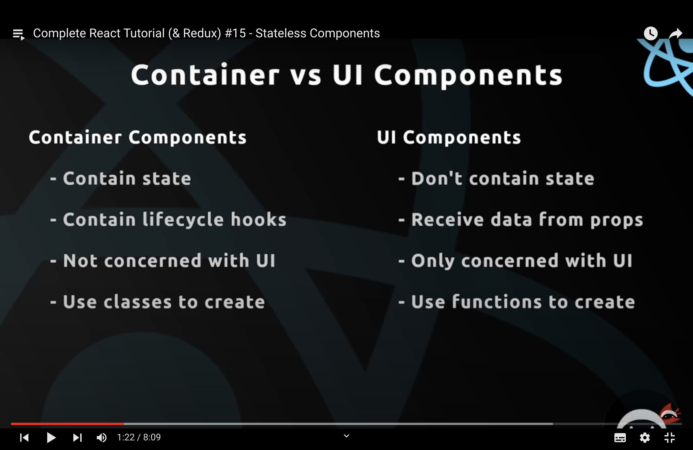
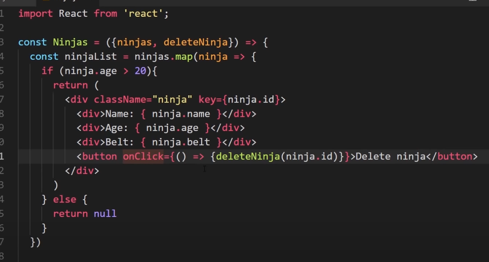
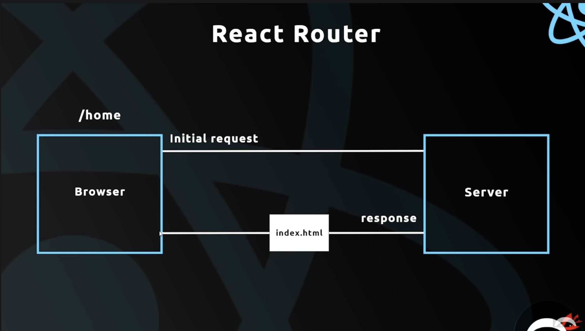

# WSC Project

## Python

### sqlite3

SQLite is a C library that provides a lightweight disk-based database that doesn't require a separate server process and allows accessing the database using a nonstandard variant of the SQL query language. In the project, we decide to use sqlite3 to handle the data of the users.

#### Intro

~~~python
import sqlite3

con = sqlite3.connect('./test.db')
~~~

The code above is to create the data storage in the file, *test.db*. The variable, *con*, will connect this data file, letting us to handle and change the data. We can choose to store in the heap memory using the following variable:

~~~python
con = sqlite3.connect(':memory:')
~~~

Then, we need to create an object called, *cursor*. The method **.execute()** could execute SQL code, manipulate the data storage.

~~~python
cur = conn.cursor()
~~~

#### Create the data table

~~~python
sql_data = '''CREATE TABLE user_data
           (name TEXT,
            email TEXT,
            term TEXT,
            course_field TEXT,
            course_number NUM);'''
cur.execute(sql_data)
~~~

#### Input the data

~~~python
data_text = "INSERT INTO user_data VALUES('Eric','kangyuf2@illinois.edu','SP2022', 'CS', '225')"
cur.execute(data_text)
~~~

Or, we can use array to insert mutiple data.

~~~python
#data is the array of tuple with data
cur.executemany('INSERT INTO user_data VALUES (?,?,?,?,?)', data)
~~~

#### Commit

After we input data into storage, it will not update until we commit the change. Using

~~~python
conn.commit()
~~~

#### Search the data storage

~~~python
cur.execute("SELECT * FROM user_data WHERE name=='Eric'")
cur.fetchall()
#output: [('Eric', 'kangyuf2@illinois.edu', 'SP2022', 'CS', 225)]
~~~

#### Close the data storage

We need to close the cursor and the connection. Using

~~~python
cur.close()
conn.close()
~~~

The following part is instructed by the [Offical Page](https://docs.python.org/3/library/sqlite3.html).

## React & Javascript

#### States

When we are in the **function** we can just build in a state by using {}, and set the value of the state by using this.state.xxx.

However, if we are under const function, we can declare a state by using

```js
const [xxx, setxxx] = useState(?)
```

while xxx is the name of state, setxxx is the set function of state, and ? is the type/initializtion of the state.

Note that we need to use the state value within {}, since the states will change.

#### Props

Props are used to pass the data from parents to the child. For example, if we use the class such as “table”, then we can pass the value to this table by using props.
```js
<table name="Eric" age = "25"/>
```

In the table, we can get this props by using:

```js
<div> {this.props.name} </div>
//or we can just pass the value before return
cosnt {name, age} = this.props

return{
  <div> {name} </div>
	<div> {age} </div>	
}
```

#### Container vs UI Component



Usually, a container marked as **class** means it can have a state. On the other hand, UI Component marked as. const, means it does not contain a state.

Note that, for a component, we do not auto get the props from parents. We need to write:

```js
const XXX = (props) =>{
	//something
}
//or pass the props to a variable directly by
const XXX = ({variable}) =>{
	//something
}
```

to pass the props.

#### Conditional output

We can use the if-statement to get the conditional output.

~~~js
if (condition){
	//do something
} else{
	return null;
}
~~~

The other way is ternary operator 

~~~js
return condition ? (output if true) : (output if false)
~~~

#### Forms

A form will provide the user with an interface to input the data they want. Then, we can get the data and use it in our website.  Since we need to modify the data in the form, we need to use the state.

```
class XXX extends Component{
	state = {
		name: null
	}
	handleChange = (e) => {
		this.setState({
			[e.target.id]: e.target.value
		})
	}
	handleSubmit = (e) => {
		e.prebentDefault();
		console.log(this.state);
	}
}
```

After we set up the function we need, we can return the things we need.

```javascript
render(){
  return(
    <div>
      <form onSubmit={this,handleSubmit}>
        <label htmlFor = "name">Name:</label>
        <input type = "text" id = "name" onChange={this.handleChange}/>
        <button>Submit</button>
      </form>
    </div>
  )
}


```

### Function as a props

In the parent class, we can create a function that use to collect the data user want, and add it to the list. First, change the line 12 in class XXX.

```javascript
class XXX extends Component{
	state = {
		name: null
	}
	handleChange = (e) => {
		this.setState({
			[e.target.id]: e.target.value
		})
	}
	handleSubmit = (e) => {
		e.prebentDefault();
		this.props.addXXX(this.state);
	}
}
```

Then, in the parent class, create a function that handles the data, remember to pass this function as a prop. Then, the child class can use this function by calling props.

```js
addXXX = (name) =>{
  let newarr = [...this.state.oddarr, name]; 
  // we add the new name to the old arr, create a new arr
  this.setState({
    arr : newarr
  })
}


// add props when called

<XXX addXXX = {this.addXXX}/>
```

#### Deleting data



Since we don’t need to fire the deleteNinja automatically, we can use an anomalous function to include it to make it happen.

In parent class, define deleteXXX:

```js
deleteXXX = (name) => {
	let XXX = this.state.XXX.filter(xxx => {
		return xxx.name !== name
	})
	this.setState({
		XXX : XXX
	})
}
```

More about filter:

when the element xxx inside XXX will stay when the return is true. In this scenario, we want to delete the name object, then, just let them unequal when it is not true.

The [example code in GitHub](https://github.com/iamshaunjp/react-redux-complete-playlist/tree/lesson-19) for the above section.

#### CSS file

We can add modify the format of a page by creating a CSS file and importing it into the page we want to modify

```css
body{
	background: (color);
  transition: all 1s;
  
}
//we can limit the scope by using the name of file.
.xxx form{ //use this format just in the import page
  background: (color);
  padding: 20px;
} 

form{ //use this format for all the page
  background: (color);
  padding: 20px;
} 
```

more information about [CSS file](https://blog.pusher.com/css-modules-react/).

#### Lifecycle Methods

```js
//this function fired once when the page is intitinalized
componentDidMount(){
	//do something
}
//this function fired when the props or state update
componentDidUpdata(prevProps, prevState){
  //do something
}
```

See [more lifecycle functions](https://projects.wojtekmaj.pl/react-lifecycle-methods-diagram/).

#### React Router



 If we do not want to send the request to the server, we can use a link or Navlink to the browser. It will get the direct component in the react-dom and do not refresh the page to get a  smooth transition.

#### Programmatic Redirects

For the component we used, we can add take a prop argument. It will provide some information that is useful.

```js
setTimeout(() => {
	props.history.push('/about')
},2000);

```

The above code is an example of using the information in props. We can transition the about page for 2 seconds. History is the page we go.

We have a higher-order component to supercharge the object that we do not have.  For example, only under the route browser with the route tag has the information of props.  By **import {withRouter} from ‘react-router-dom’**, and **export default withRouter(Navbar)**, we can get the props.
